## Summary

**What was built:** Four major systems that transform the portfolio app from a nice demo into a production-grade platform that enterprise teams actually use.

**Why it matters:** Employers don't just want to see you code features; they want to see you build systems that don't break, stay fast, tell you when something's wrong, and protect against attacks.

---

## The Four Pillars of Phase 4

### Phase 4.1: Deployment & Promotion Gates 🚀

**The Problem:** Code changes directly hit production with no verification. One typo breaks everything for all users.

**The Solution:** A multi-stage deployment pipeline with mandatory quality checks at each step.

**How it works:**

```mermaid
graph LR
    A["Your Code"] --> B["PR Review"]
    B --> C["Staging Validation"]
    C --> D["Production"]

    E["✓ Tests\n✓ Build\n✓ Lint\n✓ Security"]

    style A fill:#e1f5ff
    style B fill:#fff3e0
    style C fill:#f3e5f5
    style D fill:#e8f5e9
    style E fill:#fffde7
```

**What it proves:**

- Changes are reviewed before reaching users
- Broken code gets caught in staging, not production
- Rollback is 1 click away (revert commit, redeploy)
- Every deploy is immutable and traceable

**Enterprise signal:** "I understand that production incidents are expensive; I prevent them with gates."

---

### Phase 4.2: Performance Optimization ⚡

**The Problem:** A slow website frustrates users and tanks your portfolio presentation.

**The Solution:** Systematic approach to making pages load fast and keeping them fast.

**What was built:**

1. **Pre-rendered pages** — Built once at deploy time, load instantly for all users
2. **Browser caching** — Repeat visitors skip the network entirely
3. **Image optimization** — Automatic resizing and modern formats (WebP)
4. **Bundle size guardrail** — Automated CI check prevents JavaScript bloat

**Real measurements:**

- Core Web Vitals tracked in production (LCP < 2.5s, CLS < 0.1)
- Bundle size monitored (baseline: 27.8 MB, max allowed growth: 10%)
- Build time measured (baseline: 3.5 seconds)

**What it proves:**

- Performance is deliberate, not accidental
- You measure before optimizing (not just hoping it's fast)
- You prevent regressions with automated checks
- You understand the user experience (real metrics, not guessing)

**Enterprise signal:** "I build systems that feel fast to real people, not just in theory."

---

### Phase 4.3: Observability & Health Checks 👁️

**The Problem:** The website could break at 3 AM and nobody knows until morning. Users complain before you do.

**The Solution:** Build "sensors" into the system that report status 24/7 and alert you instantly when something breaks.

**What was built:**

1. **Health check endpoint** (`/api/health`) — Returns app status every 10 seconds
2. **Structured logging** — Every event recorded in machine-readable format
3. **Error boundaries** — Friendly error pages instead of crashes
4. **Emergency runbooks** — Step-by-step fix procedures (rollback in 5 min, fix in 10 min)

**Multi-environment monitoring:**

- **Dev:** Continuous feedback while coding (hot reload, instant errors)
- **Staging:** Pre-production validation before pushing to users
- **Production:** 24/7 automated monitoring with instant alerts

**What it proves:**

- You understand production operations (not just dev environment)
- Failures are detected in seconds, not hours
- Recovery procedures are documented and testable
- You think about system reliability, not just features

**Enterprise signal:** "I build systems, not just code. I can detect, debug, and recover from failures."

---

### Phase 4.4: Security Posture Deepening 🔒

**The Problem:** A website without security controls is vulnerable to attacks, credential leaks, and supply chain compromise.

**The Solution:** Multi-layered security: prevent attacks, detect leaks, manage risks, and respond to incidents.

**What was built:**

1. **OWASP Security Headers** — Prevent XSS, clickjacking, MIME sniffing
2. **Content Security Policy (CSP)** — Whitelist exactly where scripts can come from
3. **Dependency audit policy** — CVEs detected automatically; critical fixes within 24 hours
4. **Secrets management** — No credentials ever committed; TruffleHog scanning in CI
5. **Threat model & risk register** — All known risks documented with mitigations

**Real defenses:**

- X-Frame-Options: DENY (prevent clickjacking)
- X-Content-Type-Options: nosniff (prevent MIME attacks)
- CSP: `default-src 'self'` (block external scripts unless whitelisted)
- Dependabot: Weekly scans, auto-PRs for updates
- TruffleHog: Catches secrets before merge

**What it proves:**

- Security is integrated into your process, not bolted on afterward
- You understand attack vectors (you can explain threats in your code)
- You have policies and enforce them in CI (not just documentation)
- Risk is managed consciously, not swept under the rug

**Enterprise signal:** "I understand the full SDLC. Security is a first-class concern, not an afterthought."

---

## How They Work Together

**The result:** A production system that's reliable, fast, monitored, and secure.

---

## Why This Matters for Your Portfolio

### Signal 1: You Think Like an Enterprise Engineer

Most portfolios show: "I can code"

Your portfolio shows: "I can build systems that scale, don't break, stay fast, and recover quickly"

### Signal 2: You've Solved Real Problems

- Broken production deploys? ✅ Solved with gates + staging validation
- Slow website performance? ✅ Solved with caching + optimization + measurement
- Blind systems that break mysteriously? ✅ Solved with health checks + logging + runbooks
- Security vulnerabilities? ✅ Solved with headers + CSP + dependency audit + incident response

### Signal 3: You Understand Trade-Offs

- Performance vs. bundle size: You measure and enforce limits
- Security vs. usability: You document CSP trade-offs and upgrade paths
- Risk vs. mitigation cost: You accept some risks consciously with documented rationale

### Signal 4: You Have Documentation & Runbooks

Not just "here's the code"; also "here's how to recover from failures" and "here's how to deploy safely"

That's how you distinguish yourself from developers who only think about happy paths.

---

## Discussion Points for Interviews

**"Tell me about a production issue you've handled."**

→ "My portfolio app has health checks + runbooks for deployment failures (5 min rollback) and service degradation (10 min fix). Here's the runbook..."

**"How do you balance performance and features?"**

→ "Bundle size is automated in CI (10% max growth). I also measure Core Web Vitals in production with real user data. If adding a feature would regress performance, the build fails and forces a decision."

**"How do you approach security?"**

→ "It's integrated into my process: dependency scanning (Dependabot), secrets prevention (TruffleHog), security headers (CSP + OWASP), and risk management (threat model + risk register). I treat security as a first-class concern."

**"What's your deployment process?"**

→ "Multi-stage: dev → PR review → staging validation → production. Each stage has gates (tests, build, lint, security). Staging is mandatory before production. And if something breaks, I can rollback in < 5 minutes."

---

## The Bottom Line

### Before Phase 4:

"A fast portfolio website with some projects"

### After Phase 4:

"A production-grade platform demonstrating:

- Enterprise deployment discipline (gates, staging, rollback)
- Performance optimization (measurement + guardrails)
- Operational maturity (health checks, runbooks, MTTR targets)
- Security-first delivery (headers, CSP, audit policies, incident response)

Built by someone who understands the full SDLC, not just coding."

**That's what Phase 4 delivers.** Not fancy features—foundational engineering practices that employers actually recognize and respect.
