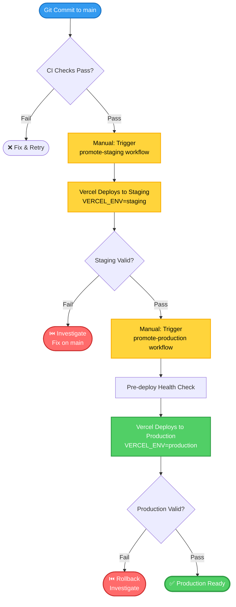

# Stage 4.1: Multi-Environment Deployment Strategy — Documentation

**Type:** ADR / Runbook / Reference  
**Phase:** Phase 4 — Enterprise-Grade Platform Maturity  
**Stage:** 4.1  
**Linked Issue:** [stage-4-1-app-issue.md](stage-4-1-app-issue.md)  
**Duration Estimate:** 1.5–2 hours  
**Assignee:** [Your name or team]

---

## Overview

Document the architectural decision to adopt explicit three-tier environment separation (preview/staging/production) with immutable builds and environment-aware configuration. This documentation captures the rationale, operational procedures, and maintenance guidelines for multi-environment deployments—supporting team understanding and enabling consistent promotion practices across the portfolio program.

**Audience:** Engineers deploying code, platform architects reviewing decisions, team members understanding deployment flow.

## Objectives

- Record ADR-0013: Multi-Environment Deployment Strategy with clear rationale and consequences
- Document environment promotion flow and operational procedures
- Create runbooks for environment promotion and rollback scenarios
- Establish promotion checklist and validation gates
- Enable team to confidently promote code across tiers

---

## Scope

### Files to Create

1. **`docs/10-architecture/adr/adr-0013-multi-environment-deployment.md`** — Architecture Decision Record
   - Type: ADR (Architecture Decision Record)
   - Purpose: Records decision to use preview/staging/production with immutable builds; captures rationale and alternatives
   - Audience: Architects, senior engineers, platform reviewers
   - Sections: Problem, Decision, Rationale, Consequences, Alternatives, Implementation, Success Criteria

2. **`docs/50-operations/runbooks/rbk-portfolio-environment-promotion.md`** — Environment Promotion Runbook
   - Type: Runbook (Operational Procedure)
   - Purpose: Step-by-step guide for promoting code to staging and production environments
   - Audience: Engineers, DevOps leads, operations team
   - Sections: Overview, Prerequisites, Promote to Staging, Promote to Production, Validation, Rollback

3. **`docs/50-operations/runbooks/rbk-portfolio-environment-rollback.md`** — Environment Rollback Runbook
   - Type: Runbook (Operational Procedure)
   - Purpose: Quick reference for rolling back failed promotions
   - Audience: Engineers, DevOps leads
   - Sections: Triggers, Rollback to Previous, Rollback via Git Revert, Post-Incident

### Files to Update

1. **`docs/60-projects/portfolio-app/02-architecture.md`** — Enhanced architecture documentation
   - Update section: Add "Environment Architecture" subsection
   - Add: Diagram of preview/staging/production tiers and promotion flow
   - Add: Description of immutability principle
   - Link to: ADR-0013 for detailed decision rationale

2. **`docs/60-projects/portfolio-app/01-overview.md`** — Project overview
   - Update section: Deployment & Environments
   - Add: Brief description of multi-tier approach
   - Link to: Runbooks for promotion procedures

3. **`docs/50-operations/runbooks/index.md`** — Runbook index page
   - Update section: Add entries for new promotion and rollback runbooks
   - Link to: rbk-portfolio-environment-promotion.md, rbk-portfolio-environment-rollback.md

4. **`docs/00-portfolio/dossier.md`** — Portfolio dossier (if section exists for ops)
   - Update section: Multi-Environment Deployment Strategy
   - Add: Summary of environment model, immutability principle, promotion gates

---

## Content Structure & Design

### Document Type & Template

**Document 1: ADR-0013**

- **Type:** Architecture Decision Record
- **Template:** Standard ADR format with Problem, Decision, Rationale, Consequences, Alternatives, Implementation
- **Front Matter:**
  ```yaml
  ---
  title: 'ADR-0013: Multi-Environment Deployment Strategy'
  description: 'Three-tier environment separation with immutable builds and environment-specific configuration via env vars.'
  sidebar_position: 13
  tags: [adr, deployment, environments, devops, phase-4, stage-4-1]
  ---
  ```

**Document 2: Promotion Runbook**

- **Type:** Operational Runbook
- **Template:** Step-by-step procedure with prerequisites, steps, validation, troubleshooting
- **Front Matter:**
  ```yaml
  ---
  title: 'Runbook: Environment Promotion & Validation'
  description: 'Procedures for promoting code from main to staging and production environments.'
  sidebar_position: 1
  tags: [runbook, deployment, promotion, operations, phase-4, stage-4-1]
  ---
  ```

**Document 3: Rollback Runbook**

- **Type:** Operational Runbook
- **Template:** Quick reference for reverting failed deployments
- **Front Matter:**
  ```yaml
  ---
  title: 'Runbook: Environment Rollback'
  description: 'Procedures for rolling back failed promotions and recovering from deployment issues.'
  sidebar_position: 2
  tags:
    [runbook, deployment, rollback, incident, operations, phase-4, stage-4-1]
  ---
  ```

### Content Outline

#### ADR-0013: Multi-Environment Deployment Strategy

1. **Problem Statement**
   - Current state: How deployments work pre-Phase 4 (preview auto, production manual)
   - Pain points: Lack of staging validation, "works locally" surprises, environment parity gaps
   - Trigger: Phase 4 goal to establish production-grade platform maturity

2. **Decision**
   - Clear statement: Adopt explicit three-tier environment model (preview/staging/production)
   - Immutability: Same build artifact deployed across all tiers; env config applied at runtime
   - Promotion: Manual workflows with validation gates; GitHub Actions + Vercel integration

3. **Rationale**
   - Why this approach:
     - Immutability eliminates "works in staging but fails in production" surprises
     - Staging provides final smoke test before production impact
     - Manual promotion gates enable thoughtful deployment reviews
   - Alignment: Supports 12-factor app principles; matches SaaS deployment best practices
   - Risk mitigation: Staging rollback doesn't affect production; easy rollback procedure

4. **Consequences**
   - Positive:
     - Build artifact confidence (same everywhere)
     - Staging validation prevents production incidents
     - Rollback procedure is simple and fast
     - Team has explicit promotion checklist
   - Negative:
     - Extra promotion step adds 5-10 min to deploy timeline
     - Requires manual workflow triggers (not auto-deployed on main)
     - Team discipline needed to follow promotion checklist

5. **Alternatives Considered**
   - Alternative A: Single environment (production only)
     - Pros: Simplicity, no staging overhead
     - Cons: No validation before production; high risk
     - Why rejected: Doesn't meet Phase 4 production-grade goal
   - Alternative B: Environment-specific builds (rebuild for each tier)
     - Pros: Can optimize per environment
     - Cons: Violates immutability; increases build time; hard to reproduce issues
     - Why rejected: Immutability principle is non-negotiable

6. **Implementation**
   - Related to: `src/lib/config.ts` environment helpers, `.github/workflows/promote-*.yml` workflows
   - Integrated into: CI/CD pipeline, Vercel deployments, team promotion procedures
   - Documentation: Runbooks, architecture section in dossier

7. **Success Criteria**
   - [ ] Multi-env promotion workflow is operational and tested
   - [ ] Staging deploys before production on every production change
   - [ ] Build artifacts are identical across tiers (verified post-deploy)
   - [ ] Team conducts ≥1 full promotion cycle (main → staging → production)
   - [ ] Rollback procedure is tested and documented

---

#### Promotion Runbook: Environment Promotion & Validation

1. **Purpose**
   - Operational guide for promoting code from main → staging → production
   - Audience: Engineers, DevOps leads, anyone deploying code

2. **Prerequisites**
   - [ ] Main branch is stable (all CI checks pass)
   - [ ] You have access to GitHub Actions UI
   - [ ] Vercel project is configured with staging/production environments
   - [ ] You are familiar with health check endpoint (`/api/health`)

3. **Environment Overview**
   - **Preview:** Auto-deployed on PR; `VERCEL_ENV=preview`
   - **Staging:** Manual promotion; `VERCEL_ENV=staging`; final validation before production
   - **Production:** Manual promotion; `VERCEL_ENV=production`; user-facing

4. **Promote to Staging (Step-by-Step)**
   - Step 1: Verify main branch is ready
     - Check: All CI checks pass on `main` branch
     - Check: Latest commit on main is the desired build
   - Step 2: Trigger staging promotion workflow
     - Go to: GitHub repo → Actions → `promote-staging` workflow
     - Click: Run workflow → Run workflow (on main branch)
     - Wait: Workflow runs; Vercel deploys staging environment
   - Step 3: Validate staging deployment
     - Test: `curl https://staging.portfolio.example.com/api/health`
     - Expected: 200 response with environment: "staging"
     - Check: Application loads and all pages accessible
     - Smoke tests: Try key user flows (view projects, click links, etc.)
   - Step 4: Review results
     - Success: Staging is ready for promotion to production
     - Failure: See Troubleshooting section; fix issue on main; retry

5. **Promote to Production (Step-by-Step)**
   - Step 1: Confirm staging is validated and stable
     - Prerequisite: Staging must have been validated (see above)
     - Check: No recent errors or issues observed
   - Step 2: Trigger production promotion workflow
     - Go to: GitHub repo → Actions → `promote-production` workflow
     - Click: Run workflow → Run workflow (on main branch)
     - Wait: Workflow runs; pre-deploy health checks; Vercel deploys
   - Step 3: Validate production deployment
     - Test: `curl https://portfolio.example.com/api/health`
     - Expected: 200 response with environment: "production"
     - Check: Application loads; critical pages accessible
     - Verify: Analytics data flowing; no error spikes
   - Step 4: Log promotion event
     - Document: When, who, what commit
     - Note: Any issues observed or mitigation steps taken

6. **Validation Checklist (After Each Promotion)**
   - [ ] Health check returns 200 and correct environment
   - [ ] Homepage loads without errors
   - [ ] Projects page displays all projects
   - [ ] Evidence links resolve correctly
   - [ ] Metadata is correct (OG tags, title)
   - [ ] No console errors in browser
   - [ ] Analytics events are firing
   - [ ] Vercel deployment dashboard shows "ready"

7. **Rollback Procedure (if production fails)**
   - Quick rollback: Revert last commit and re-run workflow (see rollback runbook)
   - Emergency: Use Vercel dashboard to deploy previous version
   - Post-recovery: Investigate root cause; fix and re-promote

8. **Troubleshooting**
   - **Issue: Workflow fails to trigger**
     - Cause: You don't have Actions permissions on repo
     - Fix: Contact repo admin; add yourself to Actions permission group
   - **Issue: Health check fails after deployment**
     - Cause: Environment variables not set in Vercel project settings
     - Fix: Verify `NEXT_PUBLIC_SITE_URL` and other vars are configured per environment
   - **Issue: Staging passes but production fails**
     - Cause: Different environment variables set in production
     - Fix: Compare Vercel project env var settings; ensure parity between staging/prod

9. **MTTR Target**
   - Promote main → staging: ~5 min (auto-deployed by workflow)
   - Validate staging: ~3 min (manual testing)
   - Promote staging → production: ~5 min (auto-deployed by workflow)
   - Validate production: ~3 min (manual testing)
   - **Total E2E:** ~20 min for full promotion cycle

---

#### Rollback Runbook: Environment Rollback

1. **Purpose**
   - Quick reference for reverting failed deployments
   - Audience: Engineers, DevOps leads, on-call responders

2. **Trigger Scenarios**
   - Production health check fails post-deployment
   - Critical bug discovered in production (post-promotion)
   - Database migration fails (not applicable yet; placeholder for future)
   - Security vulnerability discovered in deployed code

3. **Rollback Option 1: Git Revert (Recommended)**
   - Step 1: Identify problematic commit (SHA)
     - Example: `abc1234` is the commit deployed that caused issue
   - Step 2: Create revert commit
     - Command: `git revert abc1234 --no-edit`
     - This creates new commit that undoes changes
   - Step 3: Push revert commit to main
     - Command: `git push origin main`
     - CI will validate revert commit
   - Step 4: Re-run promotion workflow to production
     - GitHub Actions → promote-production → Run workflow
     - Vercel deploys revert commit to production
   - Step 5: Verify production health
     - Test: `curl https://portfolio.example.com/api/health`
     - Expected: 200 response; application functioning

4. **Rollback Option 2: Manual Vercel Rollback**
   - Step 1: Access Vercel dashboard
   - Step 2: Navigate to portfolio-app production project
   - Step 3: Find previous successful deployment
   - Step 4: Click "Rollback to this deployment"
   - Step 5: Confirm rollback
   - Step 6: Verify production health (same as above)

5. **Rollback Option 3: Branch Revert (Emergency)**
   - Step 1: Check out previous working commit
     - Command: `git checkout [previous-good-commit-sha]`
   - Step 2: Force-push to main (use with caution!)
     - Command: `git push origin main --force`
     - ⚠️ Warning: This rewrites main history; use only in emergencies
   - Step 3: Re-run promotion workflow
     - GitHub Actions → promote-production → Run workflow
     - Vercel deploys reverted commit

6. **Post-Rollback**
   - Step 1: Create incident log
     - What happened: Describe issue
     - When: Timestamp of rollback
     - Root cause: Initial investigation
   - Step 2: Investigate root cause
     - Review: Code changes in reverted commit
     - Test: Local reproduction of issue
   - Step 3: Fix and re-promote
     - Create: New commit with fix
     - Push: To main; CI validates
     - Promote: Back to production via workflow
   - Step 4: Document lessons learned
     - What: What went wrong
     - Why: Why did testing miss it
     - How: How to prevent in future

7. **MTTR Target**
   - Detect failure: ~2 min (post-deployment health checks)
   - Execute rollback: ~3 min (git revert + push)
   - Re-deploy via workflow: ~5 min (Vercel deployment)
   - Verify rollback: ~2 min (health check + smoke test)
   - **Total E2E:** ~15 min from detection to recovery

8. **Prevention Checklist**
   - [ ] Staging was validated before production promotion
   - [ ] Health checks were passing on staging
   - [ ] All CI checks passed before promoting
   - [ ] Team reviewed changes before promotion
   - [ ] No emergency/forced pushes to main (unless incident)

---

### Code Examples & Diagrams

#### Diagram 1: Environment Promotion Flow



#### Diagram 2: Environment Variables Per Tier

```mermaid
graph TB
    subgraph Local["Local Development"]
        LocalVars["NEXT_PUBLIC_SITE_URL=http://localhost:3000<br/>NEXT_PUBLIC_DOCS_BASE_URL=http://localhost:3001"]
    end

    subgraph Preview["Preview (Auto-Deploy)"]
        PreviewVars["VERCEL_ENV=preview<br/>NEXT_PUBLIC_SITE_URL=https://portfolio-app-[PR].vercel.app"]
    end

    subgraph Staging["Staging (Manual Promotion)"]
        StagingVars["VERCEL_ENV=staging<br/>NEXT_PUBLIC_SITE_URL=https://staging.portfolio.example.com"]
    end

    subgraph Production["Production (Manual Promotion)"]
        ProdVars["VERCEL_ENV=production<br/>NEXT_PUBLIC_SITE_URL=https://portfolio.example.com"]
    end

    style Local fill:#339af0,stroke:#1971c2,stroke-width:2px,color:#fff
    style Preview fill:#ffd43b,stroke:#fab005,stroke-width:2px,color:#000
    style Staging fill:#ffd43b,stroke:#fab005,stroke-width:2px,color:#000
    style Production fill:#51cf66,stroke:#2f9e44,stroke-width:2px,color:#fff
```



---

## Implementation Tasks

### Phase 1: ADR-0013 Creation (0.75 hours)

#### Tasks

- [ ] **Research and synthesize multi-environment decision**
  - Details: Review Phase 4 implementation guide Stage 4.1 section
  - Reference: Environment Model diagram, immutability principle, rationale
  - Document: Clear problem statement and decision
  - Files: Start drafting ADR-0013

- [ ] **Write ADR-0013 Problem & Decision sections**
  - Problem: Current deployment limitations; lack of staging
  - Decision: Three-tier model with immutable builds
  - Include: Rationale for immutability principle
  - Files: `docs/10-architecture/adr/adr-0013-multi-environment-deployment.md`

- [ ] **Document ADR-0013 Rationale & Consequences**
  - Rationale: Why immutability, why manual promotion, why multi-tier
  - Positive consequences: Build confidence, staged rollout capability
  - Negative consequences: Extra deployment step, workflow overhead
  - Files: ADR-0013

- [ ] **Document ADR-0013 Alternatives & Implementation**
  - Alternatives: Single env, per-env rebuilds, auto-promotion (why rejected)
  - Implementation: Links to config.ts, workflows, runbooks
  - Success criteria: 5–7 measurable outcomes
  - Files: ADR-0013

#### Success Criteria for Phase 1

- [ ] ADR-0013 is 300–400 lines
- [ ] All sections complete (Problem, Decision, Rationale, Consequences, Alternatives)
- [ ] Problem statement is clear and relatable
- [ ] Decision is unambiguous and justified
- [ ] Rationale explains "why this approach" not just "what is this"
- [ ] Build-time immutability principle is clearly explained
- [ ] Links to implementation (config.ts, workflows) included
- [ ] No typos or grammatical errors
- [ ] Follows ADR format established in portfolio-docs

---

### Phase 2: Runbook Creation (0.75 hours)

#### Tasks

- [ ] **Create promotion runbook structure and overview**
  - Details: Document environment model, prerequisites, promotion flow
  - Include: Why staging exists, what validation gates apply
  - Sections: Purpose, Prerequisites, Overview, Step-by-step procedures
  - Files: `docs/50-operations/runbooks/rbk-portfolio-environment-promotion.md`

- [ ] **Write Promote to Staging section (detailed steps)**
  - Steps: Verify main is ready → Trigger workflow → Validate staging
  - Include: CLI commands, expected outputs, validation checklist
  - Add: Troubleshooting for common issues
  - Details: MTTR target ~5 min per tier

- [ ] **Write Promote to Production section (detailed steps)**
  - Steps: Confirm staging ready → Trigger workflow → Validate production
  - Include: Pre-deploy checks, post-deploy validation
  - Add: How to monitor for issues post-promotion
  - Details: MTTR target, who approves, when to rollback

- [ ] **Create rollback runbook**
  - Details: When to rollback, how to rollback, post-incident steps
  - Options: Git revert, Vercel manual rollback, emergency branch revert
  - Include: Rollback MTTR target (~15 min), prevention checklist
  - Files: `docs/50-operations/runbooks/rbk-portfolio-environment-rollback.md`

#### Success Criteria for Phase 2

- [ ] Promotion runbook is 400–500 lines
- [ ] All steps include specific commands and expected outputs
- [ ] Troubleshooting section covers 3+ common issues
- [ ] Rollback runbook is 200–300 lines
- [ ] Both runbooks include MTTR targets and checklists
- [ ] Validation checklist is clear and verifiable
- [ ] No placeholder text or TODOs
- [ ] Screenshots or examples (if applicable) included

---

### Phase 3: Architecture Documentation & Integration (0.5 hours)

#### Tasks

- [ ] **Update `docs/60-projects/portfolio-app/02-architecture.md`**
  - Details: Add "Environment Architecture" subsection
  - Include: Environment model diagram (Mermaid)
  - Add: Description of immutability, promotion flow
  - Link to: ADR-0013 for detailed decision

- [ ] **Update `docs/60-projects/portfolio-app/01-overview.md`**
  - Details: Add Deployment & Environments section (if not exists)
  - Include: Brief description of multi-tier approach
  - Link to: Promotion and rollback runbooks

- [ ] **Update `docs/50-operations/runbooks/index.md`**
  - Details: Add new runbook entries
  - Include: Links to promotion and rollback runbooks
  - Add: Brief descriptions of each runbook purpose

- [ ] **Update `docs/00-portfolio/dossier.md` (if exists)**
  - Details: Add Multi-Environment Deployment Strategy section
  - Include: Summary of environment model, immutability principle
  - Link to: ADR-0013 and runbooks

#### Success Criteria for Phase 3

- [ ] All cross-references are bidirectional
- [ ] All links resolve in build: `pnpm build` (0 broken links)
- [ ] Architecture documentation is 150–200 words
- [ ] Diagrams render correctly
- [ ] Front matter is complete for all new docs

---

## Integration with Existing Docs

### Cross-References

- **Links from ADR-0013:**
  - → `docs/60-projects/portfolio-app/02-architecture.md` (referenced by architecture section)
  - → `docs/50-operations/runbooks/rbk-portfolio-environment-promotion.md` (implementation link)
  - → `docs/50-operations/runbooks/rbk-portfolio-environment-rollback.md` (rollback reference)

- **Links from Runbooks:**
  - → ADR-0013 (decision rationale)
  - → `docs/60-projects/portfolio-app/01-overview.md` (environment overview)
  - ← `docs/50-operations/runbooks/index.md` (parent runbook index)

- **Links from Architecture:**
  - → ADR-0013 (decision details)
  - → Runbooks (operational procedures)

### Updates to Existing Pages

1. **`docs/60-projects/portfolio-app/02-architecture.md`**
   - Update section: Add "Environment Architecture & Deployment Strategy" subsection after "Component Architecture"
   - Add link: "See ADR-0013 for decision rationale"
   - Add link: "See promotion and rollback runbooks for operational procedures"

2. **`docs/60-projects/portfolio-app/01-overview.md`**
   - Update section: Add "Deployment & Environments" subsection (if not exists)
   - Add link: "See runbooks: Environment Promotion & Rollback"
   - Brief description: "Three-tier environment model with manual promotion gates"

3. **`docs/50-operations/runbooks/index.md`**
   - Add entry: "Environment Promotion & Validation — Procedures for staging and production promotion"
   - Add entry: "Environment Rollback — Rollback procedures for failed deployments"
   - Note: These are prerequisite reading for all deployment activities

---

## Documentation Review Checklist

Before marking complete:

- [ ] All sections have content (no TODOs or placeholders)
- [ ] Front matter is complete: title, description, tags, sidebar_position
- [ ] Follows style guide: formatting, tone, voice
- [ ] Diagrams render correctly and use standard color palette
- [ ] All code examples are correct and tested
- [ ] All links are valid (build passes with 0 broken links)
- [ ] Cross-references are bidirectional
- [ ] Technical accuracy verified against implementation
- [ ] Runbook steps are specific and actionable
- [ ] MTTR targets are realistic
- [ ] Troubleshooting covers common issues
- [ ] No secrets or sensitive data exposed
- [ ] Reviewed by technical peer for clarity

---

## Acceptance Criteria

This stage is complete when:

- [ ] ADR-0013 is complete and follows ADR format
- [ ] Promotion runbook documents all steps with validation gates
- [ ] Rollback runbook provides quick reference for incident recovery
- [ ] Architecture documentation is updated with environment model
- [ ] All cross-references are bidirectional and working
- [ ] Diagrams render correctly in build: `pnpm build`
- [ ] No broken links: `pnpm build` reports 0 broken links
- [ ] All new pages have complete front matter
- [ ] Runbooks are reviewed for clarity and accuracy
- [ ] Team has read and understood runbooks
- [ ] PR created with title: `docs(devops): Stage 4.1 - Multi-environment deployment ADR & runbooks`
- [ ] PR reviewed and approved
- [ ] PR merged to `main`

---

## Effort Breakdown

| Phase | Task                                  | Hours  | Notes                          |
| ----- | ------------------------------------- | ------ | ------------------------------ |
| 1     | Research and write ADR-0013           | 0.5h   | Problem, Decision, Rationale   |
| 1     | Write ADR Consequences & Alternatives | 0.25h  | Complete ADR                   |
| 2     | Create promotion runbook              | 0.5h   | Steps, checklist, troubleshoot |
| 2     | Create rollback runbook               | 0.25h  | Rollback options, MTTR target  |
| 3     | Update architecture documentation     | 0.25h  | Links, diagrams, descriptions  |
| 3     | Verify builds and links               | 0.25h  | `pnpm build` with 0 broken     |
| —     | **Total**                             | **2h** | **Includes buffer for review** |

---

## Definition of Done

All documentation is complete when:

- ✅ **Content Complete:** All sections filled; no placeholders
- ✅ **Accurate:** Reflects actual implementation and decisions
- ✅ **Well-Structured:** Follows ADR and runbook templates
- ✅ **Diagrams Included:** Mermaid diagrams render correctly
- ✅ **Links Working:** All internal links resolve in build
- ✅ **Bidirectional:** Related docs link back to this content
- ✅ **Style Consistent:** Matches portfolio docs style guide
- ✅ **Front Matter Complete:** Title, description, tags, positioning
- ✅ **No Secrets:** No API keys, tokens, or sensitive data
- ✅ **Build Verified:** `pnpm build` passes with 0 broken links
- ✅ **Reviewed:** Approved by technical reviewer
- ✅ **Merged:** PR merged to `main`

---

## Content Quality Standards

All documentation must meet:

- **Clarity:** Target audience can understand the content
- **Accuracy:** Content matches actual implementation and decisions
- **Completeness:** All sections filled; no TODOs
- **Consistency:** Follows style guide; formatting is uniform
- **Maintainability:** Easy to update as procedures evolve
- **Actionability:** Runbooks provide step-by-step procedures
- **Searchability:** Proper tags and keywords for discovery
- **Accessibility:** High contrast, proper markdown formatting

---

## Coordination with Implementation

### Depends On

- [ ] App implementation (stage-4-1-app-issue.md) complete and merged
- [ ] Workflows created and tested
- [ ] `.env.example` and config.ts finalized

### Coordination

- **Created in parallel with:** App implementation issue
- **Finalized after:** App implementation complete and workflows tested
- **Published with:** App implementation PR (merged together)

### Synchronization

- [ ] Documentation reviewed after app implementation
- [ ] Runbook steps verified against actual workflows
- [ ] ADR reflects final implementation decisions
- [ ] Links to app code are correct

---

## Related Issues

- **Parent:** Phase 4 Implementation Guide
- **Sibling (App):** [stage-4-1-app-issue.md](stage-4-1-app-issue.md)
- **Successor:** Stages 4.2–4.5 (depend on this foundation)

---

## Post-Implementation Notes

[To be filled after implementation]

- Lessons learned from ADR/runbook creation
- Suggestions for improvement
- Updates needed for future stages

---

**Milestone:** Phase 4 — Enterprise-Grade Platform Maturity  
**Labels:** `documentation`, `adr`, `runbook`, `phase-4`, `stage-4-1`, `devops`  
**Priority:** High
