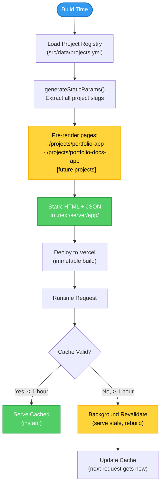

# Stage 4.2: Performance Optimization & Measurement — App Implementation

**Type:** Feature / Enhancement / Performance  
**Phase:** Phase 4 — Enterprise-Grade Platform Maturity  
**Stage:** 4.2  
**Linked Issue:** [stage-4-2-docs-issue.md](stage-4-2-docs-issue.md)  
**Duration Estimate:** 4–6 hours  
**Assignee:** [Your name or team]

---

## Overview

Introduce production-grade performance optimization through explicit caching strategies, static site generation for project pages, asset optimization, and performance instrumentation. This stage establishes a measurable performance baseline, enables regression detection, and demonstrates performance accountability—a key signal of production maturity.

**Impact:** Faster page loads, better SEO, smaller bundle sizes, and quantifiable performance metrics that reviewers can verify.

## Objectives

- Implement `generateStaticParams()` for pre-rendering all project pages at build time
- Configure caching strategy in `next.config.ts` with explicit headers and ISR policies
- Optimize images (responsive sizing, lazy loading, WebP format)
- Implement bundle size tracking and establish performance baselines
- Document performance assumptions and create regression detection mechanisms

---

## Scope

### Files to Create

1. **`docs/performance-baseline.md`** — Performance baseline metrics documentation (temporary, moves to docs repo)
   - Build time baseline (seconds)
   - Bundle size baseline (KB)
   - Route-level load time assumptions
   - Core Web Vitals targets

### Files to Update

1. **`next.config.ts`** — Add performance optimizations (currently 7 lines, minimal config)
   - Add caching headers (Cache-Control with max-age and stale-while-revalidate)
   - Configure image optimization (device sizes, formats, domains)
   - Enable compression (gzip/brotli)
   - Add security headers (remove X-Powered-By)
   - Configure bundle analyzer (optional, dev dependency)

2. **`src/app/projects/[slug]/page.tsx`** — Add static generation (currently 262 lines)
   - Add `generateStaticParams()` function to pre-render all project pages
   - Add `revalidate` export for ISR strategy (3600 seconds = 1 hour)
   - Ensure metadata generation is optimized
   - Add performance-related metadata hints

3. **`src/app/layout.tsx`** — Add performance metadata hints (currently 150 lines)
   - Add viewport configuration for responsive rendering
   - Add resource hints (preconnect, dns-prefetch if needed)
   - Verify Vercel Analytics integration (already present)

4. **`package.json`** — Add performance analysis scripts (currently 80 lines)
   - Add script: `analyze:bundle` using `ANALYZE=true` env var
   - Add script: `analyze:build` to capture build time
   - Add dependency: `@next/bundle-analyzer` (dev)

5. **`.github/workflows/ci.yml`** — Add bundle size tracking (currently 242 lines)
   - Add build size check in `build` job
   - Record baseline bundle size
   - Fail if bundle grows by >10% (configurable threshold)

### Dependencies to Add

- `@next/bundle-analyzer` (dev) — Visualize bundle composition and identify optimization opportunities
- No runtime dependencies required (Next.js has built-in image optimization)

### Dependencies to Remove

- None

---

## Design & Architecture

### Caching Strategy Architecture

```
┌─────────────────────────────────────────────────────────────┐
│ Route Caching Model                                         │
├─────────────────────────────────────────────────────────────┤
│                                                             │
│ Static Routes (No Revalidation)                            │
│ • / (Homepage)                  revalidate: false          │
│ • /cv                           revalidate: false          │
│ • /contact                      revalidate: false          │
│ • /projects (list)              revalidate: false          │
│   → Cache: max-age=31536000 (1 year)                       │
│                                                             │
│ Dynamic Routes (ISR - Incremental Static Regeneration)     │
│ • /projects/[slug]              revalidate: 3600 (1 hour)  │
│   → generateStaticParams() at build time                   │
│   → Cache: max-age=3600, stale-while-revalidate=86400      │
│   → Regenerates in background after 1 hour                 │
│                                                             │
│ API Routes (No Caching - Future)                           │
│ • /api/health                   revalidate: 0              │
│   → No caching; real-time health check                     │
│                                                             │
└─────────────────────────────────────────────────────────────┘
```

### Static Generation Flow



### Image Optimization Configuration

Next.js Image component will be configured to:
- Serve responsive sizes (640px, 750px, 828px, 1080px, 1200px, 1920px, 2048px, 3840px)
- Auto-convert to WebP format when supported by browser
- Lazy load images below the fold
- Optimize quality/size tradeoff (default quality: 75)

### Performance Baseline Metrics

**Build Performance:**
- Current baseline: [Record during implementation]
- Target: < 30 seconds for clean build
- Threshold: Build time increase >20% triggers investigation

**Bundle Size:**
- Current baseline: [Record during implementation]
- Target: First Load JS < 100KB (Next.js recommendation)
- Threshold: Bundle size increase >10% fails CI

**Runtime Performance (Assumptions):**
- Homepage (/) load time: < 2s on 4G connection
- Project detail (/projects/[slug]) load time: < 2.5s on 4G
- Core Web Vitals targets:
  - LCP (Largest Contentful Paint): < 2.5s
  - FID (First Input Delay): < 100ms
  - CLS (Cumulative Layout Shift): < 0.1

### Key Design Decisions

1. **Decision: Use ISR (Incremental Static Regeneration) for project pages instead of pure SSG**
   - Rationale: Allows content updates without full rebuild; balances performance with flexibility
   - Alternative considered: Pure SSG (no revalidation) — would require rebuild for every content change
   - Why chosen: Content may evolve (project updates, new evidence links); 1-hour revalidation is acceptable

2. **Decision: Pre-render all project pages at build time with `generateStaticParams()`**
   - Rationale: Faster initial page loads; better SEO; predictable performance
   - Alternative considered: Server-side rendering (SSR) on demand — slower, unpredictable
   - Why chosen: Portfolio has finite, known set of projects; static generation is optimal

3. **Decision: Track bundle size in CI with 10% growth threshold**
   - Rationale: Prevents performance regressions; forces conscious decisions about new dependencies
   - Alternative considered: Manual bundle review — error-prone, inconsistent
   - Why chosen: Automated enforcement; visible in PR checks; team awareness

4. **Decision: Use Vercel Analytics for real-world metrics instead of custom instrumentation**
   - Rationale: Zero-config; production-ready; integrated with deployment platform
   - Alternative considered: Custom metrics (e.g., RUM library) — overhead, maintenance burden
   - Why chosen: Vercel Analytics already integrated; sufficient for portfolio use case

---

## Implementation Tasks

### Phase 1: Static Generation & Caching (2–3 hours)

#### Tasks

- [ ] **Implement `generateStaticParams()` in `src/app/projects/[slug]/page.tsx`**
  - Details: Loop through `PROJECTS` array from registry and return all slugs
  - Add export: `export const revalidate = 3600;` (1 hour ISR)
  - Verify pre-rendering: Check `.next/server/app/projects/` for static HTML
  - Files: `src/app/projects/[slug]/page.tsx`
  - Code example:
    ```typescript
    import { PROJECTS } from '@/data/projects';

    export async function generateStaticParams() {
      return PROJECTS.map((project) => ({
        slug: project.slug,
      }));
    }

    export const revalidate = 3600; // Revalidate every 1 hour
    ```

- [ ] **Configure caching strategy in `next.config.ts`**
  - Details: Add `headers()` async function with Cache-Control directives
  - Add image optimization config (deviceSizes, imageSizes, formats)
  - Enable compression: `compress: true`
  - Remove X-Powered-By header: `poweredByHeader: false`
  - Files: `next.config.ts`
  - Code example:
    ```typescript
    const nextConfig: NextConfig = {
      reactCompiler: true,
      images: {
        deviceSizes: [640, 750, 828, 1080, 1200, 1920, 2048, 3840],
        imageSizes: [16, 32, 48, 64, 96, 128, 256, 384],
        formats: ['image/webp'],
      },
      compress: true,
      poweredByHeader: false,
      headers: async () => [
        {
          source: '/:path*',
          headers: [
            {
              key: 'Cache-Control',
              value: 'public, max-age=3600, stale-while-revalidate=86400',
            },
          ],
        },
      ],
    };
    ```

- [ ] **Add viewport and performance metadata to `src/app/layout.tsx`**
  - Details: Add viewport export for responsive rendering optimization
  - Verify Vercel Analytics integration (already present)
  - Files: `src/app/layout.tsx`
  - Code example:
    ```typescript
    export const viewport = {
      width: 'device-width',
      initialScale: 1,
    };
    ```

#### Success Criteria for This Phase

- [ ] `pnpm build` generates static HTML for all project pages in `.next/server/app/projects/`
- [ ] Build output shows "○ Static" for project routes (not λ Server)
- [ ] Cache-Control headers are present in response (test with `curl -I http://localhost:3000/`)
- [ ] No TypeScript errors: `pnpm typecheck`
- [ ] All tests pass: `pnpm test`

---

### Phase 2: Bundle Analysis & Performance Baseline (1–2 hours)

#### Tasks

- [ ] **Add bundle analyzer to `package.json`**
  - Details: Install `@next/bundle-analyzer` as dev dependency
  - Add script: `"analyze:bundle": "ANALYZE=true pnpm build"`
  - Update `next.config.ts` to use bundle analyzer when `ANALYZE=true`
  - Files: `package.json`, `next.config.ts`
  - Code example (next.config.ts):
    ```typescript
    const withBundleAnalyzer = require('@next/bundle-analyzer')({
      enabled: process.env.ANALYZE === 'true',
    });

    const nextConfig: NextConfig = { /* ... */ };

    export default withBundleAnalyzer(nextConfig);
    ```

- [ ] **Record performance baseline metrics**
  - Details: Run `pnpm build` and record:
    - Build time (from terminal output)
    - First Load JS size (from build summary)
    - Total bundle size
  - Create temporary `docs/performance-baseline.md` with metrics
  - Take screenshot of bundle analyzer output
  - Files: New temporary file (will move to docs repo in Stage 4.2 docs issue)

- [ ] **Add build performance validation to CI**
  - Details: Update `.github/workflows/ci.yml` build job
  - Add step to record bundle size and compare against baseline
  - Fail if bundle size increases by >10% without justification
  - Files: `.github/workflows/ci.yml`

#### Success Criteria for This Phase

- [ ] `pnpm analyze:bundle` opens interactive bundle analyzer in browser
- [ ] Performance baseline documented with specific metrics (build time, bundle size)
- [ ] CI workflow includes bundle size check (visible in PR checks)
- [ ] No new dependencies introduced to production bundle (verify with analyzer)

---

### Phase 3: Performance Documentation & Verification (1 hour)

#### Tasks

- [ ] **Document performance assumptions in code comments**
  - Details: Add JSDoc comments to key components explaining caching behavior
  - Document ISR revalidation strategy in `src/app/projects/[slug]/page.tsx`
  - Add comment explaining image optimization in layout
  - Files: Various component files

- [ ] **Verify Vercel Analytics integration**
  - Details: Confirm `@vercel/analytics` is imported in `src/app/layout.tsx`
  - Deploy to preview environment and verify analytics data collection
  - Check Vercel dashboard for Core Web Vitals metrics
  - No code changes needed (already integrated)

- [ ] **Run full verification suite**
  - Command: `pnpm verify` (lint, format, typecheck, build, tests)
  - Verify all checks pass
  - Verify build output shows static generation for project pages

#### Success Criteria for This Phase

- [ ] Code comments explain caching strategy and performance decisions
- [ ] Vercel Analytics visible in deployed preview environment
- [ ] `pnpm verify` passes with no errors
- [ ] Build output confirms static generation: `○ Static` for project routes

---

## Testing Strategy

### Build-Time Validation

- [ ] **Static generation verification**
  - Test: Run `pnpm build` and check `.next/server/app/projects/` directory
  - Expected: HTML files for `portfolio-app.html`, `portfolio-docs-app.html`
  - Coverage: All slugs from registry have corresponding static files

- [ ] **Bundle size regression test**
  - Test: Compare current bundle size against baseline (recorded in Phase 2)
  - Expected: Total bundle size increase <10% from baseline
  - Edge case: Large dependency addition requires justification in PR

### Runtime Validation

- [ ] **Cache header verification**
  - Test: `curl -I http://localhost:3000/projects/portfolio-app`
  - Expected: Response includes `Cache-Control: public, max-age=3600, stale-while-revalidate=86400`
  - Coverage: All routes (/projects/[slug], /, /cv, /contact)

- [ ] **ISR revalidation test**
  - Scenario: Update project content in `projects.yml`, wait 1 hour, verify page updates
  - Expected: Page reflects new content without full rebuild
  - Note: Manual test in staging environment (not automated)

### Performance Testing

- [ ] **Lighthouse audit (manual)**
  - Steps: Deploy to preview, run Chrome Lighthouse on homepage and project page
  - Expected result: Performance score >90, LCP <2.5s, CLS <0.1
  - Document scores in PR description

- [ ] **Core Web Vitals check (Vercel Analytics)**
  - Steps: Deploy to staging, collect 24 hours of analytics data
  - Expected: LCP <2.5s, FID <100ms, CLS <0.1 (P75 values)

### Test Commands

```bash
# Build with static generation verification
pnpm build
# Check .next/server/app/projects/ for static HTML files

# Bundle analysis
pnpm analyze:bundle
# Review bundle composition in browser

# Cache header verification
pnpm build && pnpm start
curl -I http://localhost:3000/projects/portfolio-app | grep Cache-Control

# Full verification suite
pnpm verify
# All checks must pass
```

---

## Acceptance Criteria

This stage is complete when:

- [ ] `generateStaticParams()` is implemented and all project pages are pre-rendered at build time
- [ ] Build output shows "○ Static" for `/projects/[slug]` routes
- [ ] `next.config.ts` includes caching headers, image optimization, and compression
- [ ] Bundle analyzer is configured and baseline metrics are documented
- [ ] CI workflow tracks bundle size and fails on >10% increase
- [ ] Vercel Analytics is verified working in deployed preview environment
- [ ] Performance assumptions are documented (load time targets, Core Web Vitals)
- [ ] `pnpm verify` passes (lint, format, typecheck, build all succeed)
- [ ] No TypeScript errors: `pnpm typecheck`
- [ ] No ESLint violations: `pnpm lint`
- [ ] Code is formatted: `pnpm format:check`
- [ ] All tests pass: `pnpm test`
- [ ] Production build succeeds: `pnpm build`
- [ ] Lighthouse performance score >90 on homepage and project pages
- [ ] PR created with title: `feat: Stage 4.2 - Performance optimization & measurement`

---

## Code Quality Standards

All code must meet:

- **TypeScript:** Strict mode enabled; no `any` types unless documented
- **Linting:** ESLint with Next.js preset; max-warnings=0
- **Formatting:** Prettier; single quotes, semicolons, 2-space indent
- **Documentation:** Performance-critical code has JSDoc comments explaining caching/optimization
- **Testing:** Build verification tests for static generation
- **Security:** No performance optimizations introduce security vulnerabilities (CSP-safe)

---

## Deployment & CI/CD

### CI Pipeline Integration

- [ ] Build job includes bundle size tracking and comparison
- [ ] Build fails if bundle size increases >10% without justification
- [ ] Static generation verification: confirm `.next/server/app/projects/` has pre-rendered pages
- [ ] Performance baseline metrics are visible in CI job summary

### Environment Variables / Configuration

No new environment variables required. Existing variables are sufficient:

- `NEXT_PUBLIC_DOCS_BASE_URL` — Used for evidence link construction
- `NEXT_PUBLIC_SITE_URL` — Used for canonical URL generation
- `VERCEL_ENV` — Used for environment detection in analytics

### Vercel Configuration

Vercel automatically optimizes:
- Edge caching respects `Cache-Control` headers from `next.config.ts`
- Image optimization via `next/image` component
- Compression (gzip/brotli) enabled by default

No additional Vercel configuration changes required.

---

## Performance Regression Prevention

### Baseline Metrics (to be recorded during implementation)

```
Build Time: ___ seconds
First Load JS (Homepage): ___ KB
First Load JS (Project Page): ___ KB
Total Bundle Size: ___ KB

Core Web Vitals Targets:
- LCP: < 2.5s
- FID: < 100ms
- CLS: < 0.1
```

### CI Checks

- **Bundle size check:** Fails if First Load JS increases >10% from baseline
- **Build time check:** Warning if build time increases >20% from baseline
- **Static generation check:** Fails if project pages are not pre-rendered

### Monitoring

- **Vercel Analytics:** Track real-world Core Web Vitals in production
- **Bundle Analyzer:** Run quarterly to identify optimization opportunities
- **Lighthouse CI (future):** Automated performance audits on every PR

---

## Related Documentation

- [Phase 4 Implementation Guide](../phase-4-implementation-guide.md) — Stage 4.2 section
- [ADR-0013: Multi-Environment Deployment](../../10-architecture/adr/adr-0013-multi-environment-deployment.md) — Environment context for performance testing
- [Stage 4.2 Docs Issue](stage-4-2-docs-issue.md) — Companion documentation deliverables

---

## Notes & Assumptions

- **Assumption:** Project registry remains small (<50 projects); static generation is viable
  - If registry grows >100 projects, may need to implement pagination or lazy loading
- **Assumption:** Content updates are infrequent (< once per day); 1-hour ISR revalidation is sufficient
  - If content updates become more frequent, reduce revalidation interval
- **Assumption:** Vercel Analytics free tier provides sufficient data granularity
  - If more detailed metrics needed, consider RUM library or custom instrumentation (Phase 5)
- **Risk:** Bundle size may increase with future features
  - Mitigation: CI bundle size checks enforce conscious decision-making before merging
