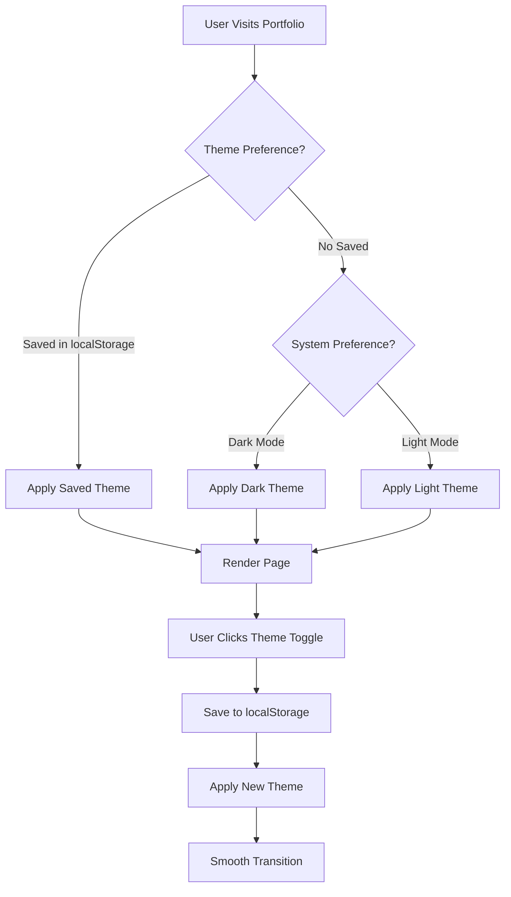
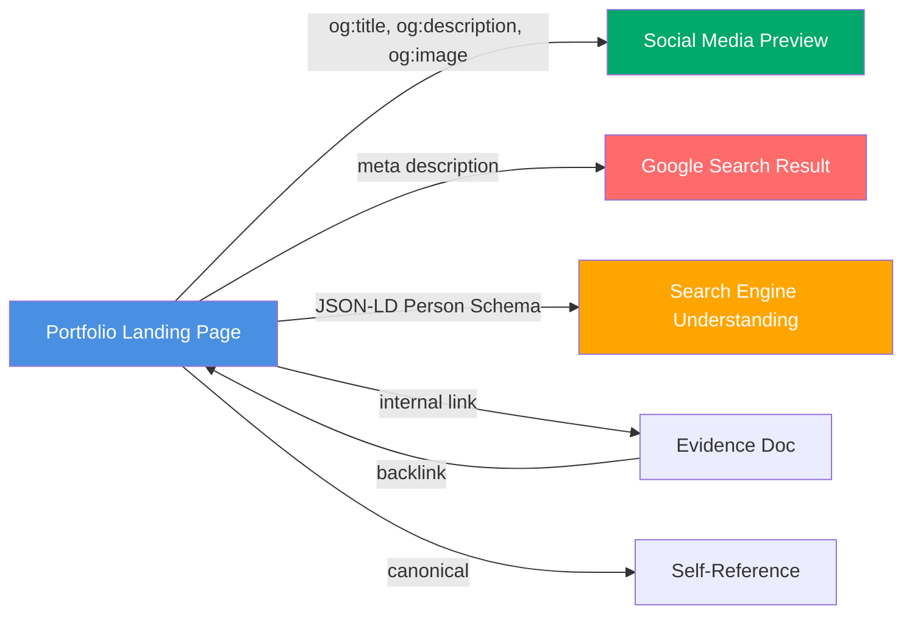

# Stage 4.5: UX Enhancements & SEO Optimization — Documentation

**Type:** Documentation / Architecture Guide  
**Phase:** Phase 4 — Enterprise-Grade Platform Maturity  
**Stage:** 4.5  
**Linked Issue:** [Stage 4.5 — UX Enhancements & SEO Optimization (App)](./stage-4-5-app-issue.md)  
**Duration Estimate:** 2–2.5 hours  
**Assignee:** [Technical Writer / Architect]

---

## Overview

Document the UX architecture, theming system, navigation patterns, and SEO implementation strategy for Stage 4.5. This stage produces architecture guides and operational documentation that explain design decisions, implementation patterns, and best practices for the portfolio's user experience and search engine visibility. Complements app implementation with rationale, troubleshooting guides, and future extensibility paths.

## Objectives

- Document UX architecture: navigation patterns, theme system design, animation strategy
- Create SEO implementation guide with metadata strategy and structured data explanation
- Document bidirectional evidence linking between portfolio and docs
- Provide troubleshooting guides for common theme/nav/animation issues
- Record design decisions and trade-offs for future reference
- Provide upgrade paths for Phase 5 enhancements (blog, advanced search, etc.)

---

## Scope

### Files to Create

1. **`docs/60-projects/portfolio-app/09-ux-strategy.md`** — UX architecture, navigation, and design patterns
   - Type: Architecture/Reference Guide
   - Purpose: Explain UX patterns, design system, accessibility approach
   - Audience: Future developers, product reviewers, UX stakeholders

2. **`docs/60-projects/portfolio-app/10-seo-strategy.md`** — SEO implementation and metadata strategy
   - Type: Reference/Technical Guide
   - Purpose: Document SEO metadata structure, JSON-LD schemas, sitemap strategy
   - Audience: Developers maintaining SEO, content reviewers, search engine optimizers

3. **`docs/60-projects/portfolio-app/11-theme-system-guide.md`** — Theme system implementation details
   - Type: Technical Reference
   - Purpose: Explain CSS variables, theme switching, dark mode implementation
   - Audience: Developers extending theme, future theme enhancements (Phase 5+)

### Files to Update

1. **`docs/60-projects/portfolio-app/01-overview.md`** — Update main dossier with links to Stage 4.5
   - Update section: Stage/Phase overview
   - Reason: Link to UX and SEO documentation for completeness

2. **`docs/60-projects/portfolio-app/02-architecture.md`** — Add UX architecture reference
   - Update section: Architecture diagram or subsystem overview
   - Reason: Include UX subsystem (navigation, theming, animations) in architecture

3. **`docs/_meta/templates/README.md`** — Add UX strategy reference template (optional)
   - Add guidance for: How to document UX patterns in project dossiers
   - Reason: Establish pattern for future portfolio documentation

4. **`docs/70-reference/cli-commands.md`** — Add any new commands related to theme/seo (if applicable)
   - Add: Documentation of any new npm scripts for bundling analysis or theme verification
   - Reason: Maintain reference guide completeness

5. **`docs/00-portfolio/index.md`** or Phase 4 summary — Add Stage 4.5 summary
   - Update section: Phase 4 completion summary
   - Reason: Document delivery of UX/SEO polish as final Phase 4 stage

---

## Content Structure & Design

### Document Type & Template

**Primary documents:** Technical Reference Guides (with Architecture Decision sections where applicable)

**Template:** Architecture/Reference template from `docs/_meta/templates/README.md`

**Front Matter:**

```yaml
---
title: '[Document Title]'
description: '[1–2 sentence summary]'
sidebar_position: [number]
tags: [ux, seo, architecture, theme, navigation]
---
```

### Content Outline

#### Document 1: UX Strategy (`09-ux-strategy.md`)

**Purpose:** Explain user experience architecture, design patterns, and accessibility approach for portfolio app.

**Key sections to cover:**

1. **Overview & Goals**
   - What: UX strategy objective (elevate from functional to polished enterprise-grade)
   - Why: Portfolio first impression matters; UX reflects engineering discipline
   - Audience: Reviewers, future developers, product stakeholders

2. **Design System Overview**
   - Visual identity (colors, typography, spacing)
   - Theme system (light/dark mode implementation)
   - Component patterns (sticky header, animations, accessibility)

3. **Navigation Architecture**
   - Sticky header pattern rationale
   - Navigation link structure (Home, CV, Projects, Docs, etc.)
   - Mobile responsiveness (hamburger menu pattern)
   - Keyboard navigation and accessibility

4. **Theme System Deep Dive**
   - CSS variable architecture (colors, spacing, effects)
   - Dark mode implementation (class-based, localStorage, system preference)
   - Theme switching mechanism (ThemeToggle component)
   - Contrast ratios and WCAG compliance

5. **Animation Strategy**
   - Performance-first approach (CSS transforms, Intersection Observer)
   - Animation types:
     - Fade-in-on-scroll (lazy reveal as user scrolls)
     - Hover effects (interactive feedback)
     - Page transitions (smooth between routes)
   - `prefers-reduced-motion` respect (accessibility)
   - Trade-offs: Simplicity vs. advanced animation libraries

6. **Accessibility Standards**
   - WCAG AA compliance (contrast, keyboard nav, ARIA labels)
   - Component accessibility patterns
   - Testing approach (manual + automated tools)
   - Common pitfalls and how to avoid them

7. **Best Practices & Patterns**
   - How to maintain theme consistency
   - When to add new animations (performance budget)
   - Extending navigation (adding new links)
   - Mobile-first responsive design approach

8. **Troubleshooting & Common Issues**
   - Theme doesn't persist → localStorage debugging
   - Hydration errors → useState + useEffect pattern
   - Menu doesn't close → event handler verification
   - Animations causing layout shift → CSS transform verification

9. **Future Enhancements (Phase 5+)**
   - Advanced animations with Framer Motion
   - Search UI integration
   - Blog/case study navigation patterns
   - Dark mode system theme expansion (multiple themes, not just light/dark)

**Examples to include:**

- CSS variables code block (light and dark themes)
- ThemeToggle component implementation snippet
- NavigationEnhanced component structure diagram
- Accessibility checklist (what to verify)

**Diagrams:**



---

#### Document 2: SEO Strategy (`10-seo-strategy.md`)

**Purpose:** Document SEO metadata implementation, structured data strategy, and optimization approach.

**Key sections to cover:**

1. **SEO Overview & Goals**
   - What: Complete SEO metadata implementation (OG, Twitter, JSON-LD, sitemap)
   - Why: Search visibility + social media presence matter for portfolio discoverability
   - Target: Rank for keywords (full-stack engineer, Next.js portfolio, etc.)

2. **Metadata Architecture**
   - Layout metadata (global)
   - Dynamic metadata per page (template-based titles)
   - Meta tags hierarchy (title, description, OG, Twitter, canonical)
   - Why this structure (reusability, maintainability)

3. **Meta Tags Strategy**
   - **Title Tags**
     - Format: `[Page Name] | Portfolio`
     - Default: `Portfolio — Enterprise-Grade Full-Stack Engineering`
     - Why: Keywords, brand, conciseness (50–60 chars)
   - **Description Tags**
     - Purpose: Snippet in search results
     - Format: 150–160 characters, action-oriented
     - Example: "Full-stack engineer portfolio with Next.js, TypeScript, and enterprise DevOps maturity."
   - **Open Graph (OG) Tags**
     - og:title, og:description, og:image, og:url, og:type
     - Purpose: Rich preview on social media (Facebook, LinkedIn, Slack, etc.)
     - Image: 1200x630 PNG/JPG at `public/og-image.png`
   - **Twitter Card Tags**
     - twitter:card (summary_large_image), twitter:title, twitter:description, twitter:image
     - Purpose: Rich preview on Twitter/X
     - Complement to OG tags

4. **Structured Data (JSON-LD)**
   - **Person Schema**
     - Fields: name, url, image, sameAs (social profiles)
     - Purpose: Semantic meaning; helps search engines understand "who" the portfolio is
     - Example schema code block
   - **WebSite Schema**
     - Fields: url, name, description, search action
     - Purpose: Search enhancement (sitelinks search box)
     - Example schema code block
   - **Optional: BreadcrumbList** (for complex sites; may not apply to portfolio)
     - Purpose: Navigation context in search results
     - Can defer to Phase 5

5. **Sitemap & Robots Strategy**
   - **robots.txt** (public/robots.txt)
     - Allow all user agents
     - Reference sitemap
     - Example file
   - **sitemap.xml** (public/sitemap.xml or auto-generated)
     - List all pages: /, /cv, /projects, /projects/[slug]
     - Include lastmod, changefreq, priority
     - Example file

6. **Evidence Linking Strategy**
   - **Bidirectional Links**
     - Portfolio → Docs: Each major claim links to evidence (threat model, architecture, etc.)
     - Docs → Portfolio: Documentation pages link back to portfolio sections
     - Purpose: Cross-validation (portfolio claims are evidence-backed)
   - **Link Format**
     - Portfolio: "See my security posture → [link to threat model]"
     - Docs: "Referenced in portfolio app's [section]"
   - **Implementation**
     - Use config helpers (docsUrl(), DOCS_BASE_URL)
     - No hardcoded URLs
     - All links validated during build

7. **SEO Best Practices**
   - Unique, descriptive titles and descriptions
   - Include target keywords naturally (not keyword stuffing)
   - Mobile-first responsive design (ranking factor)
   - Fast load times (LCP < 2.5s; ranking factor)
   - Clean, semantic HTML (h1, h2, h3 hierarchy)
   - Internal linking (topic clustering, navigation paths)
   - Accessibility (WCAG AA; indirectly affects SEO)

8. **Optimization Checklist**
   - Page speed (Lighthouse Performance >= 90)
   - Metadata completeness (title, description, OG, Twitter)
   - JSON-LD valid (Google Rich Results Test)
   - Sitemap accessible and up-to-date
   - robots.txt allows indexing
   - All links working (no 404s for internal/evidence links)
   - Mobile responsiveness verified
   - Canonical URLs set correctly

9. **Monitoring & Maintenance**
   - Google Search Console: Monitor indexing, impressions, rankings
   - Google Analytics: Track organic traffic
   - Quarterly audit: Title/description accuracy, link health
   - Yearly: Refresh sitemap, verify robots.txt

10. **Future Enhancements (Phase 5+)**
    - Blog posts (more content = better SEO)
    - Case studies (rich content, more keywords)
    - Internal search (Algolia or fuse.js)
    - Dynamic structured data (Articles for blog posts)

**Examples to include:**

- Complete metadata object from layout.tsx (code block)
- Person schema JSON (code block)
- WebSite schema JSON (code block)
- Sample robots.txt (code block)
- Sample sitemap.xml (code block)

**Diagrams:**



---

#### Document 3: Theme System Guide (`11-theme-system-guide.md`)

**Purpose:** Technical reference for implementing and extending the theme system.

**Key sections to cover:**

1. **Theme Architecture Overview**
   - CSS Variables: Foundation (light and dark themes)
   - Tailwind Config: Integration with Tailwind dark mode
   - React Component (ThemeToggle): User control layer
   - Implementation layers (CSS → Tailwind → Components)

2. **CSS Variables Reference**
   - Light theme variables:
     - `--bg-primary, --bg-secondary`
     - `--text-primary, --text-secondary`
     - `--border, --shadow, --accent`
   - Dark theme overrides: Same variable names, different values
   - Design rationale (why these variables, how they're used)

3. **Theme Switching Mechanism**
   - localStorage API: Where preference is stored
   - System preference detection: `window.matchMedia("(prefers-color-scheme: dark)")`
   - Class-based switching: Toggle class on `<html>` element
   - Transition CSS: Smooth color changes (no jarring)
   - Hydration safety: Use mounted flag to prevent SSR/client mismatch

4. **Extending the Theme**
   - Adding new colors (e.g., accent colors for links)
   - Adding new theme variants (e.g., high-contrast mode)
   - Testing new themes for contrast compliance (WCAG AA: 4.5:1 minimum)
   - Performance implications (minimal; CSS variables are efficient)

5. **Accessibility Compliance**
   - Contrast ratio targets (4.5:1 for normal text, 3:1 for large text)
   - Testing tools (WebAIM, aXe, WAVE browser extensions)
   - `prefers-reduced-motion` respect (no animations if user preference set)
   - Color alone shouldn't convey information (support text, icons)

6. **Troubleshooting Guide**
   - Theme doesn't apply: Check class on `<html>`, verify CSS loaded
   - Contrast insufficient: Use contrast checker tool, adjust variables
   - Animations janky in dark mode: Check will-change, simplify animations
   - localStorage not working: Check browser privacy settings, use fallback

7. **Best Practices**
   - Use CSS variables for all colors (no hardcoded colors)
   - Test every new component in both themes
   - Use Tailwind's `dark:` prefix for Tailwind-based utilities
   - Keep transition timing consistent (0.3s standard)
   - Document new theme variables in code comments

8. **Performance Considerations**
   - CSS variables have minimal performance overhead
   - Theme switching doesn't trigger unnecessary re-renders (class-based, not state)
   - Avoid deeply nested CSS variable dependencies
   - Keep animation counts low (performance budget)

9. **Code Examples**
   - Complete CSS variables block
   - ThemeToggle component implementation
   - Tailwind config with darkMode setup
   - Example component using theme variables

**Code blocks to include:**

```css
/* Light theme (root) */
:root {
  --bg-primary: #ffffff;
  --text-primary: #000000;
  /* ... more variables ... */
}

/* Dark theme */
html.dark {
  --bg-primary: #1a1a1a;
  --text-primary: #ffffff;
  /* ... more variables ... */
}

/* Smooth transition */
* {
  transition:
    background-color 0.3s ease,
    color 0.3s ease;
}
```

---

### Cross-References & Link Strategy

**Internal documentation links:**

- Link to: [Stage 4.5 Implementation Guide](../phase-4-implementation-guide.md#stage-45-ux-content-credibility--advanced-features-45-hours)
- Link to: [Future Features](../future-features.md) (for Phase 5+ enhancement paths)
- Link from: [01-overview.md](docs/60-projects/portfolio-app/01-overview.md) (add UX section)
- Link from: [02-architecture.md](docs/60-projects/portfolio-app/02-architecture.md) (add UX subsystem)

**External documentation links:**

- [Next.js Metadata API](https://nextjs.org/docs/app/api-reference/functions/generate-metadata)
- [Tailwind Dark Mode](https://tailwindcss.com/docs/dark-mode)
- [JSON-LD Structured Data](https://json-ld.org/)
- [Google Rich Results Test](https://search.google.com/test/rich-results)
- [WCAG Accessibility Guidelines](https://www.w3.org/WAI/WCAG21/quickref/)

---

## Implementation Tasks

### Phase 1: UX Strategy Documentation (0.75–1 hour)

**Create comprehensive UX architecture guide.**

#### Tasks

- [ ] **Research current UX implementation**
  - Review app PR #61 (Stage 4.4) for UX patterns
  - Review Stage 4.5 app implementation code (layout, components)
  - Document current: Navigation structure, theme system, animation approach
  - Files: Review `src/components/NavigationEnhanced.tsx`, `src/components/ThemeToggle.tsx`, `src/app/layout.tsx`

- [ ] **Draft `docs/60-projects/portfolio-app/09-ux-strategy.md`**
  - Create file with structure outlined above
  - Write sections 1–6 (Overview through Accessibility)
  - Include code examples from actual implementation
  - Add Mermaid diagram showing theme preference logic
  - Files: `docs/60-projects/portfolio-app/09-ux-strategy.md`

- [ ] **Document design decisions & trade-offs**
  - Record why dark mode is class-based (not CSS media query alone)
  - Record why sticky header (not alternative patterns)
  - Record why CSS animations (not Framer Motion for Phase 4)
  - Create "Design Decisions" section or sidebar callout

- [ ] **Add troubleshooting section**
  - Document common UX issues: theme persistence, hydration errors, menu closure
  - Include reproduction steps and solutions
  - Link to relevant GitHub issues or comments if applicable

- [ ] **Document future enhancements**
  - List Phase 5+ UX features: advanced animations, search UI, blog navigation
  - Explain upgrade paths from current implementation

#### Success Criteria for Phase 1

- [ ] UX strategy document complete and comprehensive
- [ ] Design decisions documented with rationale
- [ ] Code examples accurate (match actual implementation)
- [ ] Accessibility section addresses WCAG AA compliance
- [ ] Troubleshooting guide practical and actionable
- [ ] Future enhancements path clear

---

### Phase 2: SEO Strategy Documentation (0.75–1 hour)

**Create comprehensive SEO metadata guide.**

#### Tasks

- [ ] **Research current SEO implementation**
  - Review app PR #61 (Stage 4.4) for SEO changes
  - Review metadata object in layout.tsx (actual implementation)
  - Document current: Meta tags, OG configuration, JSON-LD schemas
  - Verify sitemap.xml and robots.txt exist and are valid
  - Files: Review `src/app/layout.tsx`, `src/lib/structured-data.ts`, `public/sitemap.xml`, `public/robots.txt`

- [ ] **Draft `docs/60-projects/portfolio-app/10-seo-strategy.md`**
  - Create file with structure outlined above
  - Write sections 1–6 (Overview through Robots strategy)
  - Include actual metadata code blocks from layout.tsx
  - Include JSON-LD schema examples
  - Include sample robots.txt and sitemap.xml
  - Add Mermaid diagram showing social preview flow
  - Files: `docs/60-projects/portfolio-app/10-seo-strategy.md`

- [ ] **Document evidence linking strategy**
  - Explain bidirectional linking concept
  - Show examples of portfolio → docs links
  - Show examples of docs → portfolio backlinks
  - Document link validation and best practices

- [ ] **Create SEO best practices checklist**
  - List practices implemented: mobile-first design, fast load times, structured data
  - List practices to maintain: unique titles/descriptions, clean HTML, no broken links
  - Link to monitoring tools (Google Search Console, Analytics)

- [ ] **Document monitoring & maintenance**
  - Suggest quarterly review process
  - List metrics to track (impressions, rankings, organic traffic)
  - Document how to respond to SEO issues (404s, broken links, etc.)

#### Success Criteria for Phase 2

- [ ] SEO strategy document complete and detailed
- [ ] Metadata architecture explained clearly
- [ ] All meta tag types documented with examples
- [ ] Structured data schemas explained with purpose
- [ ] Evidence linking strategy clear and actionable
- [ ] Monitoring approach documented
- [ ] Future enhancements (blog, case studies) integrated into strategy

---

### Phase 3: Theme System Guide (0.5–0.75 hour)

**Create technical reference for theme implementation and extension.**

#### Tasks

- [ ] **Draft `docs/60-projects/portfolio-app/11-theme-system-guide.md`**
  - Create file with structure outlined above
  - Write sections 1–5 (Architecture through Extending)
  - Include complete CSS variables code block
  - Include Tailwind config examples
  - Include ThemeToggle component snippet
  - Files: `docs/60-projects/portfolio-app/11-theme-system-guide.md`

- [ ] **Add accessibility & compliance section**
  - Document WCAG AA contrast ratio requirements
  - Link to contrast testing tools
  - Document `prefers-reduced-motion` implementation
  - Include accessibility testing checklist

- [ ] **Create troubleshooting & best practices**
  - Common theme issues and fixes
  - How to extend with new colors/themes
  - Performance considerations
  - Testing approach for new themes

- [ ] **Include performance considerations**
  - Document CSS variable efficiency
  - Explain why class-based switching (not state-based)
  - Discuss animation performance budget

#### Success Criteria for Phase 3

- [ ] Theme system guide complete and technical
- [ ] CSS variables documented with purpose
- [ ] Implementation details clear (localStorage, class toggling, hydration)
- [ ] Extension guide practical (how to add new colors/themes)
- [ ] Accessibility compliance documented
- [ ] Performance implications explained

---

### Phase 4: Update Existing Dossier Pages (0.5 hour)

**Update main project dossier with links to new UX/SEO documentation.**

#### Tasks

- [ ] **Update `docs/60-projects/portfolio-app/01-overview.md`**
  - Add "User Experience & SEO" section or subsection
  - Link to Stage 4.5 UX strategy, SEO strategy, theme guide
  - Brief summary of what Stage 4.5 delivers (theme, nav, SEO optimization)
  - Update sidebar_position if needed to reflect new docs

- [ ] **Update `docs/60-projects/portfolio-app/02-architecture.md`**
  - Add UX subsystem to architecture diagram (if present)
  - Document navigation and theming as architectural components
  - Link to detailed UX strategy guide for specifics

- [ ] **Add Stage 4.5 summary to `docs/00-portfolio/index.md` or phase-4 summary**
  - Note: If phase-4-summary.md exists, update it with Stage 4.5 completion
  - Document delivery: polished UX, comprehensive SEO, theme system

- [ ] **Verify all cross-links working**
  - Test links in generated docs: `pnpm build`
  - Check for broken link warnings

#### Success Criteria for Phase 4

- [ ] Main dossier updated with UX/SEO references
- [ ] Architecture documentation includes UX subsystem
- [ ] Phase 4 summary includes Stage 4.5 completion note
- [ ] All cross-links valid and buildable
- [ ] No broken link warnings in build output

---

### Phase 5: Build & Validation (0.25–0.5 hour)

**Verify documentation builds correctly and all links work.**

#### Tasks

- [ ] **Build documentation**
  - Run `pnpm build` in portfolio-docs
  - Check for broken link warnings
  - Fix any link errors before merge

- [ ] **Manual validation**
  - Test generated site locally: `pnpm serve` (view at http://localhost:3000/docs)
  - Click through all cross-links (UX strategy → implementation guide, SEO → structured data, etc.)
  - Verify code blocks render correctly (syntax highlighting)
  - Verify Mermaid diagrams render (theme logic diagram, social preview flow diagram)

- [ ] **Quality check**
  - Proofread for spelling, grammar, tone consistency
  - Verify code examples are accurate and runnable
  - Check that all statements have supporting evidence (links or quotes)
  - Ensure Markdown formatting is consistent

- [ ] **Documentation coverage verification**
  - Cross-check against app implementation (ensure docs match code)
  - Verify no TODOs or placeholder text remain
  - Confirm all sections from outline are present and complete

#### Success Criteria for Phase 5

- [ ] Documentation builds without errors or warnings
- [ ] All cross-links clickable and leading to correct pages
- [ ] Code examples accurate and syntax-highlighted
- [ ] Diagrams render correctly
- [ ] No broken links or missing files
- [ ] Documentation tone professional and consistent
- [ ] Ready for code review and merge

---

## Acceptance Criteria

This stage is complete when:

- [ ] `09-ux-strategy.md` created with complete UX documentation (9 sections + examples + diagram)
- [ ] `10-seo-strategy.md` created with complete SEO documentation (10 sections + examples + diagram)
- [ ] `11-theme-system-guide.md` created with technical theme reference (9 sections + examples)
- [ ] Main dossier (`01-overview.md`, `02-architecture.md`) updated with Stage 4.5 references
- [ ] All cross-links validated and working
- [ ] `pnpm build` passes with no broken link warnings
- [ ] Code examples accurate and match actual implementation
- [ ] Accessibility section documents WCAG AA compliance
- [ ] Troubleshooting guides practical and actionable
- [ ] Future enhancement paths documented (Phase 5+)
- [ ] Documentation tone professional and consistent
- [ ] No TODOs or placeholder text remain
- [ ] Diagrams (Mermaid) render correctly
- [ ] Front matter complete (title, description, tags, sidebar_position)
- [ ] PR created with title: `docs: Stage 4.5 - UX and SEO strategy documentation`

---

## Definition of Done

All documentation is complete when:

- ✅ **Content Complete:** All sections written; no TODOs
- ✅ **Accuracy Verified:** Code examples match implementation; links accurate
- ✅ **Links Validated:** All internal/cross-links work; no broken references
- ✅ **Build Success:** `pnpm build` passes; no warnings
- ✅ **Professionally Written:** Tone consistent; spelling/grammar correct
- ✅ **Accessibility Documented:** WCAG AA compliance explained; testing approaches included
- ✅ **Troubleshooting Included:** Common issues and fixes documented
- ✅ **Future Paths Documented:** Phase 5+ upgrade paths and extensions clear
- ✅ **Cross-Referenced:** Links bidirectional between new and existing docs
- ✅ **Code Examples Proper:** Syntax highlighted; runnable; relevant
- ✅ **Diagrams Included:** Mermaid diagrams render and clarify complex concepts

---

## Reference Material Documentation

### Purpose & Audience

- **UX Strategy Audience:** Future developers, UX reviewers, product stakeholders
- **SEO Strategy Audience:** SEO maintainers, content reviewers, developers optimizing for search
- **Theme Guide Audience:** Developers extending theme system, future Phase 5+ work

### Key Concepts Documented

**UX Strategy:**

1. Navigation architecture (sticky header, mobile menu, links)
2. Theme system (CSS variables, dark mode, localStorage)
3. Animation strategy (performance-first, Intersection Observer)
4. Accessibility standards (WCAG AA compliance)
5. Design patterns and best practices

**SEO Strategy:**

1. Metadata architecture (title, description, OG, Twitter, canonical)
2. Structured data (JSON-LD Person, WebSite schemas)
3. Sitemap and robots strategy
4. Evidence linking (bidirectional portfolio ↔ docs)
5. Best practices and monitoring approach

**Theme System:**

1. CSS variables (light and dark themes)
2. Tailwind integration (darkMode: 'class')
3. React component (ThemeToggle)
4. Implementation layers (CSS → Tailwind → Components)
5. Extension and customization guide

### Usage Examples

**How to add a new theme color:**

1. Define CSS variable in `:root` (light) and `html.dark` (dark) in globals.css
2. Reference variable in component: `color: var(--new-color)`
3. Test in both light and dark modes
4. Verify contrast compliance (WCAG AA)

**How to create a bidirectional evidence link:**

1. In portfolio: "See my security posture → [link to /docs/40-security/threat-models/...]"
2. In docs: "This threat model is referenced in the portfolio app [section]"
3. Both links should resolve correctly and validate during build

**How to extend dark mode with new theme:**

1. Add new class variant (e.g., `html.high-contrast`)
2. Define new CSS variables with adjusted values
3. Add theme selector in ThemeToggle (if expanding beyond light/dark)
4. Test contrast and accessibility
5. Document in theme guide

### Best Practices Documented

- **UX:** Use CSS variables for consistency; test every component in both themes; keep animations < 300ms
- **SEO:** Unique titles/descriptions per page; include keywords naturally; validate JSON-LD; monitor in Search Console
- **Theme:** CSS-based (not JavaScript state) for performance; respect system preference; smooth transitions

### Troubleshooting Guide

**Common UX Issues:**

- Theme doesn't persist: Check localStorage access and browser privacy settings
- Hydration errors: Use mounted state flag before rendering theme-dependent UI
- Mobile menu doesn't close: Verify click handlers on menu items

**Common SEO Issues:**

- Metadata not in preview: Verify OG image URL is valid and accessible
- JSON-LD not validating: Use Google Rich Results Test; check schema syntax
- Sitemap outdated: Regenerate after adding new routes

**Common Theme Issues:**

- Colors not changing: Check CSS variables loaded and class toggled on `<html>`
- Contrast insufficient: Use contrast checker tool; adjust variable values

---

## Integration with Existing Docs

### Cross-References

**Links to existing docs:**

- Link to: [Phase 4 Implementation Guide](../phase-4-implementation-guide.md) (parent stage documentation)
- Link to: [Future Features](../future-features.md) (Phase 5+ enhancements referenced)
- Link from: [Project Dossier Overview](../../../60-projects/portfolio-app/01-overview.md)
- Link from: [Project Architecture](../../../60-projects/portfolio-app/02-architecture.md)

**External links:**

- [Next.js Metadata API](https://nextjs.org/docs/app/api-reference/functions/generate-metadata)
- [Tailwind Dark Mode Configuration](https://tailwindcss.com/docs/dark-mode)
- [JSON-LD Documentation](https://json-ld.org/)
- [Google Search Console](https://search.google.com/search-console/)
- [WCAG 2.1 Guidelines](https://www.w3.org/WAI/WCAG21/quickref/)

### Updates Required in Existing Pages

1. **`docs/60-projects/portfolio-app/01-overview.md`**
   - Add section: "User Experience & SEO (Stage 4.5)"
   - Add links to new UX, SEO, theme guide documents
   - Update stage summary to include UX polish

2. **`docs/60-projects/portfolio-app/02-architecture.md`**
   - Add UX subsystem to architecture diagram
   - Document navigation and theme as components
   - Link to detailed architecture docs

3. **`docs/00-portfolio/index.md`** (or phase-4-summary.md if exists)
   - Add Stage 4.5 completion note
   - Document delivery: theme system, navigation enhancements, SEO optimization

---

## Implementation & Content Strategy

### Phase-Based Content Development

1. **Phase 1 (Research & Outline):** Read implementation code, document current state
2. **Phase 2 (Documentation Drafting):** Write all sections with examples
3. **Phase 3 (Examples & Diagrams):** Add code blocks, create Mermaid diagrams
4. **Phase 4 (Cross-Linking):** Update existing docs, verify all links
5. **Phase 5 (Build & Validation):** Generate docs site, test navigation, fix issues

### Content Quality Standards

- **Accuracy:** Examples match actual implementation code
- **Clarity:** Explain "why" not just "what"; accessible to varied audiences
- **Completeness:** No TODOs; all sections addressed
- **Consistency:** Tone, formatting, terminology consistent across documents
- **Accessibility:** Code examples have syntax highlighting; diagrams clear; links descriptive

---

## Effort Breakdown

| Phase     | Task                                     | Hours      | Notes                                        |
| --------- | ---------------------------------------- | ---------- | -------------------------------------------- |
| 1         | Research UX implementation + draft guide | 0.75h      | Reference app PR #61 and implementation code |
| 2         | Draft SEO strategy + examples            | 0.75h      | Metadata, schemas, evidence linking          |
| 3         | Draft theme guide + technical details    | 0.5h       | CSS vars, Tailwind config, examples          |
| 4         | Update existing dossier pages            | 0.5h       | Add Stage 4.5 references and links           |
| 5         | Build verification + link validation     | 0.25h      | `pnpm build`, manual testing                 |
| **Total** | **Stage 4.5 Docs Complete**              | **2–2.5h** | **Comprehensive documentation delivery**     |

---

## Success Verification Checklist

Before marking this stage complete:

- [ ] All documentation files created (3 new files)
- [ ] All sections written (no TODOs)
- [ ] Code examples accurate and syntax-highlighted
- [ ] Mermaid diagrams created and rendering
- [ ] Cross-links verified and working
- [ ] Existing dossier pages updated with Stage 4.5 references
- [ ] Build passes: `pnpm build` with no warnings
- [ ] Manual navigation testing complete (all links clickable)
- [ ] Proofreading complete (spelling, grammar, consistency)
- [ ] Accessibility section comprehensive (WCAG AA documented)
- [ ] Troubleshooting guides practical and actionable
- [ ] Future enhancements path documented (Phase 5+)
- [ ] Code review passed
- [ ] PR merged to `main`
- [ ] Linked PR [App Issue](./stage-4-5-app-issue.md) also complete and merged

---

## Troubleshooting & Common Issues

### Documentation Issues & Fixes

**Issue: Code examples don't match actual implementation**

- **Cause:** Implementation changed after documentation drafted
- **Fix:** Re-read implementation code; update examples to match current code
- **Prevention:** Cross-check examples against actual files before finalizing

**Issue: Broken link in generated docs**

- **Cause:** Typo in link path or incorrect file name
- **Fix:** Verify file exists at path; check path formatting
- **Prevention:** Test all links in generated site before merge

**Issue: Mermaid diagram doesn't render**

- **Cause:** Incorrect Mermaid syntax or missing triple backticks
- **Fix:** Validate syntax on [mermaid.live](https://mermaid.live); check formatting
- **Prevention:** Test diagram in mermaid.live before adding to docs

### Content Issues & Fixes

**Issue: UX explanation too technical for non-developers**

- **Cause:** Audience unclear; too much implementation detail
- **Fix:** Add "for non-technical audiences" section; simplify explanations
- **Prevention:** Write for multiple audiences; explain "why" before "how"

**Issue: SEO metadata strategy seems incomplete**

- **Cause:** Missing section or insufficient examples
- **Fix:** Add missing sections; include more real examples from implementation
- **Prevention:** Cross-check against outline; verify all sections present

---

## Notes & Assumptions

- **Assumption:** Implementation (app Stage 4.5) is complete and merged when documentation begins
- **Assumption:** Code examples sourced from merged app PR #61
- **Assumption:** Audience includes both developers and product/UX reviewers
- **Design constraint:** Phase 4.5 focused on documentation; extensive blog/case study content deferred to Phase 5
- **Technical debt:** Advanced theme extensions (multiple themes, not just light/dark) documented as future work (Phase 5+)
- **Risk:** If app implementation changes after docs drafted, examples may need updates (mitigate by cross-checking before merge)

---

## Related Issues

- **Paired App Issue:** [Stage 4.5 — UX Enhancements & SEO Optimization (App)](./stage-4-5-app-issue.md)
- **Blocked by:** Stage 4.5 App implementation must be complete before documentation can be finalized
- **Related documentation:**
  - [Phase 4 Implementation Guide](../phase-4-implementation-guide.md)
  - [Future Features & Advanced Enhancements](../future-features.md) (Phase 5+ content and blog)

---
