# Phase 4 Implementation Guide — Enterprise-Grade Platform Maturity

**Phase:** Phase 4 (Reliability, Performance & Security Hardening)  
**Estimated Duration:** 28–36 hours (7–9 hours/week, assuming 4-week sprint)  
**Status:** Ready to Execute  
**Last Updated:** 2026-01-24

## Purpose

Elevate the Portfolio Program from "well-architected professional project" to "production-grade platform" by introducing real-world DevOps complexity, performance discipline, security rigor, and demonstrable operational maturity. Phase 4 emphasizes that engineering credibility extends beyond code correctness into deployment strategy, observability, and incident preparedness.

By the end of Phase 4, reviewers will see a platform that manages multiple environments, monitors its health, secures its perimeter, and responds to failure systematically—hallmarks of serious infrastructure.

## What Phase 4 Delivers

- **Multi-Environment Architecture:** Explicit `preview` → `staging` → `production` promotion flow with immutable builds and environment parity
- **Performance as a Control:** Route-level caching strategy, static vs. dynamic rendering decisions, asset optimization, and build size tracking
- **Operational Observability:** Health checks, structured logging, metrics, runbooks for degradation and incident response
- **Security Hardening:** Threat model extensions for deployment surface and runtime, hardened headers, CSP policy, dependency audit policy
- **UX & Content Credibility:** Rich content (case studies, blog), interactive features (contact form), enhanced navigation, SEO optimization, and bidirectional evidence linking
- **Evidence-Driven Documentation:** Updated threat model, multi-environment ADRs, performance runbooks, and security posture artifacts

---

## Prerequisites

Before starting Phase 4, ensure:

- ✅ Phase 3 complete and verified (all stages 3.1–3.6 merged to `main`)
- ✅ Both repos on `main` branch with no uncommitted changes
- ✅ Vercel preview/staging/production deployments active for portfolio-app
- ✅ Current threat model accessible and reviewable
- ✅ Performance baseline established (you can run `pnpm build` and note build time)
- ✅ Team alignment on Phase 4 scope (multi-env, observability, hardening)
- ✅ Access to Vercel project settings for environment configuration

**Verification checklist:**

```bash
# Portfolio App
cd portfolio-app
git branch  # Confirm on main
pnpm verify  # All checks pass
pnpm build   # Note build time and size for baseline

# Portfolio Docs
cd ../portfolio-docs
git branch  # Confirm on main
pnpm build   # Docusaurus builds clean
```

---

## Implementation Overview

Phase 4 consists of **5 modular stages** that can proceed in parallel where dependencies allow:

- **Stage 4.1:** Multi-Environment Deployment Strategy (2–3 hours) — Foundational; should complete first
- **Stage 4.2:** Performance Optimization & Measurement (4–6 hours) — Can proceed independently
- **Stage 4.3:** Observability & Operational Readiness (4–6 hours) — Depends on Stage 4.1
- **Stage 4.4:** Security Posture Deepening (4–6 hours) — Can proceed independently
- **Stage 4.5:** UX, Content Credibility & Advanced Features (6–8 hours) — Can proceed independently

---

## STAGE 4.1: Multi-Environment Deployment Strategy (2–3 hours)

**What:** Define explicit environment separation (`preview` / `staging` / `production`) with immutable builds, environment-specific configuration via env vars, and no hardcoded environment-specific logic.

**Key Files/Components:**

- Portfolio App:
  - `.env.example` (update with environment variables for each tier)
  - `vercel.json` (update or create with environment overrides)
  - `src/lib/config.ts` (verify environment-aware helpers)
  - New: Environment promotion ADR

- Documentation App:
  - New: Environment model documentation
  - New: Environment promotion runbook
  - New: Deployment flow diagrams

**Design Specifications:**

### Environment Model

```mermaid
graph TB
    Start([Git Push to PR]) --> PreviewDeploy["Preview Deployment<br/>(Auto)<br/>portfolio-app-[pr-number].vercel.app"]
    PreviewDeploy --> PreviewCheck{CI Gates<br/>Pass?}
    PreviewCheck -->|Fail| Failed1(["❌ Fix & Retry"])
    PreviewCheck -->|Pass| Review["Manual Review<br/>& Approval"]
    Review --> Merge([Git Merge to main])
    Merge --> StagingDeploy["Staging Deployment<br/>(Manual)<br/>staging.portfolio.example.com"]
    StagingDeploy --> StagingTest{Smoke Test<br/>Pass?}
    StagingTest -->|Fail| Failed2(["❌ Investigate & Fix"])
    StagingTest -->|Pass| PromoteCheck["Manual Promotion<br/>Check"]
    PromoteCheck --> ProdDeploy["Production Deployment<br/>(Manual)<br/>portfolio.example.com"]
    ProdDeploy --> HealthCheck{Health Checks<br/>Pass?}
    HealthCheck -->|Fail| Failed3(["❌ Rollback"])
    HealthCheck -->|Pass| Success(["✅ Production Ready"])

    style Start fill:#339af0,stroke:#1971c2,stroke-width:2px,color:#fff
    style PreviewDeploy fill:#ffd43b,stroke:#fab005,stroke-width:2px,color:#000
    style StagingDeploy fill:#ffd43b,stroke:#fab005,stroke-width:2px,color:#000
    style ProdDeploy fill:#51cf66,stroke:#2f9e44,stroke-width:2px,color:#fff
    style Success fill:#51cf66,stroke:#2f9e44,stroke-width:3px,color:#fff
    style Failed1 fill:#ff6b6b,stroke:#c92a2a,stroke-width:2px,color:#fff
    style Failed2 fill:#ff6b6b,stroke:#c92a2a,stroke-width:2px,color:#fff
    style Failed3 fill:#ff6b6b,stroke:#c92a2a,stroke-width:2px,color:#fff
    style Review fill:#339af0,stroke:#1971c2,stroke-width:2px,color:#fff
    style PromoteCheck fill:#339af0,stroke:#1971c2,stroke-width:2px,color:#fff
    style Merge fill:#339af0,stroke:#1971c2,stroke-width:2px,color:#fff
```



**Environment Promotion Flow:** Pull requests trigger auto-deployment to preview with CI validation. After merge to main and manual review, code promotes to staging for smoke testing, then to production with post-deployment health checks. Failures at any stage trigger investigation or rollback.

### Environment Variable Contract

**Portfolio App (`src/lib/config.ts`):**

```typescript
// Environment-specific variables
export const ENVIRONMENT = process.env.VERCEL_ENV || 'development'; // 'preview' | 'staging' | 'production' | 'development'
export const SITE_URL =
  process.env.NEXT_PUBLIC_SITE_URL || 'http://localhost:3000';
export const DOCS_BASE_URL = process.env.NEXT_PUBLIC_DOCS_BASE_URL || '/docs';
export const GITHUB_URL = process.env.NEXT_PUBLIC_GITHUB_URL || '';
export const DOCS_GITHUB_URL = process.env.NEXT_PUBLIC_DOCS_GITHUB_URL || '';

// Derived helpers
export function isProduction(): boolean {
  return ENVIRONMENT === 'production';
}

export function isStaging(): boolean {
  return ENVIRONMENT === 'staging';
}

export function isPreview(): boolean {
  return ENVIRONMENT === 'preview';
}

export function isDevelopment(): boolean {
  return ENVIRONMENT === 'development' || !process.env.VERCEL_ENV;
}
```

### Immutable Build Principle

- Every production build is tagged with commit SHA and deployed without rebuilding
- Staging/preview builds from the same artifact (no per-environment rebuilds)
- Environment configuration is applied at **runtime**, not build time

**Verification Rules:**

1. No environment-specific code paths in source files (use env vars instead)
2. `NEXT_PUBLIC_*` variables are prefixed with `NEXT_PUBLIC_` (Next.js convention for client-side)
3. Secrets (if any) use non-`NEXT_PUBLIC_*` variables (server-side only)
4. Build artifacts are identical across environments; only env vars differ

### CI Integration & Environment Promotion

- **Preview:** Auto-deployed on every PR; CI gates must pass
- **Staging:** Manual promotion from `main`; triggered via GitHub Actions workflow dispatch or Vercel UI
- **Production:** Manual promotion from staging or directly from `main` after review; includes health checks post-deploy

**Files to Create/Modify:**

- [ ] `.env.example` (update with all environment variables)
- [ ] `vercel.json` (create or update; define environment overrides for staging/prod)
- [ ] `src/lib/config.ts` (add `ENVIRONMENT`, `isProduction()`, etc. helpers)
- [ ] `docs/10-architecture/adr/adr-0013-multi-environment-deployment.md` (NEW)
- [ ] `docs/50-operations/runbooks/rbk-portfolio-environment-promotion.md` (NEW)

**Success check:**

- [ ] `.env.example` documents all environment variables with descriptions
- [ ] `vercel.json` specifies environment overrides for staging/production (if needed)
- [ ] `src/lib/config.ts` has helpers for environment detection
- [ ] Promotion workflows exist and are documented
- [ ] Local dev works with default values; staging/prod override via env vars
- [ ] No hardcoded URLs or environment-specific logic in code
- [ ] PR created with title: `feat: Stage 4.1 - Multi-environment deployment strategy`

**Related documentation:**

- ADR-0013: Multi-Environment Deployment Strategy (create with rationale for preview/staging/production tier)
- Runbook: Environment Promotion & Rollback

---

## STAGE 4.2: Performance Optimization & Measurement (4–6 hours)

**What:** Introduce caching strategy, static vs. dynamic rendering decisions, asset optimization, and performance instrumentation (build size tracking, load time assumptions, route-level metrics).

**Key Files/Components:**

- Portfolio App:
  - `next.config.ts` (caching headers, optimization settings)
  - `src/app/layout.tsx` (update metadata with performance hints)
  - `src/app/projects/[slug]/page.tsx` (static generation strategy)
  - New: Performance monitoring/metrics collection (lightweight)
  - `package.json` (add performance measurement scripts)

- Documentation App:
  - New: Performance architecture section
  - New: Performance optimization runbook

**Design Specifications:**

### Caching Strategy

**Static Routes (Cached Forever):**

```typescript
// src/app/layout.tsx
export const revalidate = false; // Disable ISR; cache forever

// Static routes
export const metadata: Metadata = {
  // ...
};
```

**Dynamic Routes (Revalidated On-Demand):**

```typescript
// src/app/projects/[slug]/page.tsx
export const revalidate = 3600; // Revalidate every 1 hour (ISR)

export async function generateStaticParams() {
  // Pre-render all project slugs at build time
  return PROJECTS.map((p) => ({ slug: p.slug }));
}
```

**API Routes (if added later):**

```typescript
// src/app/api/health/route.ts (no caching)
export const revalidate = 0;
```

### Asset Optimization

- Images: Serve optimized formats (WebP), responsive sizes, lazy loading
- Fonts: Minimal font weight/face; load only what's rendered above-fold
- JavaScript: Code split by route; minimize vendor code bundled upfront
- CSS: Tree-shake unused styles (Tailwind already does this)

**Build Size Tracking:**

```bash
# Add to package.json
"scripts": {
  "analyze:bundle": "ANALYZE=true pnpm build"
}

# Use @next/bundle-analyzer to generate a report
```

**Performance Metrics (Lightweight):**

- Track build size: `pnpm run analyze:bundle` and save baseline
- Document assumptions about route load times (e.g., "Homepage should load in < 2s on 4G")
- Use Vercel Analytics to monitor real-world Core Web Vitals (if enabled)

**Files to Create/Modify:**

- [ ] `next.config.ts` (add caching headers, image optimization, bundle analyzer)
- [ ] `src/app/layout.tsx` (add performance-related metadata hints)
- [ ] `src/app/projects/[slug]/page.tsx` (add static generation with ISR)
- [ ] `package.json` (add bundle analysis script)
- [ ] `docs/60-projects/portfolio-app/01-overview.md` or new `07-performance.md` (NEW: Performance architecture section)
- [ ] `docs/50-operations/runbooks/rbk-portfolio-performance-optimization.md` (NEW)

**Configuration Examples:**

```typescript
// next.config.ts
import type { NextConfig } from 'next';

const nextConfig: NextConfig = {
  images: {
    remotePatterns: [
      {
        protocol: 'https',
        hostname: '**', // Allow images from anywhere for now
      },
    ],
    deviceSizes: [640, 750, 828, 1080, 1200, 1920, 2048, 3840],
    imageSizes: [16, 32, 48, 64, 96, 128, 256, 384],
  },
  compress: true, // Enable gzip compression
  poweredByHeader: false, // Remove X-Powered-By header
  headers: async () => [
    {
      source: '/:path*',
      headers: [
        {
          key: 'Cache-Control',
          value: 'public, max-age=3600, stale-while-revalidate=86400',
        },
      ],
    },
  ],
};

export default nextConfig;
```

**Success check:**

- [ ] Static routes have explicit caching strategies (revalidate: false or specific ISR interval)
- [ ] Project pages use `generateStaticParams()` for pre-rendering
- [ ] Images are optimized (responsive, lazy-loaded)
- [ ] Build size is tracked and documented
- [ ] Performance assumptions are documented in dossier
- [ ] Vercel Analytics is enabled and showing data
- [ ] PR created with title: `feat: Stage 4.2 - Performance optimization & measurement`

**Related documentation:**

- Updated dossier section: Performance & Caching Strategy
- Runbook: Performance Optimization & Monitoring

---

## STAGE 4.3: Observability & Operational Readiness (4–6 hours)

**What:** Add health checks, structured logging, failure mode documentation, and runbooks for degradation/incident scenarios.

**Key Files/Components:**

- Portfolio App:
  - `src/app/api/health/route.ts` (NEW: Health check endpoint)
  - `src/lib/observability.ts` (NEW: Structured logging helpers)
  - `next.config.ts` (add error handling configuration)

- Vercel Console / External Monitoring (Future):
  - Logs configuration for Vercel
  - Optional: Lightweight metrics export (e.g., StatsD, if justified)

- Documentation App:
  - New: Observability architecture section
  - New: Runbooks for common failure scenarios
  - New: Operational runbooks index

**Design Specifications:**

### Health Check Endpoint

```typescript
// src/app/api/health/route.ts
import { NextRequest, NextResponse } from 'next/server';
import { PROJECTS } from '@/data/projects';

export const revalidate = 0; // No caching

export async function GET(request: NextRequest) {
  try {
    // Verify critical resources are accessible
    const projectCount = PROJECTS.length;
    const buildTime = process.env.BUILD_TIME || 'unknown';
    const commit = process.env.VERCEL_GIT_COMMIT_SHA?.slice(0, 7) || 'unknown';
    const environment = process.env.VERCEL_ENV || 'development';

    if (projectCount === 0) {
      return NextResponse.json(
        {
          status: 'degraded',
          message: 'No projects loaded',
          timestamp: new Date().toISOString(),
        },
        { status: 503 }
      );
    }

    return NextResponse.json(
      {
        status: 'healthy',
        timestamp: new Date().toISOString(),
        environment,
        commit,
        buildTime,
        projectCount,
      },
      { status: 200 }
    );
  } catch (error) {
    return NextResponse.json(
      {
        status: 'unhealthy',
        error: error instanceof Error ? error.message : 'Unknown error',
        timestamp: new Date().toISOString(),
      },
      { status: 500 }
    );
  }
}
```

### Structured Logging

```typescript
// src/lib/observability.ts
export interface LogEntry {
  timestamp: string;
  level: 'info' | 'warn' | 'error' | 'debug';
  message: string;
  context?: Record<string, unknown>;
  environment?: string;
}

export function log(entry: Omit<LogEntry, 'timestamp'>) {
  const fullEntry: LogEntry = {
    timestamp: new Date().toISOString(),
    environment: process.env.VERCEL_ENV || 'development',
    ...entry,
  };

  // Output in JSON format for structured parsing
  console.log(JSON.stringify(fullEntry));
}

// Usage:
// log({ level: "info", message: "Project loaded", context: { slug: "portfolio-app" } });
```

### Failure Mode Definition

Document what each state means:

| State         | Definition                                                                 | User Impact | Recovery                                    |
| ------------- | -------------------------------------------------------------------------- | ----------- | ------------------------------------------- |
| **Healthy**   | All routes render, health check passes, analytics working                  | None        | N/A                                         |
| **Degraded**  | Core routes work; non-critical features unavailable (e.g., analytics slow) | Minor       | Monitor; escalate if persists >5 min        |
| **Unhealthy** | Critical routes fail (500s, timeouts)                                      | Major       | Execute incident runbook; consider rollback |

**Files to Create/Modify:**

- [ ] `src/app/api/health/route.ts` (NEW: Health check endpoint)
- [ ] `src/lib/observability.ts` (NEW: Structured logging helpers)
- [ ] `next.config.ts` (configure error boundaries and logging)
- [ ] `docs/60-projects/portfolio-app/01-overview.md` or new `08-observability.md` (NEW: Observability architecture)
- [ ] `docs/50-operations/runbooks/rbk-portfolio-service-degradation.md` (NEW: Degradation runbook)
- [ ] `docs/50-operations/runbooks/rbk-portfolio-deployment-failure.md` (NEW: Deployment failure runbook)
- [ ] `docs/50-operations/runbooks/rbk-portfolio-incident-response.md` (NEW: General incident response)

**Runbook: Service Degradation**

```markdown
# Runbook: Portfolio App Service Degradation

## Trigger

- Health check returns 503 (degraded)
- User reports slow pages or errors
- Analytics lag detected

## Response (MTTR target: 10 minutes)

1. **Triage (1 min)**
   - Confirm via health endpoint: curl https://portfolio.example.com/api/health
   - Check Vercel deployment logs (Vercel UI → Deployments → View)
   - Check for recent commits or env var changes

2. **Contain (2 min)**
   - If caused by new deployment: consider rollback to last known good
   - If caused by env var: restore previous value and redeploy

3. **Investigate (3–5 min)**
   - Review error logs in Vercel console
   - Identify service or dependency at fault (registry, docs links, analytics)

4. **Recover (2–5 min)**
   - Fix root cause (e.g., restore env var, revert commit, restart)
   - Verify health check returns 200

5. **Post-Incident (async)**
   - Document in postmortem (template: /docs/\_meta/templates/template-postmortem.md)
   - Add preventive control (e.g., env validation, automated alerts)
```

**Success check:**

- [ ] Health check endpoint returns 200 for healthy state
- [ ] Health check includes environment, commit, project count
- [ ] Structured logging is used for errors and key events
- [ ] Failure modes (healthy/degraded/unhealthy) are documented
- [ ] Runbooks exist for degradation, deployment failure, incident response
- [ ] Team has reviewed and tested runbooks
- [ ] PR created with title: `feat: Stage 4.3 - Observability & operational readiness`

**Related documentation:**

- Observability architecture section in dossier
- Runbooks: Service degradation, deployment failure, incident response

---

## STAGE 4.4: Security Posture Deepening (4–6 hours)

**What:** Extend threat model to cover deployment surface and runtime misconfiguration, harden HTTP headers, define CSP policy, and formalize dependency audit policy.

**Key Files/Components:**

- Portfolio App:
  - `next.config.ts` (add security headers)
  - `.env.example` (add security-related env vars)
  - New: Security configuration documentation

- Threat Model:
  - New: `portfolio-app-threat-model-v2.md` (extend with deployment/runtime threats)
  - Update: Risk register with residual risks and mitigations

- Runbooks:
  - New: Dependency vulnerability response runbook
  - Existing: Enhance secrets incident response runbook

**Design Specifications:**

### Security Headers (OWASP-Recommended)

```typescript
// next.config.ts
const nextConfig: NextConfig = {
  // ... other config ...
  headers: async () => [
    {
      source: '/:path*',
      headers: [
        // Prevent clickjacking
        {
          key: 'X-Frame-Options',
          value: 'DENY',
        },
        // Prevent MIME type sniffing
        {
          key: 'X-Content-Type-Options',
          value: 'nosniff',
        },
        // Enable XSS protection in older browsers
        {
          key: 'X-XSS-Protection',
          value: '1; mode=block',
        },
        // Referrer policy
        {
          key: 'Referrer-Policy',
          value: 'strict-origin-when-cross-origin',
        },
        // Permissions policy (formerly Feature-Policy)
        {
          key: 'Permissions-Policy',
          value: 'geolocation=(), microphone=(), camera=()',
        },
        // Content Security Policy (strict)
        {
          key: 'Content-Security-Policy',
          value:
            "default-src 'self'; script-src 'self' 'unsafe-inline' https://cdn.vercel-analytics.com; style-src 'self' 'unsafe-inline'; img-src 'self' https: data:; font-src 'self'; connect-src 'self' https://vitals.vercel-analytics.com;",
        },
      ],
    },
  ],
};
```

### Content Security Policy (CSP) Rationale

The CSP above:

- Restricts scripts to same-origin + Vercel Analytics (needed for analytics)
- Allows inline styles (Tailwind CSS uses inline styles)
- Allows images from same-origin and HTTPS (for static images and external CDNs)
- Blocks geolocation, microphone, and camera APIs (not needed for this app)

**Trade-off:** `unsafe-inline` for scripts is less secure but necessary for Next.js. Consider moving to script hashes in a future phase if external scripts are avoided.

### Dependency Audit Policy

**Goals:**

1. Stay informed of vulnerabilities in dependencies
2. Prioritize and respond to critical/high vulnerabilities
3. Document decisions to accept or mitigate lower-risk vulnerabilities

**Process:**

```bash
# Weekly: Check for vulnerabilities
pnpm audit

# If vulnerabilities found:
# 1. Categorize: Critical / High / Medium / Low
# 2. For Critical/High: Update or remove package within 48h
# 3. For Medium: Update within 2 weeks or document accepted risk
# 4. For Low: Update within monthly cadence or accept
# 5. Document in GitHub issue or postmortem if incident occurs
```

**Automation (Optional for Phase 4+):**

- Use Dependabot (already configured from Phase 2) to auto-create PRs for updates
- Add required checks for CI to validate no critical vulns in lockfile

### Threat Model Extension

**New Attack Surfaces for Phase 4:**

| Threat                          | Asset                   | Attack                                     | Impact                                    | Mitigation                                              |
| ------------------------------- | ----------------------- | ------------------------------------------ | ----------------------------------------- | ------------------------------------------------------- |
| **Configuration Drift**         | Env vars                | Incorrect secrets or URLs deployed         | Broken app or leaked credentials          | Version control env templates; automated validation     |
| **Dependency Compromise**       | node_modules            | Malicious update to transitive dependency  | Arbitrary code execution at build/runtime | Audit policy; lockfile integrity; supply chain scanning |
| **Deployment Misconfiguration** | Vercel project settings | Wrong env var set in production            | Data leakage or service degradation       | Runbook checklist; promotion gates                      |
| **Performance Abuse**           | Public routes           | Excessive requests or resource consumption | DDoS, service degradation                 | Rate limiting (future); health checks                   |
| **Secrets in Logs**             | Logs/Vercel console     | Sensitive data accidentally logged         | Credential compromise                     | Structured logging; log scrubbing (future)              |

**Residual Risks (Accepted):**

- Vercel infrastructure compromise (accepted; out of our control)
- Supply chain attacks on Vercel or CDN (accepted; trust relationship)
- Browser-based XSS if Next.js framework has unpatched vulns (mitigated by CSP + dependency audit)

**Files to Create/Modify:**

- [ ] `next.config.ts` (add security headers + CSP)
- [ ] `.env.example` (document all env vars with security notes)
- [ ] `docs/40-security/threat-models/portfolio-app-threat-model-v2.md` (NEW)
- [ ] `docs/40-security/risk-register.md` (NEW)
- [ ] `docs/50-operations/runbooks/rbk-portfolio-dependency-vulnerability.md` (NEW)
- [ ] `docs/50-operations/runbooks/rbk-portfolio-secrets-incident.md` (update/enhance from Phase 2)

**Success check:**

- [ ] Security headers are configured and present in HTTP responses
- [ ] CSP policy is documented with rationale
- [ ] Threat model extended to cover deployment and runtime surfaces
- [ ] Dependency audit policy is documented and integrated into workflows
- [ ] Runbooks for dependency vulnerability and secrets incident exist
- [ ] Team has reviewed threat model updates and agreed on residual risks
- [ ] PR created with title: `feat: Stage 4.4 - Security posture deepening`

**Related documentation:**

- Threat Model v2 (extended with deployment/runtime threats)
- Risk Register (documented accepted risks + mitigations)
- Dependency Audit Policy runbook
- Secrets Incident Response runbook (enhanced)

---

## STAGE 4.5: UX, Content Credibility & Advanced Features (6–8 hours)

**What:** Enhance portfolio UX with richer content (blog/case studies), interactive features (contact form), improved navigation/search, SEO optimization, theming, and animations—while ensuring all claims link to verifiable evidence.

**Key Files/Components:**

- Portfolio App:
  - `src/app` (new or enhanced pages)
  - `src/components` (new components for blog, case studies, contact form)
  - `src/data` (new data files for blog/case study entries)
  - `next.config.ts` (SEO configuration)
  - `src/app/layout.tsx` (enhanced metadata + theme setup)

- New Content:
  - Blog/case study MDX files (if using MDX) or database if using CMS
  - Contact form with email integration

- Documentation:
  - UX architecture documentation
  - SEO strategy documentation
  - Content management runbook

**Design Specifications:**

### Content Types & Enhancements

#### 1. Case Studies / Blog (Rich Content)

**Purpose:** Showcase project depth and personality; demonstrate communication skills.

**Approach Options:**

**Option A: MDX-Based (Git-Backed, Recommended)**

- Blog posts as `.mdx` files in `src/content/blog/` and `src/content/case-studies/`
- Front matter with metadata (title, date, tags, excerpt)
- Route: `/blog/[slug]` and `/case-studies/[slug]`
- No external CMS; everything in Git

**Option B: Headless CMS (Contentful, Sanity, etc.)**

- More flexible content management UI
- Risk: External dependency; requires careful secret management
- Not recommended for Phase 4 (keep it simple)

**Recommendation for Phase 4:** Start with MDX; keep content in Git.

**Example Structure:**

```
src/content/
├── blog/
│   ├── 2026-01-24-nextjs-16-setup.mdx
│   ├── 2026-01-25-tailwind-v4-migration.mdx
│   └── ...
├── case-studies/
│   ├── portfolio-app.mdx
│   ├── portfolio-docs.mdx
│   └── ...
└── metadata.ts (index of all content files)
```

#### 2. Interactive Contact Form

**Purpose:** Demonstrate full-stack capability (form handling, email integration, validation).

**Implementation:**

```typescript
// src/app/contact/page.tsx
"use client";

import { useState } from "react";

export default function ContactPage() {
  const [form, setForm] = useState({ name: "", email: "", message: "" });
  const [status, setStatus] = useState<"idle" | "loading" | "success" | "error">("idle");

  const handleSubmit = async (e: React.FormEvent) => {
    e.preventDefault();
    setStatus("loading");

    try {
      const response = await fetch("/api/contact", {
        method: "POST",
        headers: { "Content-Type": "application/json" },
        body: JSON.stringify(form),
      });

      if (response.ok) {
        setStatus("success");
        setForm({ name: "", email: "", message: "" });
      } else {
        setStatus("error");
      }
    } catch (error) {
      setStatus("error");
    }
  };

  return (
    <div>
      <h1>Contact</h1>
      <form onSubmit={handleSubmit}>
        <input
          type="text"
          placeholder="Name"
          value={form.name}
          onChange={(e) => setForm({ ...form, name: e.target.value })}
          required
        />
        <input
          type="email"
          placeholder="Email"
          value={form.email}
          onChange={(e) => setForm({ ...form, email: e.target.value })}
          required
        />
        <textarea
          placeholder="Message"
          value={form.message}
          onChange={(e) => setForm({ ...form, message: e.target.value })}
          required
        />
        <button type="submit" disabled={status === "loading"}>
          {status === "loading" ? "Sending..." : "Send"}
        </button>
      </form>
      {status === "success" && <p>Message sent!</p>}
      {status === "error" && <p>Error sending message. Try again.</p>}
    </div>
  );
}
```

```typescript
// src/app/api/contact/route.ts
import { NextRequest, NextResponse } from 'next/server';

export async function POST(request: NextRequest) {
  const { name, email, message } = await request.json();

  // Validate input
  if (!name || !email || !message) {
    return NextResponse.json({ error: 'Missing fields' }, { status: 400 });
  }

  // Anti-spam: Check for patterns (basic)
  if (message.length > 5000 || name.length > 100) {
    return NextResponse.json({ error: 'Invalid input' }, { status: 400 });
  }

  try {
    // Send email via SendGrid or similar service
    // const response = await fetch("https://api.sendgrid.com/v3/mail/send", {
    //   method: "POST",
    //   headers: { Authorization: `Bearer ${process.env.SENDGRID_API_KEY}` },
    //   body: JSON.stringify({
    //     personalizations: [{ to: [{ email: "your-email@example.com" }] }],
    //     from: { email: "noreply@portfolio.example.com" },
    //     subject: `New message from ${name}`,
    //     content: [{ type: "text/plain", value: message }],
    //     reply_to: { email },
    //   }),
    // });

    // For Phase 4, placeholder: Log to Vercel console
    console.log(
      `[CONTACT FORM] From: ${email}, Name: ${name}, Message: ${message.slice(0, 100)}...`
    );

    return NextResponse.json({ success: true }, { status: 200 });
  } catch (error) {
    console.error('Contact form error:', error);
    return NextResponse.json({ error: 'Failed to send' }, { status: 500 });
  }
}
```

#### 3. Enhanced Navigation & Search

- Add sticky navbar with logo + nav links
- Add "back to top" button on long pages
- Improve 404 page design
- Consider adding quick search (for docs: Algolia; for app: client-side fuse.js)

#### 4. Theming & Animations (Optional Enhancements)

**Dark Mode Toggle:**

```typescript
// src/components/ThemeToggle.tsx
"use client";

import { useEffect, useState } from "react";

export function ThemeToggle() {
  const [theme, setTheme] = useState<"light" | "dark">("light");

  useEffect(() => {
    const saved = localStorage.getItem("theme") as "light" | "dark" | null;
    setTheme(saved || "light");
    document.documentElement.classList.toggle("dark", saved === "dark");
  }, []);

  const toggle = () => {
    const newTheme = theme === "light" ? "dark" : "light";
    setTheme(newTheme);
    localStorage.setItem("theme", newTheme);
    document.documentElement.classList.toggle("dark", newTheme === "dark");
  };

  return <button onClick={toggle}>{theme === "light" ? "🌙" : "☀️"}</button>;
}
```

**Subtle Animations (Framer Motion Optional):**

- Fade-in on scroll
- Hover effects on cards
- Smooth page transitions
- Keep performance in mind; don't over-animate

#### 5. SEO & Meta Optimization

```typescript
// src/app/layout.tsx (enhance)
export const metadata: Metadata = {
  title: {
    default: 'Portfolio — Enterprise-Grade Full-Stack Engineering',
    template: '%s | Portfolio',
  },
  description:
    'Full-stack engineer portfolio with Next.js, TypeScript, and enterprise DevOps maturity. Interactive CV, verified projects, and operational evidence.',
  metadataBase: SITE_URL ? new URL(SITE_URL) : undefined,
  openGraph: {
    type: 'website',
    locale: 'en_US',
    url: SITE_URL || '/',
    siteName: 'Portfolio',
  },
  twitter: {
    card: 'summary_large_image',
  },
  // JSON-LD structured data
  other: {
    'script:ld+json': JSON.stringify({
      '@context': 'https://schema.org',
      '@type': 'Person',
      name: 'Your Name',
      url: SITE_URL,
      image: `${SITE_URL}/og-image.png`,
      sameAs: [
        `https://github.com/yourname`,
        `https://linkedin.com/in/yourname`,
      ],
    }),
  },
};
```

### Bidirectional Evidence Linking

**Principle:** Every claim on the portfolio links to docs; docs link back to portfolio.

**Implementation:**

- Portfolio App: Evidence links in project cards, contact page, CV
- Documentation: Cross-links back to portfolio app features

**Example:**

- Portfolio App: "See my security posture → /docs/security/threat-models/portfolio-app-threat-model-v2"
- Docs: "This threat model is explained in the portfolio app under the Security section"

**Files to Create/Modify:**

- [ ] `src/app/blog/` (NEW: Blog route and pages)
- [ ] `src/app/case-studies/` (NEW: Case studies route and pages)
- [ ] `src/app/contact/page.tsx` (enhance or update)
- [ ] `src/app/api/contact/route.ts` (NEW: Contact form endpoint)
- [ ] `src/content/blog/` (NEW: Blog post MDX files)
- [ ] `src/content/case-studies/` (NEW: Case study MDX files)
- [ ] `src/content/metadata.ts` (NEW: Content index)
- [ ] `src/components/ThemeToggle.tsx` (NEW: Dark mode toggle)
- [ ] `src/components/NavigationEnhanced.tsx` (NEW: Enhanced sticky navbar)
- [ ] `src/app/layout.tsx` (enhance with SEO, theme toggle)
- [ ] `next.config.ts` (SEO configuration)
- [ ] `docs/60-projects/portfolio-app/09-content-strategy.md` (NEW: UX/Content strategy)
- [ ] `docs/60-projects/portfolio-app/10-seo-strategy.md` (NEW: SEO strategy)

**Success check:**

- [ ] Blog/case study routes render correctly
- [ ] Contact form submits successfully (logs to Vercel console in Phase 4)
- [ ] Dark mode toggle works and persists to localStorage
- [ ] Enhanced navigation is sticky and accessible
- [ ] SEO metadata is complete (title, description, OG, JSON-LD)
- [ ] All portfolio claims link to evidence docs
- [ ] Bidirectional linking is verified (spot-check 5 links)
- [ ] Performance remains acceptable (Core Web Vitals ok)
- [ ] Mobile UX is smooth and responsive
- [ ] PR created with title: `feat: Stage 4.5 - UX, content credibility & advanced features`

**Related documentation:**

- UX Architecture & Content Strategy
- SEO Strategy & Configuration
- Content Management Runbook

---

## Implementation Checklist

### Pre-Implementation

- [ ] Phase 3 verified and on `main` branch
- [ ] Team alignment on Phase 4 scope and timeline
- [ ] Create GitHub milestone: "Phase 4" in both repos
- [ ] Create tracking issues per stage (Stage 4.1 through 4.5)
- [ ] Review this implementation guide
- [ ] Schedule mid-phase review (after Stage 4.1–4.3)
- [ ] Schedule end-of-phase review (after all stages complete)

### Stage 4.1: Multi-Environment Deployment Checklist

- [ ] `.env.example` documents all environment variables
- [ ] `vercel.json` specifies environment overrides
- [ ] `src/lib/config.ts` has environment helpers (isProduction, isDevelopment, etc.)
- [ ] No hardcoded URLs or environment logic in code
- [ ] Local dev works with defaults
- [ ] Staging/production URLs use env vars
- [ ] Promotion workflows are documented
- [ ] ADR-0013 created and reviewed
- [ ] Environment promotion runbook created and tested
- [ ] Local verification: `pnpm verify` passes
- [ ] PR created, reviewed, merged to `main`

### Stage 4.2: Performance Optimization Checklist

- [ ] `next.config.ts` has caching strategy and optimization settings
- [ ] `generateStaticParams()` implemented for project pages
- [ ] Images are optimized (responsive, lazy-loaded)
- [ ] Build size is analyzed and documented
- [ ] Performance assumptions are documented in dossier
- [ ] Vercel Analytics is enabled
- [ ] Baseline metrics are recorded (build time, size, load time)
- [ ] Dossier updated with performance section
- [ ] Performance optimization runbook created
- [ ] Local verification: `pnpm verify` passes
- [ ] PR created, reviewed, merged to `main`

### Stage 4.3: Observability Checklist

- [ ] Health check endpoint `/api/health` returns 200 for healthy state
- [ ] Health check includes environment, commit, project count
- [ ] Structured logging is implemented and used for errors
- [ ] Failure modes (healthy/degraded/unhealthy) are documented
- [ ] Service degradation runbook created and tested
- [ ] Deployment failure runbook created and tested
- [ ] Incident response runbook created and available
- [ ] Team has tested runbooks (dry-run)
- [ ] Local verification: `pnpm verify` passes
- [ ] PR created, reviewed, merged to `main`

### Stage 4.4: Security Posture Deepening Checklist

- [ ] Security headers are configured in `next.config.ts`
- [ ] CSP policy is documented with rationale
- [ ] Threat model extended to deployment/runtime surfaces
- [ ] Risk register created (documented accepted risks + mitigations)
- [ ] Dependency audit policy is documented and integrated
- [ ] Dependency vulnerability response runbook created
- [ ] Secrets incident response runbook enhanced
- [ ] Team has reviewed threat model and agreed on residual risks
- [ ] Local verification: `pnpm verify` passes
- [ ] PR created, reviewed, merged to `main`

### Stage 4.5: UX & Content Credibility Checklist

- [ ] Blog routes and pages implemented
- [ ] Case study routes and pages implemented
- [ ] Contact form renders and submits (logs to console in Phase 4)
- [ ] Dark mode toggle works and persists
- [ ] Enhanced navigation is sticky and accessible
- [ ] SEO metadata is complete (OG, JSON-LD, structured data)
- [ ] Bidirectional evidence links verified
- [ ] Content strategy documented
- [ ] SEO strategy documented
- [ ] Mobile UX is responsive
- [ ] Performance remains acceptable (Core Web Vitals)
- [ ] Local verification: `pnpm verify` passes
- [ ] PR created, reviewed, merged to `main`

### Post-Implementation

- [ ] All PRs merged to `main`
- [ ] All CI checks passing
- [ ] Deployments successful (docs, then app)
- [ ] Health checks verified in preview/staging/production
- [ ] Analytics data flowing correctly
- [ ] Team trained on new runbooks
- [ ] Phase 4 milestone closed
- [ ] Release notes created and published
- [ ] Phase 5 planning initiated

---

## Timeline & Resource Estimate

| Stage     | Task                                   | Duration   | Status    | Notes          |
| --------- | -------------------------------------- | ---------- | --------- | -------------- |
| 4.1       | Multi-Environment Deployment Strategy  | 2–3h       | Ready     | —              |
| 4.2       | Performance Optimization & Measurement | 4–6h       | Ready     | —              |
| 4.3       | Observability & Operational Readiness  | 4–6h       | Ready     | Depends on 4.1 |
| 4.4       | Security Posture Deepening             | 4–6h       | Ready     | —              |
| 4.5       | UX, Content & Advanced Features        | 6–8h       | Ready     | —              |
| **Total** | **Phase 4 Complete**                   | **28–36h** | **Ready** | ~7–9h/week     |

**Resource allocation:**

- **Full-time:** One engineer, 4 weeks
- **Part-time:** One engineer, 7–9 weeks
- **Dependencies:** Vercel project access, SendGrid account (for contact form email)
- **Risk factors:** Email integration complexity; performance tuning may reveal build bottlenecks

---

## Success Criteria

Phase 4 is complete when:

- ✅ Multi-environment promotion flow is documented and operational (preview → staging → production)
- ✅ Build artifacts are immutable; environment configuration applied at runtime
- ✅ Performance is measured; caching strategy is explicit; build size is tracked
- ✅ Health checks work; observability is operational; runbooks are tested
- ✅ Security headers are hardened; threat model covers deployment/runtime; CSP is configured
- ✅ Dependency audit policy is integrated; vulnerability response is documented
- ✅ UX is enhanced with rich content, interactive features, and SEO optimization
- ✅ All portfolio claims link to verifiable evidence docs
- ✅ All tests pass locally: `pnpm verify`
- ✅ All CI checks pass on `main`
- ✅ Deployments successful and production verified
- ✅ Documentation (dossier, ADRs, runbooks) is complete and team-trained
- ✅ Phase 4 reads like a **production-grade platform**, not a demo

---

## Acceptance Criteria (Reviewability)

A reviewer validates Phase 4 completion by:

1. **Deployment:** Accessing `/api/health` in production; confirming response includes environment, commit, and project count
2. **Performance:** Examining `next.config.ts` for caching strategy and build size report in dossier
3. **Observability:** Reviewing runbooks for degradation, deployment failure, and incident response
4. **Security:** Checking HTTP response headers (X-Frame-Options, CSP, etc.) and reviewing threat model v2
5. **UX:** Exploring portfolio for blog, case studies, contact form, dark mode, and bidirectional evidence links
6. **Documentation:** Verifying dossier is updated with multi-environment, performance, observability, security sections
7. **Evidence:** Confirming all major claims (stack, process, controls) link to verifiable artifacts

---

## Key Architecture Decisions

### ADR-0013: Multi-Environment Deployment Strategy

**Decision:** Adopt explicit three-tier environment model (preview/staging/production) with immutable builds and environment-specific configuration via env vars.

**Rationale:**

- **Immutability:** Same artifact across environments → no "works locally" surprises
- **Environment Parity:** Staging mirrors production; previews validate rapidly
- **Auditability:** Every deployment is traceable to a commit

**Alternatives Considered:**

- Single-environment (production only) — too risky; no staging validation
- Environment-specific builds — violates immutability; hard to reproduce

**Implications:**

- Requires Vercel project configuration; setup overhead ~30 min
- Enables confident promotions; reduces rollback frequency
- Enables testing in staging before production impact

### ADR-0014: Observability-First Operations (New)

**Decision:** Invest in health checks, structured logging, and documented failure modes over external APM (for now).

**Rationale:**

- Health checks + Vercel logs provide 80/20 observability without vendor lock-in
- Runbooks make incident response deterministic
- Low cost; high transparency

**Alternatives Considered:**

- Full APM (Datadog, New Relic) — overkill for current scale
- No observability — brittle; hard to diagnose production issues

**Implications:**

- Operators must read runbooks and Vercel logs
- Easy to add APM later if scale grows
- Team discipline required (structured logging, runbook adherence)

### ADR-0015: Content-First UX (New)

**Decision:** Prioritize rich content (blog, case studies) and bidirectional linking over cutting-edge frontend frameworks.

**Rationale:**

- Content showcases communication skills + depth
- Bidirectional links create credibility feedback loop
- MDX keeps content in Git; no external CMS complexity

**Alternatives Considered:**

- Minimal static portfolio (current state) — loses depth
- Headless CMS — adds operational complexity

**Implications:**

- Content discipline required (regular blog/case study updates)
- SEO benefits from rich content
- GitHub history documents content evolution

---

## Dependency Graph & Sequencing

Stage 4.1 (Multi-Environment) should complete first; it enables Stages 4.2–4.5 to deploy to multiple environments for validation.

```mermaid
graph TB
    S41(["🔵 Stage 4.1<br/>Multi-Environment<br/>2–3h<br/>(Foundational)"])
    S42["🟢 Stage 4.2<br/>Performance<br/>4–6h"]
    S43["🟢 Stage 4.3<br/>Observability<br/>4–6h"]
    S44["🟢 Stage 4.4<br/>Security<br/>4–6h"]
    S45["🟢 Stage 4.5<br/>UX & Content<br/>6–8h"]
    Complete(["✅ Phase 4 Complete"])

    S41 --> S42
    S41 --> S43
    S41 --> S44
    S41 --> S45
    S42 --> Complete
    S43 --> Complete
    S44 --> Complete
    S45 --> Complete

    style S41 fill:#339af0,stroke:#1971c2,stroke-width:3px,color:#fff
    style S42 fill:#51cf66,stroke:#2f9e44,stroke-width:2px,color:#fff
    style S43 fill:#51cf66,stroke:#2f9e44,stroke-width:2px,color:#fff
    style S44 fill:#51cf66,stroke:#2f9e44,stroke-width:2px,color:#fff
    style S45 fill:#51cf66,stroke:#2f9e44,stroke-width:2px,color:#fff
    style Complete fill:#51cf66,stroke:#2f9e44,stroke-width:3px,color:#fff
```



**Sequencing Notes:**

- **Stage 4.1 (Foundational):** Must complete first. Enables preview/staging/production environments for Stages 4.2–4.5 validation.
- **Stages 4.2–4.5 (Parallel):** After 4.1 completes, all remaining stages can proceed in parallel. Changes merge to `main` in any order; CI validates each.
- **Integration:** Total estimated duration 28–36 hours (7–9 hours/week over 4-week sprint, assuming team bandwidth).

---

## Risk Mitigation

| Risk                                         | Likelihood | Impact | Mitigation                                                                       |
| -------------------------------------------- | ---------- | ------ | -------------------------------------------------------------------------------- |
| Email integration complexity (contact form)  | Med        | Med    | Use SendGrid/Mailgun API; test locally first; document secrets setup             |
| Performance tuning reveals build bottlenecks | Med        | Med    | Profile bundle early; consider code splitting; document tradeoffs                |
| Threat model extensions miss residual risks  | Low        | High   | Peer review threat model with security-minded colleague; document accepted risks |
| Runbooks become outdated                     | Med        | Med    | Review runbooks quarterly; test dry-runs after each prod change                  |
| UX enhancements regress performance          | Med        | Med    | Monitor Core Web Vitals; test animations on slow devices; use Lighthouse         |

---

## Communication & Coordination

### Review Gates

- **Mid-Phase Review (after Stage 4.1–4.3):**
  - Participants: Core team
  - Artifacts: Multi-env deployment working, health checks operational, security headers configured
  - Decision: Proceed to content/UX work?

- **End-of-Phase Review (all stages complete):**
  - Participants: Full team + stakeholders
  - Artifacts: Release notes, updated dossier, threat model v2, runbook index
  - Decision: Approve Phase 4 → mark complete, plan Phase 5?

### Deployment Sequence

1. Merge all feature PRs to `main` (stagger if managing risk)
2. Deploy `portfolio-docs` first (documentation updates)
3. Deploy `portfolio-app` to preview (validation)
4. Deploy `portfolio-app` to staging (final smoke test)
5. Deploy `portfolio-app` to production (manual promotion via Vercel UI or GitHub Actions)
6. Verify health checks and analytics
7. Publish release notes (with links to PRs, deployed evidence)

---

## Tooling & Scripts

**Available commands:**

```bash
# Local verification (comprehensive)
pnpm verify                    # Full verification (lint, format, typecheck, build)
pnpm verify:quick              # Fast checks (skip build)

# Performance analysis
pnpm run analyze:bundle        # Generate bundle size report

# Health check (local dev)
curl http://localhost:3000/api/health

# Environment validation
env | grep NEXT_PUBLIC         # Verify env vars are set

# Runbook testing (dry-run)
# See runbooks for step-by-step procedures

# For documentation
pnpm build                      # Docusaurus build
pnpm start                      # Local dev server
```

---

## Reference Documentation

- [Roadmap — Portfolio Program](/docs/00-portfolio/roadmap/index.md)
- [Phase 3 Implementation Guide (predecessor)](/docs/00-portfolio/roadmap/phase-3-implementation-guide.md)
- [Architecture Decision Records (ADRs)](/docs/10-architecture/adr/index.md)
- [Project Dossier Template](https://github.com/bryce-seefieldt/portfolio-docs/tree/main/docs/_meta/templates/template-project-dossier/)
- [Runbook Template](https://github.com/bryce-seefieldt/portfolio-docs/tree/main/docs/_meta/templates/template-runbook.md)
- [Threat Model Template](https://github.com/bryce-seefieldt/portfolio-docs/tree/main/docs/_meta/templates/template-threat-model.md)
- [Performance Guide (TBD)](/docs/70-reference/index.md)

---

## Troubleshooting

### Common Issues

**Issue: Health check endpoint returns 500**

- **Cause:** Registry failed to load or env vars are missing
- **Fix:**
  1. Check Vercel logs: `vercel logs --scope=[your-scope]`
  2. Verify `NEXT_PUBLIC_*` env vars are set in Vercel project settings
  3. Run locally: `pnpm dev` and test `/api/health`

**Issue: Performance still slow after caching config**

- **Cause:** Large dependencies, unoptimized images, or inefficient components
- **Fix:**
  1. Run `pnpm run analyze:bundle` to identify large imports
  2. Check images: use Next.js Image component with responsive sizes
  3. Profile with Lighthouse: `pnpm build && pnpm start`

**Issue: Contact form sends but email never arrives**

- **Cause:** Email service not configured or API key invalid
- **Fix:**
  1. Verify SendGrid API key is set in Vercel env vars (not `NEXT_PUBLIC_*`)
  2. Check SendGrid dashboard for bounces/failures
  3. Test locally with hardcoded email for debugging

**Issue: Threat model feels incomplete**

- **Cause:** New surfaces introduced; residual risks not yet cataloged
- **Fix:**
  1. Review threat model with a peer (rubber duck or actual person)
  2. Use STRIDE checklist: Spoofing, Tampering, Repudiation, Info Disclosure, Denial of Service, Elevation
  3. Document accepted risks + mitigations for each threat

---

## Next Steps After Phase 4

Once Phase 4 is complete, consider:

1. **Phase 5: Advanced Demonstrations & Multi-Language Portfolio Expansion** (30–40h)
   - Add Python, Java, or Go projects
   - Expand portfolio with ecosystem breadth
   - Enhance discovery (filtering, sorting)

2. **Optional Enhancements (If justified by value):**
   - Contact form email integration (SendGrid setup)
   - Advanced analytics (Plausible or Mixpanel)
   - Automated link checking between app and docs
   - CDN integration for static assets
   - Database integration for dynamic content (if scale justifies)

---

## Notes & Assumptions

- **Node.js 20+** assumed available; verify with `node --version`
- **pnpm 10** assumed via Corepack; setup with `corepack enable`
- **Vercel project access** assumed for environment configuration
- **GitHub Actions** assumed for CI/CD (already in place from Phase 1)
- **Email service (SendGrid, Mailgun)** not required for Phase 4; optional for contact form
- **Dark mode & animations:** Optional enhancements; prioritize based on time
- **Email integration:** Placeholder in Phase 4 (logs to console); full integration (Phase 5+)

---

## Phase Completion Verification

**Completion sign-off:**

- [ ] All implementation stages complete (4.1–4.5)
- [ ] All PRs merged to `main`
- [ ] All CI checks passing
- [ ] Deployments verified in production (health checks, analytics, content)
- [ ] Documentation updated (dossier, ADRs, threat model, runbooks)
- [ ] Team trained on new runbooks and environment promotion procedures
- [ ] Release notes published (linking to PRs, evidence artifacts)
- [ ] Retrospective completed (what went well, what to improve)
- [ ] Phase 5 planning scheduled

**Date Completed:** [YYYY-MM-DD]  
**Completed by:** [Team]  
**Retrospective Notes:** [Link or summary]

---

## Revision History

| Date       | Author | Version | Changes                                                                                     |
| ---------- | ------ | ------- | ------------------------------------------------------------------------------------------- |
| 2026-01-24 | Agent  | 1.0     | Initial comprehensive Phase 4 implementation guide created from planning notes and template |

---

**Document Status:** Approved & Ready to Execute  
**Last Reviewed:** 2026-01-24  
**Next Review:** As needed (post-Phase 4 completion)
