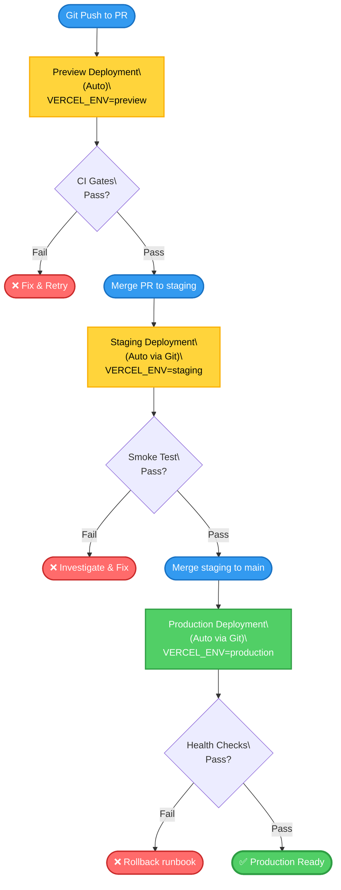

## Problem Statement

Before the multi-environment rollout, deployments rely on preview auto-deploys and production manual promotion. Without an explicit **staging** tier and **immutable builds**, validation is limited and "works locally"/"works in preview" surprises can reach production.

## Decision

Adopt a **three-tier environment model** with **immutable builds** and **environment-aware configuration**:

- Tiers: `preview` (auto) → `staging` (git-triggered) → `production` (git-triggered)
- Immutability: Vercel re-uses build artifacts when promoting deployments
- Configuration: public-safe env variables (`NEXT_PUBLIC_*`), host-provided `VERCEL_ENV`
- Promotion gates: CI workflows validate code quality, tests pass before merging to protected branches

## Rationale

- Prevents environment drift—immutable builds eliminate rebuild-by-environment discrepancies
- Staging provides final smoke-test surface before production impact
- Manual gates create reviewable checkpoints with clear validation signals
- Aligns with 12-factor app principles and enterprise deployment practices

## Consequences

**Positive:**

- Safer production deployments; faster recovery with documented rollback paths
- Traceable, reviewer-friendly promotion history via workflow summaries
- Environment parity and simpler debugging (same commit SHA across tiers)

**Managed negatives:**

- Slight process overhead (manual gate) offset by quality gains
- Requires clear runbooks to ensure promotions are consistent (documented below)

## Alternatives Considered

- Two-tier (preview → production) only: insufficient validation surface; higher risk
- Environment-specific rebuilds: prone to configuration drift; harder to reproduce
- Automated production deploy on merge: insufficient control; unacceptable risk profile

## Implementation

**App repository:**

- `src/lib/config.ts`: environment helpers (`ENVIRONMENT`, `isProduction`, `isPreview`, `isStaging`, `isDevelopment`)
- `.github/workflows/ci.yml`: automated CI gates that validate env, registry, build, tests on all branches
- `.env.example`: added `NEXT_PUBLIC_DOCS_GITHUB_URL` and staging note
- `package.json`: `env:validate` script; CI workflow enforces env contract

**Docs repository:**

- Promotion runbook: `docs/50-operations/runbooks/rbk-portfolio-environment-promotion.md`
- Rollback runbook: `docs/50-operations/runbooks/rbk-portfolio-environment-rollback.md`
- Architecture updates in dossier: environment architecture section with diagram and ADR link

## Success Criteria

- CI workflows run cleanly with validation gates on all protected branches
- Staging and production deployments use consistent build configuration (commit SHA)
- No hardcoded environment-specific logic; all configuration from env vars
- Runbooks enable deployment validation and rollback procedures

## Diagram: Environment Promotion Flow

