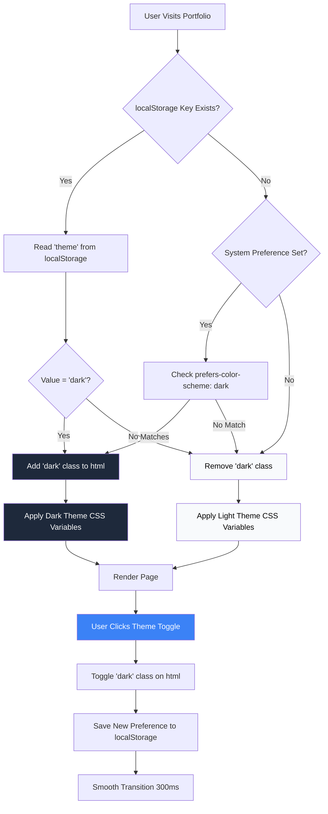

# ADR 0014: Class-Based Dark Mode with CSS Variables

**Date:** January 2026

**Status:** Accepted

**Context:** Portfolio requires user preference for dark/light mode with system fallback and persistent storage.

---

## Problem

Need to implement dark mode that:

- Respects user selection
- Remembers preference across sessions
- Falls back to system preference
- Maintains accessibility (contrast ratios)
- Has minimal performance impact (no flash of wrong theme)
- Works with Tailwind CSS 4

---

## Options Considered

### Option A: CSS-in-JS (Styled Components, Emotion)

**Approach:** Runtime theme switching with CSS generated dynamically

**Pros:**

- Full programmatic control
- No CSS file size overhead
- Easy to add theme variants

**Cons:**

- Runtime overhead (JS must execute before render)
- Larger JS bundle
- Hydration complexity
- No static extraction

**Verdict:** ❌ Rejected - excessive runtime overhead

### Option B: CSS Media Query Alone

**Approach:** Only `prefers-color-scheme` media query, no user control

**Pros:**

- Zero JS overhead
- Simple implementation
- Respects system preference

**Cons:**

- No user override capability
- No persistence
- Less control over transitions

**Verdict:** ❌ Rejected - no user choice

### Option C: Class-Based Dark Mode with CSS Variables ✅

**Approach:** Add `dark` class to `<html>`, define CSS variables per theme

```css
:root {
  --bg: white;
  --text: black;
}

:root.dark {
  --bg: black;
  --text: white;
}
```

**Pros:**

- Zero runtime overhead for styling
- Decoupled from media queries
- User override capability
- Persistent across sessions
- Works perfectly with Tailwind
- Can be set in SSR (no flash)
- Minimal JS required

**Cons:**

- Must set class before render (init script in `<head>`)
- CSS file slightly larger
- Hydration warning (expected and suppressible)

**Verdict:** ✅ **Selected** - best balance of control, performance, and simplicity

---

## Decision

**Implement class-based dark mode with CSS variables using:**

1. **Initialization Script in `<head>`**
   - Runs before render
   - Reads localStorage or system preference
   - Sets `dark` class on `<html>`
   - Prevents flash of unstyled theme (FOUC)

2. **CSS Variables**
   - Define all colors as variables
   - Override in `:root.dark`
   - Minimal overhead, maximum flexibility

3. **Tailwind Integration**
   - Extend Tailwind config with CSS variables
   - Use `dark:` modifier for dark-specific styles
   - No additional plugins needed

4. **React Toggle Component**
   - Manages theme state
   - Persists to localStorage
   - Updates DOM class
   - SSR-safe with `useEffect` mounting guard

---

## Theme Preference Flow



**Key Decision Points:**

1. **localStorage First:** User's explicit choice always wins
2. **System Preference Fallback:** Respects OS setting if no saved preference
3. **Light Default:** If neither localStorage nor system preference exists
4. **Immediate Application:** Class added before first paint (no flash)
5. **Smooth Toggle:** Transition animates color changes when user toggles

---

## Implementation

### CSS Variables Setup

```css
:root {
  /* Light theme colors */
  --bg: rgb(255 255 255);
  --text: rgb(0 0 0);
  --border: rgb(229 231 235);
  --muted: rgb(107 114 128);
}

:root.dark {
  /* Dark theme colors */
  --bg: rgb(17 24 39);
  --text: rgb(243 244 246);
  --border: rgb(55 65 81);
  --muted: rgb(156 163 175);
}

body {
  background-color: rgb(var(--bg));
  color: rgb(var(--text));
}
```

### Initialization Script

```typescript
// In layout.tsx <head>
const themeScript = `
  (function() {
    const stored = localStorage.getItem('theme');
    const system = window.matchMedia('(prefers-color-scheme: dark)').matches;
    const isDark = stored ? stored === 'dark' : system;
    if (isDark) {
      document.documentElement.classList.add('dark');
    }
  })();
`;

<script dangerouslySetInnerHTML={{ __html: themeScript }} />
```

### Toggle Component

```typescript
export function ThemeToggle() {
  const [theme, setTheme] = useState<'light' | 'dark' | null>(null);

  useEffect(() => {
    const stored = localStorage.getItem('theme') as 'light' | 'dark' | null;
    if (stored) {
      setTheme(stored);
    } else {
      const system = window.matchMedia('(prefers-color-scheme: dark)').matches;
      setTheme(system ? 'dark' : 'light');
    }
  }, []);

  const toggleTheme = () => {
    const newTheme = theme === 'dark' ? 'light' : 'dark';
    setTheme(newTheme);
    localStorage.setItem('theme', newTheme);
    document.documentElement.classList.toggle('dark');
  };

  if (theme === null) return null; // Avoid hydration mismatch

  return (
    <button onClick={toggleTheme} aria-label="Toggle theme">
      {theme === 'dark' ? '☀️' : '🌙'}
    </button>
  );
}
```

### Tailwind Configuration

```typescript
// tailwind.config.ts
export default {
  darkMode: 'class',
  extend: {
    colors: {
      background: 'rgb(var(--bg) / <alpha-value>)',
      foreground: 'rgb(var(--text) / <alpha-value>)',
    },
  },
};
```

---

## Consequences

### Positive

✅ **Performance:** No JS blocking, pure CSS switching
✅ **UX:** Instant theme toggle, no page reload
✅ **Accessibility:** Full control over contrast ratios per theme
✅ **Persistence:** User preference survives refresh
✅ **System Integration:** Respects system preference as fallback
✅ **Flexibility:** Easy to add new theme variants
✅ **SSR Safe:** Can be initialized server-side if needed

### Negative

⚠️ **Hydration Warning:** Expected mismatch between server (`<html>`) and client (`<html class="dark">`)

- Mitigated by: `suppressHydrationWarning` on `<html>` tag

⚠️ **CSS File Size:** Slightly larger due to theme variable duplication

- Impact: < 5KB gzipped

⚠️ **Initialization Overhead:** Script in `<head>` before React hydration

- Impact: < 1ms execution, prevents FOUC

---

## Alternatives Rejected

- **CSS Media Query Only:** No user choice
- **CSS-in-JS:** Runtime overhead, hydration complexity
- **Next.js Theme Library:** Overkill for simple needs, adds dependencies
- **System Preference Only:** Doesn't respect user preference

---

## Related Decisions

- ADR-0008: Animation Strategy (respects `prefers-reduced-motion`)
- ADR-0009: SEO Metadata (social media preview strategy)

---

## References

- [CSS Variables](https://developer.mozilla.org/en-US/docs/Web/CSS/--*)
- [Tailwind Dark Mode](https://tailwindcss.com/docs/dark-mode)
- [prefers-color-scheme](https://developer.mozilla.org/en-US/docs/Web/CSS/@media/prefers-color-scheme)
- [Hydration](https://react.dev/reference/react-dom/client/hydrateRoot)
