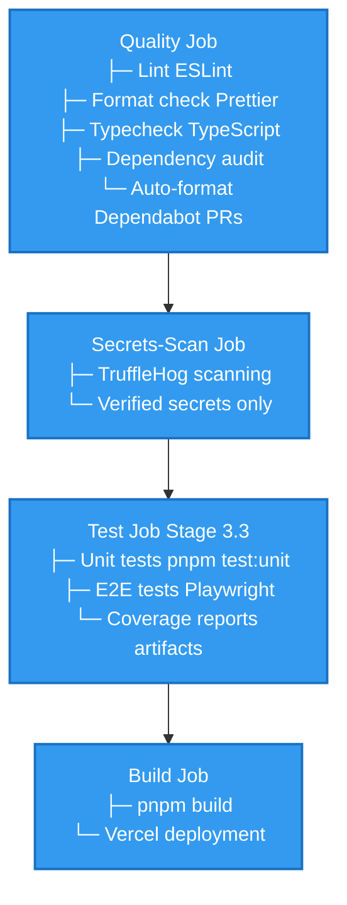

## Purpose

Document the CI/CD pipeline architecture, job dependencies, test integration, and quality gates that ensure code quality before production deployment.

## Scope

- GitHub Actions workflow design
- Job sequence and dependencies
- Quality gates (lint, format, typecheck, tests)
- Test job integration (unit + E2E)
- Coverage reporting and artifacts
- Build promotion and deployment

## Workflow Overview

The Portfolio App CI/CD pipeline enforces quality gates via GitHub Actions before build and deployment, with a three-tier environment strategy (Preview → Staging → Production).

### Environment Tiers

| Environment | Branch      | Deployment Trigger     | Domain                             | Purpose                          |
| ----------- | ----------- | ---------------------- | ---------------------------------- | -------------------------------- |
| Preview     | PR branches | Auto on PR creation    | `*.vercel.app` (auto-generated)    | Feature validation and PR review |
| Staging     | `staging`   | Manual (merge main)    | `staging-bns-portfolio.vercel.app` | Pre-production validation        |
| Production  | `main`      | Auto (after CI passes) | `bns-portfolio.vercel.app`         | Live public site                 |

**Deployment flow:** PR → Preview (auto) → Merge to main → CI runs → Production (auto) → Staging (manual) → Production validated

## Job Sequence



### Job Execution Details

#### 1. Quality Job

**Purpose**: Enforce code quality standards (lint, format, type safety)

**Runs on**: `ubuntu-latest` (GitHub-hosted runner)

**Timeout**: 10 minutes

**Permissions**: `contents: write` (for Dependabot auto-format), `pull-requests: read`

**Steps**:

1. **Checkout code**

   ```yaml
   uses: actions/checkout@v6
   ```

2. **Setup pnpm**

   ```yaml
   uses: pnpm/action-setup@v4
   with:
     version: '10.0.0'
   ```

3. **Setup Node**

   ```yaml
   uses: actions/setup-node@v6
   with:
     node-version: '20'
     cache: 'pnpm'
   ```

4. **Install dependencies (frozen)**

   ```bash
   pnpm install --frozen-lockfile
   ```

5. **Auto-format for Dependabot PRs** (conditional)

   ```bash
   if: ${{ github.actor == 'dependabot[bot]' }}
   pnpm format:write || true
   # Auto-commit if changes detected
   ```

6. **Lint** (fails on warnings)

   ```bash
   pnpm lint
   ```

7. **Format check**

   ```bash
   pnpm format:check
   ```

8. **Typecheck**

   ```bash
   pnpm typecheck
   ```

9. **Dependency audit**
   ```bash
   pnpm audit --audit-level=high
   ```

**Outcome**: Fails if any checks fail; blocks subsequent jobs

#### 2. Secrets-Scan Job (Phase 2 Enhancement)

**Purpose**: Detect accidental secrets in code and configuration

**Runs on**: `ubuntu-latest`

**Timeout**: 5 minutes

**Permissions**: `contents: read`

**Conditional**: Only runs on pull requests (avoids `BASE==HEAD` issue on push)

**Tool**: TruffleHog (hardened with `--only-verified` flag)

**Command**:

```bash
trufflesecurity/trufflehog@main \
  --base=${{ github.event.repository.default_branch }} \
  --head=HEAD \
  --debug \
  --only-verified
```

**Outcome**: Fails if verified secrets detected (blocks PR merge)

**Evidence**: ADR-XXXX (secrets scanning strategy)

#### 3. Test Job (Stage 3.3)

**Purpose**: Run unit and E2E tests before build

**Runs on**: `ubuntu-latest`

**Timeout**: 15 minutes

**Permissions**: `contents: read`

**Dependencies**: Requires `quality` job to pass

**Conditional**: `if: needs.quality.result == 'success'`

**Steps**:

1. **Checkout code**
2. **Setup pnpm** (version 10.0.0)
3. **Setup Node** (version 20, cache: pnpm)

4. **Install dependencies (frozen)**

   ```bash
   pnpm install --frozen-lockfile
   ```

5. **Run unit tests**

   ```bash
   pnpm test:unit
   ```

   - Vitest with coverage reporting
   - Coverage targets: ≥95% lines, functions, branches, statements
   - Fails if coverage targets not met

6. **Install Playwright browsers**

   ```bash
   npx playwright install --with-deps
   ```

7. **Start dev server**

   ```bash
   pnpm dev &
   ```

8. **Wait for server readiness**

   ```bash
   npx wait-on http://localhost:3000
   ```

9. **Run E2E tests**

   ```bash
   pnpm test:e2e
   ```

   - Multi-browser: Chromium, Firefox
   - 66 tests covering core routes, slugs, 404s, metadata endpoints, evidence links, and security APIs
   - 2 retries in CI, 0 locally
   - HTML report generated

10. **Upload coverage reports** (if always)
    ```yaml
    uses: actions/upload-artifact@v4
    with:
      name: coverage-report
      path: coverage/
      retention-days: 7
    ```

**Outcome**: Fails if any tests fail or coverage targets not met

#### 4. Build Job

**Purpose**: Compile production bundle and deploy to Vercel

**Runs on**: `ubuntu-latest`

**Timeout**: 15 minutes

**Permissions**: `contents: read`

**Dependencies**: Requires both `quality` and `test` jobs to pass

**Conditional**: `if: always() && needs.quality.result == 'success' && needs.test.result == 'success'`

**Steps**:

1. **Checkout code**
2. **Setup pnpm** (version 10.0.0)
3. **Setup Node** (version 20, cache: pnpm)

4. **Install dependencies (frozen)**

   ```bash
   pnpm install --frozen-lockfile
   ```

5. **Build**

   ```bash
   pnpm build
   ```

   - Compiles Next.js app
   - Registry validation runs at build time
   - Fails if any build errors occur

6. **Deploy to Vercel** (automatic)
   - Deployment happens automatically on `main` push
   - Preview deployments on PRs
   - Requires Vercel GitHub App integration

**Outcome**: Fails if build fails; deployment blocked until all gates pass

## Build Blocking & Merge Gates

### GitHub Ruleset Configuration

**Branch**: `main`

**Required Status Checks** (must pass before merge):

```
- ci / quality
- ci / test
- ci / build
```

**Dismiss Stale PR Reviews**: False (reviewers' approvals invalidated by new commits)

**Require Code Review**: At least 1 approval required

**Rationale**:

- Automation gates catch regressions early
- Code review gate ensures human review
- Build blocking prevents deployment of broken code

### Promotion Path

1. **Feature branch** → Create PR targeting `main`
2. **CI runs** → Quality gate runs first, test gate runs second, build gate runs last
3. **All gates pass** → PR is ready for merge
4. **Code review** → Human review + approval required
5. **Merge to main** → Automatically triggers deployment via Vercel

## Environment Variables & Configuration

### Public Configuration (CI Environment)

**Portfolio App** (`.github/workflows/ci.yml` env section):

```yaml
env:
  NEXT_PUBLIC_DOCS_BASE_URL: https://bns-portfolio-docs.vercel.app
  NEXT_PUBLIC_GITHUB_URL: https://github.com/bryce-seefieldt/portfolio-app
  NEXT_PUBLIC_DOCS_GITHUB_URL: https://github.com/bryce-seefieldt/portfolio-docs
  NEXT_PUBLIC_SITE_URL: https://bryce-portfolio-app.vercel.app
```

**Rationale**: Non-sensitive public URLs used for registry interpolation during CI builds

### Secrets (GitHub)

None required for Portfolio App (all config is public)

## Troubleshooting Common Failures

### Quality Job Failures

**ESLint violations**:

```bash
pnpm lint  # Run locally to see errors
pnpm lint --fix  # Auto-fix where possible
```

**Prettier format violations**:

```bash
pnpm format:write  # Fix formatting
```

**TypeScript type errors**:

```bash
pnpm typecheck  # Run locally to debug
```

**Dependency audit failures**:

```bash
pnpm audit --audit-level=high
pnpm up --latest
```

### Test Job Failures

**Unit tests fail**:

```bash
pnpm test:unit  # Run locally with details
pnpm test:coverage  # View coverage report
```

**E2E tests fail**:

```bash
pnpm dev  # Start dev server
pnpm test:e2e:ui  # Debug in interactive UI
```

**Timeout waiting for server**:

- Ensure dev server starts: `pnpm dev`
- Check port 3000 availability
- Increase wait-on timeout if needed

### Build Job Failures

**Build errors**:

```bash
pnpm build  # Reproduce locally
```

**Registry validation errors**:

```bash
pnpm registry:validate  # Test registry schema
pnpm registry:list  # List all projects
```

## Performance Optimization

### Cache Strategy

- **Dependencies**: Cached via `actions/setup-node@v6` with `cache: pnpm`
- **Playwright browsers**: Installed fresh each run (pre-cached in runner images)
- **Build output**: Not cached between runs (fresh build each time)

### Parallelization

- **Browsers**: E2E tests run in parallel across Chromium and Firefox
- **Workers**: 1 worker in CI (sequential), unlimited locally
- **Jobs**: Quality → Test → Build (sequential dependencies)

### Runtime

- Quality job: ~2 minutes
- Test job: ~3-5 minutes (depends on E2E test duration)
- Build job: ~2-3 minutes
- **Total**: ~8-10 minutes (end-to-end)

## Deployment Strategy

### Vercel Integration

- **Auto-deploy**: Enabled for `main` branch
- **Preview deployments**: Enabled for all PRs
- **Promotion checks**: Vercel checks run after GitHub checks pass

### Promotion Flow

1. **PR created**: Vercel creates preview deployment
2. **CI runs**: All GitHub checks must pass
3. **Vercel checks run**: Promotion to production requires passing checks
4. **Merge to main**: Triggers production deployment to `https://bryce-portfolio-app.vercel.app`

## Monitoring & Observability

### Workflow Runs

- **GitHub Actions tab**: View all workflow runs
- **PR Checks**: See check status in PR UI
- **Commit Status**: Badge in commit history

### Coverage Reports

- **Artifacts**: Download coverage reports from workflow run
- **HTML Report**: Open `coverage/index.html` to view detailed metrics
- **Retention**: 7 days (configured in upload-artifact action)

### Test Reports

- **Playwright Report**: Generated after E2E tests
- **Command**: `pnpm exec playwright show-report`
- **Location**: `.playwright/report/`

## Related Documentation

- **Testing Guide**: [docs/70-reference/testing-guide.md](/docs/70-reference/testing-guide.md)
- **Portfolio App Testing**: [docs/60-projects/portfolio-app/05-testing.md](/docs/60-projects/portfolio-app/05-testing.md)
- **Portfolio App Architecture**: [docs/60-projects/portfolio-app/02-architecture.md](/docs/60-projects/portfolio-app/02-architecture.md#testing-architecture-stage-33)
- **Security ADRs**: [docs/architecture/adr/](/docs/architecture/adr/) (CI security decisions)
- **CI Triage Runbook**: [docs/50-operations/runbooks/rbk-portfolio-ci-triage.md](/docs/50-operations/runbooks/rbk-portfolio-ci-triage.md)

## Maintenance & Evolution

### Adding New Checks

1. Update workflow file (`.github/workflows/ci.yml`)
2. Document in this page (CI/CD Pipeline Overview)
3. Update ADR if check represents new architectural decision
4. Test locally before merging

### Updating Node/pnpm Versions

1. Update version in `.nvmrc` / `package.json`
2. Update CI workflow (`node-version`, `pnpm` version)
3. Test workflow in feature branch
4. Document change in ADR or release notes

### Onboarding New Team Members

- Point to this documentation for CI/CD overview
- Have them review `.github/workflows/ci.yml`
- Run local verification commands (`pnpm verify`)
- Confirm workflow passes on first PR
