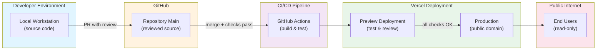

## Purpose

Define an actionable threat model for the **Portfolio App** to guide:

- secure architecture and content decisions
- enforceable SDLC controls in CI/CD
- safe-publication practices
- operational readiness and incident response

This model is written to be public-safe and verifiable.

## Scope

### In scope

- Portfolio App codebase, build chain, CI workflows, and deployment pipeline
- public-facing web surface (no authentication)
- content model (project metadata, evidence links)
- cross-site linking to the Documentation App

### Out of scope

- authentication/session threats (explicitly deferred)
- contact form and backend services (deferred)
- vendor account configuration details and secrets (never documented)

## Metadata

- Owner: portfolio maintainer
- Date: 2026-01-19
- Status: **Live — Phase 2** (STRIDE-aligned; reviewed and validated)
- Last reviewed: 2026-01-19
- Next review: after Phase 3 (when new features introduced)
- Architecture references:
  - Portfolio App dossier: `docs/60-projects/portfolio-app/`
  - ADRs: ADR-0005, ADR-0006, ADR-0007
- Operational references:
  - Runbooks: deploy/rollback/CI triage

---

## Trust Boundaries Diagram

**Key trust boundaries:**

- **Developer → GitHub:** source code integrity, PR review gating
- **GitHub → CI:** build pipeline integrity, artifact signing, permissions (OIDC tokens)
- **CI → Vercel:** promotion checks, deployment gating
- **Vercel → Public:** HTTPS/TLS, CDN security, DDoS protection
- **Portfolio App ↔ Docs App:** hyperlinks only (no privileged integration)

---

## Assets to Protect

- **Source integrity**: repository content (app code, content metadata, config)
- **Build integrity**: deterministic build artifact from reviewed sources
- **Pipeline integrity**: CI workflows and permissions, dependency supply chain
- **Publication safety**: prevent accidental disclosure of secrets/sensitive info
- **Availability and UX trust**: site must be reliably accessible and correct
- **Reputation and credibility**: portfolio must remain trustworthy and tamper-resistant

---

## Threat Analysis (STRIDE)

STRIDE categories: **S**poofing (identity), **T**ampering (data integrity), **R**epudiation (accountability), **I**nformation Disclosure (confidentiality), **D**enial of Service (availability), **E**levation of Privilege (authorization).

### Spoofing (Identity)

#### Threat: Attacker spoofs the Portfolio App domain

- **Scenario:** Attacker registers or hijacks a domain similar to the portfolio domain (typosquatting or DNS hijacking).
- **Impact:** Medium—users may visit a fake portfolio and believe they are viewing legitimate content; reputational damage.
- **Likelihood:** Low (domain registration is under owner control; DNS is managed by Vercel).
- **Mitigations:**
  - Use HTTPS/TLS with a valid certificate (Vercel automatic)
  - Enable HSTS header to enforce HTTPS (Vercel default)
  - Register domain against typosquatting (owner responsibility)
  - Domain registration lock enabled
  - DNS security best practices (MX record discipline, SPF/DKIM if needed)
- **Validation:**
  - HSTS header present in response
  - SSL certificate is valid and not self-signed
  - DNS records are as intended

---

### Tampering (Data Integrity)

#### Threat 1: Attacker modifies deployed portfolio content

- **Scenario:** Attacker modifies Portfolio App files on disk or in transit (MITM or compromised deployment system).
- **Impact:** High—malicious content could be served; reputation damage; potential malware distribution.
- **Likelihood:** Low–Medium (depends on Vercel security posture and CI access model).
- **Mitigations:**
  - Deployments only via authenticated Git + GitHub Actions + Vercel
  - No manual SSH/FTP deployments allowed
  - Vercel uses immutable, content-addressed deployments
  - Git commit audit trail (SHA-256, signed commits optional)
  - GitHub Rulesets enforce PR review before merge
  - Required checks must pass before production promotion
- **Validation:**
  - all deployments are traced back to a GitHub merge
  - promotion checks are visible in deployment logs
  - manual override to production is not possible

#### Threat 2: Attacker modifies CI workflows or build scripts to inject malicious code

- **Scenario:** PR modifies `.github/workflows/*` or `package.json` scripts to run untrusted code or exfiltrate secrets.
- **Impact:** High—tampered build artifact, potential secret exfiltration.
- **Likelihood:** Low–Medium (depends on collaborator trust model; restricted in single-maintainer setup).
- **Mitigations:**
  - Workflows use least-privilege permissions (contents: read, specific OIDC tokens)
  - No long-lived secrets or SSH keys in workflows; use Vercel OIDC if available
  - All workflow changes require PR review
  - Avoid pinning to `@latest` tags; pin actions by SHA or use Dependabot
  - postinstall hooks minimized; dependency audits recommended
- **Validation:**
  - workflow permissions are restricted (visible in workflow file)
  - no plaintext secrets in logs
  - dependency update PRs are reviewed before merge

#### Threat 3: Attacker modifies dependencies via compromised package registry

- **Scenario:** A dependency is compromised or a typosquatted package is installed.
- **Impact:** High—malicious code in build or runtime.
- **Likelihood:** Medium—supply chain attacks are known to occur.
- **Mitigations:**
  - pin all dependency versions (no `*` or `^` in production; use lockfile)
  - frozen lockfile install in CI (`pnpm install --frozen-lockfile`)
  - Dependabot scans for security advisories (enabled, required review)
  - CodeQL scanning of JavaScript/TypeScript (GH native)
  - minimize dependencies (reduce attack surface)
  - consider npm audit or Snyk checks (optional hardening phase 3+)
- **Validation:**
  - CI uses `--frozen-lockfile` (visible in workflow)
  - dependency PRs require review before merge
  - CodeQL scans pass before merge

---

### Repudiation (Accountability)

#### Threat: Attacker performs unauthorized action and claims they did not

- **Scenario:** Malicious actor modifies Portfolio App or CI, later denies the change.
- **Impact:** Low–Medium—affects accountability and incident investigation.
- **Likelihood:** Low (in small team settings; higher in open-source).
- **Mitigations:**
  - Git commit audit trail (immutable, signed with SHA-256)
  - GitHub PR/merge history visible and persistent
  - GitHub Actions logs retained and queryable
  - Enforce PR review and sign-off (GitHub requires at least 1 approval before merge)
  - commit messages include issue references and context
- **Validation:**
  - git log --oneline shows traceable history
  - GitHub PR template requires confirmation of PR security checklist
  - Actions logs are accessible for post-incident review

---

### Information Disclosure (Confidentiality)

#### Threat 1: Attacker exfiltrates secrets from environment or repository

- **Scenario:** API keys, deployment tokens, or secrets are hardcoded, committed, or logged.
- **Impact:** High—compromised credentials can be used to impersonate the service or access internal systems.
- **Likelihood:** Medium (human error is common).
- **Mitigations:**
  - No secrets in `NEXT_PUBLIC_*` environment variables (these are public)
  - `.env.local` and `.env*.local` are gitignored (not committed)
  - `.env.example` documents required variables without values
  - CI does not log environment variable values
  - GitHub Actions use OIDC or limited-lifetime tokens (Vercel OIDC)
  - PR template includes "No secrets added" checklist
  - secrets scanning gate recommended (phase 2+)
- **Validation:**
  - `grep -r "SECRET\|TOKEN\|API_KEY" src/` returns no hardcoded values
  - `.env.local` is in `.gitignore`
  - CI logs do not include plaintext secrets
  - postmortem procedure exists for suspected publication

#### Threat 2: Attacker reads private GitHub Actions logs or deployment logs

- **Scenario:** CI/deployment logs contain sensitive information (internal URLs, debug output, etc.).
- **Impact:** Medium—internal details could inform further attacks.
- **Likelihood:** Low (logs are not public; requires attacker access to GitHub account).
- **Mitigations:**
  - CI logs are stored in private GitHub (accessible only to collaborators)
  - do not log environment variable values
  - avoid printing internal URLs or PII in logs
  - use GitHub Secrets for sensitive values (Vercel API tokens, etc.)
- **Validation:**
  - CI workflow logs are reviewed for accidental leaks
  - postmortem procedure in place

#### Threat 3: Attacker performs content injection to steal data or redirect users

- **Scenario:** MDX, unsanitized HTML, or third-party embeds are used to inject malicious scripts (XSS).
- **Impact:** Medium—could exfiltrate user session tokens (low risk here; no auth) or redirect to phishing.
- **Likelihood:** Low (Markdown-first, minimal MDX, no third-party ad networks).
- **Mitigations:**
  - Markdown-first content model (safe by default)
  - MDX used only for component demos; treated as code (strict review)
  - Avoid `dangerouslySetInnerHTML` or equivalent
  - No third-party trackers or ad services
  - Content Security Policy (CSP) headers (optional, phase 3+)
  - Vercel provides DDoS and request filtering
- **Validation:**
  - PR review flags MDX changes
  - no untrusted embeds or inline script in deployed pages

---

### Denial of Service (Availability)

#### Threat 1: Attacker floods the Portfolio App domain with requests

- **Scenario:** Attacker sends high-volume traffic to degrade availability.
- **Impact:** Medium—site becomes unavailable; credibility damage.
- **Likelihood:** Low–Medium (low targeting; medium in case of viral mention).
- **Mitigations:**
  - Vercel provides DDoS protection and rate limiting (built-in)
  - static-first content model (no heavy compute per request)
  - minimal client-side JavaScript (fast render)
  - rollback readiness (revert PR and redeploy within 1 minute)
- **Validation:**
  - Vercel DDoS protections are enabled (visible in Vercel dashboard)
  - rollback runbook is tested and usable

#### Threat 2: Attacker introduces a performance regression to degrade UX

- **Scenario:** PR merges code that causes slow load times or excessive client JS.
- **Impact:** Medium—poor credibility, user frustration.
- **Likelihood:** Medium (human error in dependency updates or code changes).
- **Mitigations:**
  - performance budget mindset (keep JS minimal)
  - spot-check core routes in preview (reviewer responsibility)
  - consider adding performance budget checks (phase 3+)
  - Playwright smoke tests validate route load (phase 2+)
  - rollback procedure (fast revert)
- **Validation:**
  - core routes load in &lt;2 seconds locally and in preview
  - smoke tests pass (validate route availability)

---

### Elevation of Privilege (Authorization)

#### Threat 1: Attacker gains elevated permissions in the GitHub organization or Vercel

- **Scenario:** Attacker compromises a collaborator account or discovers a token with excessive permissions.
- **Impact:** Critical—attacker can deploy malicious code to production.
- **Likelihood:** Low–Medium (depends on account security practices and token scope).
- **Mitigations:**
  - GitHub Rulesets enforce PR review and required checks (bypass prevention)
  - minimal repository collaborators (principle of least privilege)
  - GitHub branch protection rules prevent direct pushes to `main`
  - Vercel deployment tokens are scoped (not global; production-only if possible)
  - GitHub Actions use OIDC tokens (short-lived, scoped to specific workflow)
  - Enable 2FA on GitHub account (owner responsibility)
  - audit GitHub collaborators and permissions regularly
- **Validation:**
  - GitHub Rulesets prevent bypassing required checks
  - branch protection is visible and enforced
  - no long-lived tokens are stored in GitHub Secrets

#### Threat 2: Attacker escalates from a feature branch to `main` via social engineering or process bypass

- **Scenario:** Attacker tricks a reviewer into merging an unreviewed or malicious PR.
- **Impact:** High—malicious code in production.
- **Likelihood:** Low (single-maintainer or trusted team model).
- **Mitigations:**
  - PR template includes security checklist (raises awareness)
  - GitHub Rulesets require 1+ approval (adjustable, but required)
  - dismissal of stale reviews (recommended)
  - require status checks to pass (ci / quality, ci / build, CodeQL)
  - provide reviewer guidance (ADR-0007 documents promotion gates)
- **Validation:**
  - merge without approval is prevented by Rulesets
  - checks cannot be bypassed (green check required)

---

## Mitigation Summary: Enforceable SDLC Controls

### Phase 1 Controls (Baseline — Currently Implemented)

- ✅ PR-only merges to `main` (branch protection, GitHub Rulesets)
- ✅ CI quality gates required:
  - `ci / quality`: lint + format:check + typecheck
  - `ci / build`: Next.js build + smoke tests
- ✅ CodeQL enabled (JavaScript/TypeScript scanning)
- ✅ Dependabot enabled (dependency review required)
- ✅ Vercel production promotion gated by checks
- ✅ No secrets policy with explicit PR template checklist
- ✅ `.env.local` and secrets gitignored

### Phase 2 Recommended Controls (Planned)

- secrets scanning gate (CI) — e.g., `git-secrets`, `truffleHog`, or GitHub's native scanner
- dependency auditing for high-severity advisories (npm audit or Snyk)
- e2e smoke tests for all core routes (Playwright — 100% coverage)

### Phase 3+ Enhancements (Future)

- Performance budget checks (Lighthouse CI or similar)
- Content Security Policy (CSP) hardening
- Automated link validation between Portfolio App and Docs App
- Secrets rotation and key management improvements

---

## Residual Risks (Accepted)

- **Supply chain risk:** Dependabot alerts may not catch all zero-days immediately. Mitigation is continuous.
- **Public site risks:** All public sites face reputational risk from errors, regressions, or compromises. Rollback readiness is essential.
- **Account compromise:** If a collaborator account is compromised, checks can be bypassed. Mitigation: 2FA, limited collaborators, audit logging.
- **Vercel platform risk:** Vercel is trusted to provide secure deployment. Mitigation: Vercel's security practices and SLAs are beyond Portfolio App scope but monitored.

---

## Validation & Testing

### Pre-deployment validation

- [ ] PR preview deployment succeeds
- [ ] core routes render correctly in preview
- [ ] evidence links to docs app are reachable
- [ ] no console errors or security warnings in browser
- [ ] spot-check mobile/responsive layout

### CI validation

- [ ] lint passes (`pnpm lint`)
- [ ] format check passes (`pnpm format:check`)
- [ ] typecheck passes (`pnpm typecheck`)
- [ ] build succeeds (`pnpm build`)
- [ ] smoke tests pass (Playwright — Chromium + Firefox)
- [ ] CodeQL scan passes

### Post-deployment validation

- [ ] production domain is accessible
- [ ] HSTS header is present (`curl -I https://...`)
- [ ] SSL certificate is valid
- [ ] routes match preview (no 404s)
- [ ] evidence links work end-to-end

---

## Incident Response

### Suspected secret publication

1. **Immediate:** Revert the PR (`git revert <commit>`; push to main)
2. **Investigation:** Determine what was exposed and for how long
3. **Rotation:** Rotate any compromised credentials
4. **Communication:** Notify stakeholders if needed
5. **Postmortem:** Write a brief postmortem identifying what went wrong and how to prevent recurrence

### Suspected malicious deployment

1. **Immediate:** Revert to last known good (`git revert <commit>`; redeploy via CI)
2. **Investigation:** Review the PR and commit history; check CI logs
3. **Review:** Audit who approved the PR and whether checks passed
4. **Postmortem:** Document and prevent similar escalations

### Production availability issue

1. Follow [rbk-portfolio-ci-triage.md](/docs/50-operations/runbooks/rbk-portfolio-ci-triage.md)
2. Use [rbk-portfolio-rollback.md](/docs/50-operations/runbooks/rbk-portfolio-rollback.md) if needed
3. Post-incident: Review and update runbooks

---

## References

### Portfolio App Dossier

- [Security](/docs/60-projects/portfolio-app/04-security.md)
- [Deployment](/docs/60-projects/portfolio-app/03-deployment.md)
- [Architecture](/docs/60-projects/portfolio-app/02-architecture.md)

### Architecture Decision Records (ADRs)

- [ADR-0005: Portfolio App Stack (Next.js + TypeScript)](/docs/10-architecture/adr/adr-0005-portfolio-app-stack-nextjs-ts.md)
- [ADR-0006: Separate Portfolio App from Evidence Engine (Docs)](/docs/10-architecture/adr/adr-0006-separate-portfolio-app-from-evidence-engine-docs.md)
- [ADR-0007: Portfolio App Hosting (Vercel) with Promotion Checks](/docs/10-architecture/adr/adr-0007-portfolio-app-hosting-vercel-with-promotion-checks.md)

### Operational Runbooks

60-projects/portfolio-app

- [Deploy](/docs/50-operations/runbooks/rbk-portfolio-deploy.md)
- [Rollback](/docs/50-operations/runbooks/rbk-portfolio-rollback.md)
- [CI Triage](/docs/50-operations/runbooks/rbk-portfolio-ci-triage.md)

### Phase 2 Planning

- [Roadmap](/docs/00-portfolio/roadmap/index.md)
- [Implementation Guide](/docs/00-portfolio/phase-2-implementation-guide.md)
