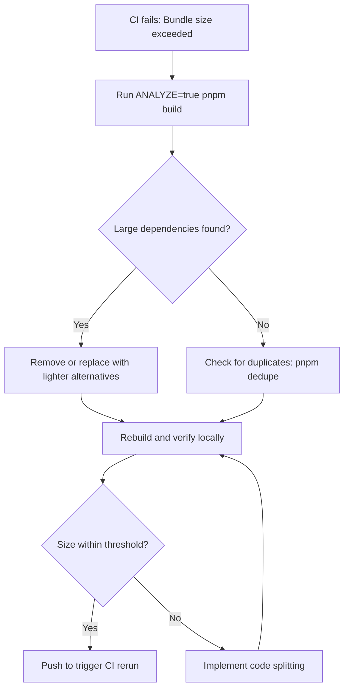
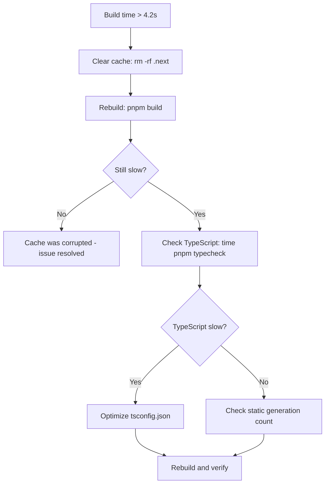
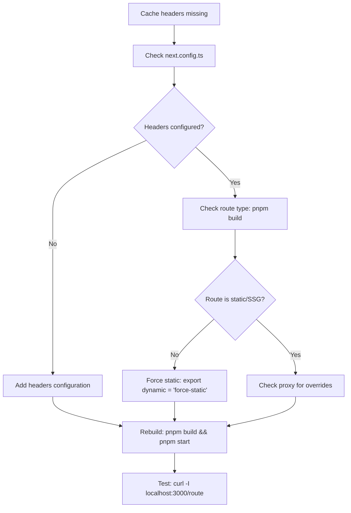

## Purpose

Troubleshooting guide for diagnosing and resolving performance issues detected during local development verification or CI/CD builds. Addresses common problems related to bundle size, build time, caching, and Core Web Vitals.

## Related Documentation

- [Performance Optimization & Monitoring Runbook](./rbk-portfolio-performance-optimization.md) - Main operational procedures
- [Performance Baseline (YAML)](https://github.com/bryce-seefieldt/portfolio-app/blob/main/docs/performance-baseline.yml) - Baseline metrics and thresholds (machine-readable)
- [Performance Baseline (Docs)](https://github.com/bryce-seefieldt/portfolio-app/blob/main/docs/performance-baseline.md) - Baseline documentation (human-readable)
- [Performance Optimization Reference Guide](../../70-reference/performance-optimization-guide.md) - Decision trees and workflows

## When to Use This Guide

Use this runbook when you encounter:

- ✗ **CI bundle size check failures** (> 10% growth)
- ⚠ **Local verification warnings** from `pnpm verify`
- 🐌 **Slow build times** (> 4.2 seconds local, > 5 seconds CI)
- 🚫 **Missing or incorrect Cache-Control headers**
- 📉 **Poor Vercel Speed Insights scores** (RES < 90) — **Note:** Speed Insights requires Vercel Pro plan or paid add-on ($10/month) on Hobby plan
- 🔴 **Core Web Vitals in red zones** (LCP > 4s, INP > 500ms, CLS > 0.25)

---

## Speed Insights Paid Feature Note

**Status:** Speed Insights is a **paid add-on on Vercel Hobby plan** ($10/month; included in Pro/Enterprise).

**For Hobby plan users:**

- `@vercel/speed-insights` package and `<SpeedInsights />` component are already implemented
- Speed Insights script endpoint will return **204 No Content** until feature is enabled
- To enable: Vercel project → Settings → Speed Insights → Enable (paid add-on)
- This feature is **deferred until post-Phase 4** when budget allows

**Verification:** Browser DevTools Network tab shows script endpoint status:

- **204 No Content** = Not enabled (current state)
- **200 OK with content** = Enabled and collecting data

---

## Bundle Size Regression

### Symptom

**CI Failure:**

```
✗ Bundle size check FAILED
  Current: 32.5 MB | Baseline: 27.8 MB | Growth: +16.9%
  Threshold: 10% | Status: EXCEEDED
```

**Local Verification:**

```
✗ FAIL  Total JavaScript  32.5 MB  27.8 MB  (+16.9%)
⚠ CI build will FAIL - bundle size exceeds 10% growth threshold
```

### Root Causes

1. **New dependencies added** without review
2. **Large library imports** (e.g., entire Lodash instead of specific functions)
3. **Duplicate dependencies** in node_modules
4. **Missing tree-shaking** (importing non-tree-shakeable code)
5. **Unoptimized images or assets** included in bundle
6. **Development-only code** accidentally included in production build

### Diagnostic Steps

#### Step 1: Run Bundle Analyzer

```bash
ANALYZE=true pnpm build
```

**What to look for:**

- Browser opens with interactive bundle visualization
- Check **chunk sizes** in left panel (largest first)
- Identify **unexpected dependencies** or **duplicates**
- Look for **large vendor chunks** (> 500 KB)

#### Step 2: Compare Package Versions

```bash
# View recent dependency changes
git diff HEAD~1 package.json

# Check for new dependencies
git diff HEAD~5 package.json | grep "dependencies"

# List all dependencies with sizes
pnpm list --depth=0
```

#### Step 3: Check for Duplicate Dependencies

```bash
# Find duplicate packages
pnpm list --depth=Infinity | grep -E "dependencies:" | sort | uniq -d

# Deduplicate (if found)
pnpm dedupe
```

#### Step 4: Analyze Import Statements

```bash
# Find large imports (e.g., entire libraries)
grep -r "import.*from.*lodash" src/
grep -r "import.*from.*moment" src/

# Should use specific imports instead:
# import debounce from 'lodash/debounce'
```

### Solutions

#### Solution 1: Remove or Replace Large Dependencies

**If dependency is unnecessary:**

```bash
pnpm remove <package-name>
```

**If dependency can be replaced with lighter alternative:**

| Heavy Package   | Lighter Alternative          | Savings |
| --------------- | ---------------------------- | ------- |
| `moment`        | `date-fns`                   | ~60 KB  |
| `lodash` (full) | `lodash-es` (tree-shakeable) | ~40 KB  |
| `axios`         | `fetch` (native)             | ~15 KB  |

#### Solution 2: Use Specific Imports

**Bad:**

```typescript
import _ from 'lodash'; // Imports entire library
```

**Good:**

```typescript
import debounce from 'lodash/debounce'; // Only imports debounce
```

#### Solution 3: Implement Code Splitting

For large components not needed on initial page load:

```typescript
// Before: Direct import
import HeavyComponent from './HeavyComponent';

// After: Dynamic import (lazy loading)
const HeavyComponent = dynamic(() => import('./HeavyComponent'), {
  loading: () => <LoadingSpinner />,
});
```

#### Solution 4: Update Baseline (If Growth is Justified)

If bundle growth is **intentional and necessary** (e.g., new critical feature):

1. Document justification in PR description
2. Update baseline values in BOTH files:
   - `docs/performance-baseline.yml`:
     ```yaml
     bundle:
       total_js_mb: 32.5
       total_js_bytes: 34078720
       size_warning_threshold_mb: 35.8 # 10% above new baseline
       size_failure_threshold_mb: 39.0 # 20% above new baseline
     ```
   - `docs/performance-baseline.md` (update tables with new values)
3. Update metadata:
   - `baseline_date` in YAML
   - "Date Recorded" in Markdown
4. Verify: Run `pnpm verify` to confirm script reads new values
5. Get approval from team/reviewer

### Verification

After fixes:

```bash
# Clean build and verify
rm -rf .next node_modules
pnpm install
pnpm verify

# Check bundle size in output
# Should show: ✓ GOOD  Total JavaScript  XX.X MB  27.8 MB
```

---

## Slow Build Time

### Symptom

**Local verification warning:**

```
⚠ SLOW  Total Build Time  5.2s  3.5s
Build time (5.2s) exceeds warning threshold (4.2s)
```

### Root Causes

1. **TypeScript compilation slowdown** (large type inference, circular dependencies)
2. **Excessive static page generation** (too many routes)
3. **Slow file I/O** (network drives, antivirus scanning)
4. **Missing Turbopack caching** (`.next/cache` cleared or corrupted)
5. **Large registry files** (`src/data/projects.yml` with many entries)

### Diagnostic Steps

#### Step 1: Isolate Compilation vs Generation

```bash
# Measure TypeScript compilation only
time pnpm typecheck

# Measure build with minimal routes
# Temporarily reduce projects in src/data/projects.yml to 2 entries
time pnpm build
```

#### Step 2: Check Turbopack Cache

```bash
# Verify cache directory exists and is being used
ls -lh .next/cache/

# If cache is corrupted, clear and rebuild
rm -rf .next/cache
pnpm build
```

#### Step 3: Analyze Build Output

```bash
pnpm analyze:build 2>&1 | tee build-log.txt

# Look for slow steps in output:
# - "Compiling" duration
# - "Collecting page data" duration
# - "Generating static pages" duration
```

### Solutions

#### Solution 1: Optimize TypeScript Configuration

**Check for overly broad `include` patterns in `tsconfig.json`:**

```json
{
  "include": [
    "src/**/*", // Good: Specific to src
    "!src/**/*.test.ts" // Good: Excludes test files
  ],
  "exclude": ["node_modules", ".next", "out", "build"]
}
```

#### Solution 2: Reduce Static Page Generation

If many project pages:

```typescript
// src/app/projects/[slug]/page.tsx

export async function generateStaticParams() {
  const projects = await getProjects();

  // Before: Generate all pages
  // return projects.map(p => ({ slug: p.slug }));

  // After: Generate only published/featured pages
  return projects
    .filter((p) => p.published && p.featured)
    .map((p) => ({ slug: p.slug }));
}
```

#### Solution 3: Enable Incremental Builds (CI Only)

For CI environments, enable caching:

```yaml
# .github/workflows/ci.yml
- name: Cache Next.js build
  uses: actions/cache@v3
  with:
    path: |
      .next/cache
    key: ${{ runner.os }}-nextjs-${{ hashFiles('**/package-lock.json') }}
```

#### Solution 4: Upgrade Hardware/Environment

If local development is consistently slow:

- **Use SSD** instead of HDD
- **Exclude project directory** from antivirus scanning
- **Increase Node.js memory**: `NODE_OPTIONS=--max_old_space_size=4096 pnpm build`

### Verification

```bash
# After fixes, build should complete in < 4.2s
time pnpm build

# Expected output:
# ✓ FAST  Total Build Time  3.8s  3.5s
```

---

## Cache Headers Missing

### Symptom

**Local verification failure:**

```
✗ Missing  Cache-Control Header
Expected: public, max-age=3600, stale-while-revalidate=86400
```

### Root Causes

1. **Missing headers configuration** in `next.config.ts`
2. **Route is dynamically rendered** (not static/SSG)
3. **Proxy overriding headers**
4. **Development mode** (headers only apply in production)

### Diagnostic Steps

#### Step 1: Verify next.config.ts

```bash
# Check if headers are configured
grep -A 10 "headers" next.config.ts
```

**Should contain:**

```typescript
async headers() {
  return [
    {
      source: '/:path*',
      headers: [
        {
          key: 'Cache-Control',
          value: 'public, max-age=3600, stale-while-revalidate=86400',
        },
      ],
    },
  ];
},
```

#### Step 2: Check Route Generation Type

```bash
# Build and check route symbols
pnpm build | grep "Route (app)"

# Look for:
# ○ Static   = headers will apply
# ● SSG      = headers will apply
# λ Dynamic  = headers may not apply (problem!)
```

#### Step 3: Test in Production Mode

```bash
# Build and start production server
pnpm build
pnpm start

# In another terminal, check headers
curl -I http://localhost:3000/projects/portfolio-app | grep -i cache-control
```

### Solutions

#### Solution 1: Add Headers Configuration

If missing from `next.config.ts`:

```typescript
// next.config.ts
const config: NextConfig = {
  // ... existing config

  async headers() {
    return [
      {
        source: '/:path*',
        headers: [
          {
            key: 'Cache-Control',
            value: 'public, max-age=3600, stale-while-revalidate=86400',
          },
        ],
      },
    ];
  },
};

export default config;
```

#### Solution 2: Force Static Generation

If route is marked as Dynamic (λ):

```typescript
// src/app/projects/[slug]/page.tsx

// Add these exports to force static generation
export const dynamic = 'force-static';
export const revalidate = 3600; // ISR: 1 hour
```

#### Solution 3: Check Proxy

If headers are being overridden:

```typescript
// proxy.ts

export function proxy(request: NextRequest) {
  const response = NextResponse.next();

  // Don't override Cache-Control for static assets
  if (!request.nextUrl.pathname.startsWith('/_next')) {
    // Add headers only if not already set
    if (!response.headers.has('Cache-Control')) {
      response.headers.set(
        'Cache-Control',
        'public, max-age=3600, stale-while-revalidate=86400'
      );
    }
  }

  return response;
}
```

### Verification

```bash
# Rebuild and test
pnpm build
pnpm start

# Check headers
curl -I http://localhost:3000/projects/portfolio-app

# Should output:
# Cache-Control: public, max-age=3600, stale-while-revalidate=86400
```

---

## Cache Headers Mismatch

### Symptom

**Local verification warning:**

```
⚠ Mismatch  Cache-Control Header
Found:    public, max-age=7200, stale-while-revalidate=86400
Expected: public, max-age=3600, stale-while-revalidate=86400
```

### Root Causes

1. **Route-specific caching strategy** (intentional)
2. **Conflicting headers** from proxy or API routes
3. **Outdated baseline** (strategy changed but baseline not updated)

### Solutions

#### Solution 1: Verify Intent

If mismatch is **intentional** (e.g., longer cache for certain routes):

1. Document in PR description
2. Update baseline in `docs/performance-baseline.md`
3. Update verification script expected value

#### Solution 2: Unify Caching Strategy

If mismatch is **unintentional**, standardize across all routes:

```typescript
// next.config.ts - Single source of truth for cache headers
const CACHE_CONTROL_VALUE =
  'public, max-age=3600, stale-while-revalidate=86400';

export default {
  async headers() {
    return [
      {
        source: '/:path*',
        headers: [{ key: 'Cache-Control', value: CACHE_CONTROL_VALUE }],
      },
    ];
  },
};
```

---

## Poor Speed Insights Scores (RES < 90)

### Symptom

Vercel Speed Insights dashboard shows:

- Real Experience Score (RES) < 90 (orange/red)
- Core Web Vitals in warning/poor zones

### Diagnostic Steps

#### Step 1: Identify Worst Metric

In Speed Insights dashboard:

1. Note which metric is **red or orange** (LCP, INP, CLS, FCP)
2. Click that metric to see route breakdown
3. Identify highest-traffic routes with poor scores

#### Step 2: Drill into Problem Routes

1. Switch to **By Route** tab
2. Sort by **Score** (lowest first)
3. Identify routes with:
   - High data points (traffic) AND
   - Low scores (< 50 orange/red)

#### Step 3: Analyze by Selector

1. Switch to **Selectors** tab
2. See which HTML elements cause issues
3. Example: `img.hero-image` causing slow LCP

### Solutions by Metric

#### LCP (Largest Contentful Paint) > 2.5s

**Root causes:**

- Large, unoptimized images
- Slow server response (TTFB)
- Render-blocking resources

**Solutions:**

```typescript
// Use Next.js Image component with optimization
import Image from 'next/image';

<Image
  src="/hero.jpg"
  alt="Hero"
  width={1200}
  height={600}
  priority  // Preload above-fold images
  quality={85}  // Reduce quality slightly
/>
```

#### INP (Interaction to Next Paint) > 200ms

**Root causes:**

- Heavy JavaScript execution on interaction
- Blocking event handlers
- Large client-side state updates

**Solutions:**

```typescript
// Debounce expensive operations
import { debounce } from 'lodash';

const handleSearch = debounce((query: string) => {
  // Expensive search operation
}, 300);

// Use passive event listeners
element.addEventListener('scroll', handler, { passive: true });
```

#### CLS (Cumulative Layout Shift) > 0.1

**Root causes:**

- Images without dimensions
- Ads/embeds loading dynamically
- Fonts causing layout shift (FOUT/FOIT)

**Solutions:**

```typescript
// Always specify image dimensions
<Image
  src="/logo.png"
  width={200}   // Explicit width
  height={50}   // Explicit height
  alt="Logo"
/>

// Reserve space for dynamic content
<div className="ad-slot" style={{ minHeight: '250px' }}>
  {/* Ad loads here */}
</div>
```

### Verification

After fixes:

1. Deploy to Preview environment
2. Generate traffic (visit affected pages 10+ times)
3. Wait 10-15 minutes for data
4. Check Speed Insights dashboard
5. Verify RES ≥ 90 and metrics in green zones

---

## Troubleshooting Workflows

### Workflow 1: CI Bundle Check Failed



### Workflow 2: Slow Local Builds



### Workflow 3: Missing Cache Headers



---

## Common Error Messages

### Error: "Bundle size check FAILED"

**Full message:**

```
✗ CI build will FAIL - bundle size exceeds 10% growth threshold
  Current: 32.5 MB | Threshold: 30.6 MB
  Required actions before pushing:
  1. Review bundle composition: ANALYZE=true pnpm build
  2. Identify and remove/optimize large dependencies
  3. Update docs/performance-baseline.md if growth is justified
```

**Solution:** See [Bundle Size Regression](#bundle-size-regression)

### Error: "Build time exceeds warning threshold"

**Full message:**

```
⚠ Build time (5.2s) exceeds warning threshold (4.2s)
```

**Solution:** See [Slow Build Time](#slow-build-time)

### Error: "Cache-Control header not found"

**Full message:**

```
✗ Cache-Control header not found
  Expected header: public, max-age=3600, stale-while-revalidate=86400
```

**Solution:** See [Cache Headers Missing](#cache-headers-missing)

---

## Prevention Best Practices

### Before Committing

```bash
# Always run full verification locally
pnpm verify

# If warnings appear, address them before pushing
# Performance regressions are easier to fix early
```

### When Adding Dependencies

```bash
# Check package size before installing
npm view <package-name> dist.tarball

# Or use bundlephobia
# https://bundlephobia.com/package/<package-name>

# Install and immediately check impact
pnpm add <package-name>
pnpm verify  # Check bundle size change
```

### Regular Monitoring

```bash
# Weekly: Run bundle analyzer to track growth
ANALYZE=true pnpm build

# Monthly: Review Speed Insights dashboard
# Look for trends and gradual degradation
```

### Documentation Updates

When performance characteristics change:

1. Update `docs/performance-baseline.md` with new baseline
2. Document reason for change in git commit message
3. Update CI thresholds in `.github/workflows/ci.yml`
4. Notify team in PR description

---

## Escalation

If issues persist after following this guide:

1. **Check Vercel Status:** https://www.vercel-status.com/
2. **Review Next.js GitHub Issues:** Search for similar problems
3. **Consult with Team:** Discuss in PR comments or team chat
4. **File Issue:** Create detailed issue with:
   - Steps to reproduce
   - Build output logs
   - Bundle analyzer screenshot
   - Speed Insights dashboard screenshot

---

## Reference

### Performance Thresholds

| Metric      | Baseline | Warning (+20%) | Failure (+20%) |
| ----------- | -------- | -------------- | -------------- |
| Build Time  | 3.5s     | 4.2s           | 4.2s           |
| Bundle Size | 27.8 MB  | 30.6 MB (+10%) | 33.4 MB (+20%) |
| .next Size  | 337 MB   | ~405 MB        | ~405 MB        |

### Core Web Vitals Targets

| Metric | Good (Green) | Needs Improvement (Orange) | Poor (Red) |
| ------ | ------------ | -------------------------- | ---------- |
| LCP    | < 2.5s       | 2.5s - 4.0s                | > 4.0s     |
| INP    | < 200ms      | 200ms - 500ms              | > 500ms    |
| CLS    | < 0.1        | 0.1 - 0.25                 | > 0.25     |
| FCP    | < 1.8s       | 1.8s - 3.0s                | > 3.0s     |
| TTFB   | < 800ms      | 800ms - 1800ms             | > 1800ms   |

### Useful Commands

```bash
# Performance verification
pnpm verify                     # Full verification with performance checks
pnpm verify --skip-performance  # Skip performance checks
pnpm analyze:build              # Timed build with output logging
ANALYZE=true pnpm build         # Interactive bundle analyzer

# Bundle analysis
pnpm list --depth=0             # List direct dependencies
pnpm dedupe                     # Remove duplicate dependencies
find .next -name "*.js" | xargs wc -c  # Total JavaScript bytes

# Cache testing
pnpm build && pnpm start        # Production build + server
curl -I http://localhost:3000/route | grep Cache-Control  # Test headers
```

---

## See Also

- [Performance Optimization & Monitoring Runbook](./rbk-portfolio-performance-optimization.md)
- [Performance Optimization Reference Guide](../../70-reference/performance-optimization-guide.md)
- [Next.js Performance Optimization](https://nextjs.org/docs/app/building-your-application/optimizing)
- [Vercel Speed Insights Documentation](https://vercel.com/docs/speed-insights)
- [Web Vitals Thresholds](https://web.dev/articles/vitals#thresholds)
