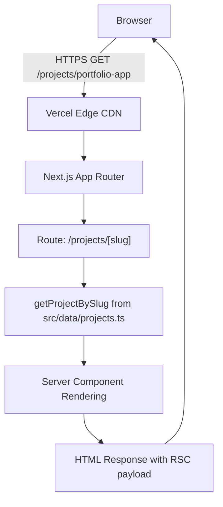

## Purpose

Describe the Portfolio App architecture at a level that is:

- specific enough to guide implementation
- credible to enterprise reviewers
- maintainable as the portfolio expands

## Scope

### In scope

- framework choice and major boundaries (Next.js App Router)
- routing and information architecture for the app
- content model for projects and CV data
- integration pattern with Documentation App evidence pages

### Out of scope

- CI/CD implementation details (see `deployment.md`)
- security threat enumeration (see `security.md`)

## Prereqs / Inputs

- Next.js (App Router) + TypeScript baseline planned
- Hosting target: Vercel
- Evidence engine exists in Docusaurus and is publicly accessible at `/docs` or a subdomain

## Procedure / Content

## System boundaries

### Portfolio App responsibilities (“front-of-house”)

- provide a polished, fast, product-like UX
- present core narrative: value proposition, CV, projects, contact
- link to evidence artifacts hosted in Docusaurus
- avoid overloading the app with long-form governance docs (keep evidence in docs engine)

### Documentation App responsibilities (“evidence engine”)

- host deep technical documentation:
  - dossiers, ADRs, threat models, runbooks, postmortems
- provide traceability and enterprise governance narrative

## Routing and UX architecture (recommended vs current)

Note: Items marked (implemented) exist in Phase 1. Items marked (planned) are illustrative and not yet implemented.

- `/` — landing, “Start Here,” primary narrative (implemented)
- `/cv` — interactive CV (timeline + skill proof) (implemented)
- `/projects` — curated gallery (implemented)
- `/projects/[slug]` — project details (evidence links) (implemented)
- `/contact` — static contact method (no auth, no form initially) (implemented)
- `/labs` — experiments / prototypes / R&D notes (optional) (planned)
- `/security` — public security posture summary (high-level, safe) (planned)

## Content model (pragmatic and scalable)

### Principle: data-driven content, components for presentation

Use structured data for:

- project list and metadata
- CV timeline entries
- skills and capability proof links
- evidence links mapping to Docusaurus paths

Recommended initial approach (low complexity):

- store project metadata in structured files (JSON/YAML/TS objects)
- generate pages from the data model with stable slugs
- keep long-form writeups in Docusaurus, linked from project pages

### Data-Driven Registry (Phase 3)

- Registry lives in the Portfolio App at [portfolio-app/src/data/projects.yml](https://github.com/bryce-seefieldt/portfolio-app/tree/main/src/data/projects.yml) and is validated by [portfolio-app/src/lib/registry.ts](https://github.com/bryce-seefieldt/portfolio-app/tree/main/src/lib/registry.ts).
- Loader flow: YAML → env placeholder interpolation (`NEXT_PUBLIC_*`) → Zod validation (slug uniqueness, URL shape) → typed export via `src/data/projects.ts` → page components.
- Validation is enforced in CI via `pnpm registry:validate` and during build; schema is documented in [docs/70-reference/registry-schema-guide.md](docs/70-reference/registry-schema-guide.md); rationale captured in [docs/10-architecture/adr/adr-0011-data-driven-project-registry.md](docs/10-architecture/adr/adr-0011-data-driven-project-registry.md).
- URLs support env-driven placeholders (`{GITHUB_URL}`, `{DOCS_BASE_URL}`, `{DOCS_GITHUB_URL}`, `{SITE_URL}`) resolved from `NEXT_PUBLIC_*` variables to keep references portable across deploy environments.
- Evidence fields (dossier, threat model, ADR index, runbooks, GitHub) are part of the contract so every claim on a project page links to verifiable artifacts in the docs app.

### Evidence Visualization Layer (Stage 3.2)

After Stage 3.1 established a data-driven registry, Stage 3.2 makes evidence visualization a first-class architectural concern through three reusable React components. Rather than relegating evidence links to project footers or separate pages, components embed evidence discovery into the main project detail experience.

#### Component Architecture

**Three-Tier Component System:**

```
EvidenceBlock (render evidence grid)
↑
BadgeGroup (conditional badge aggregation)
↑
VerificationBadge (single badge + icon)
↑
Registry Data (Project.evidence)
```

**VerificationBadge Component**

- **Purpose:** Quick status indicator for evidence artifacts
- **Location:** `src/components/VerificationBadge.tsx`
- **Badge Types:**
  - `docs-available` → Blue theme, document icon
  - `threat-model` → Purple theme, shield icon
  - `gold-standard` → Amber theme, check-circle icon
  - `adr-complete` → Green theme, archive icon
- **Design:** Inline badges with icons, text labels, full dark mode support
- **Props:** `type` (BadgeType), `title?` (optional tooltip)

**BadgeGroup Component**

- **Purpose:** Conditional multi-badge rendering based on project evidence
- **Location:** `src/components/BadgeGroup.tsx`
- **Logic:**
  - Shows `gold-standard` if `project.isGoldStandard === true`
  - Shows `docs-available` if `project.evidence.dossierPath` exists
  - Shows `threat-model` if `project.evidence.threatModelPath` exists
  - Shows `adr-complete` if `project.evidence.adr` array has items
- **Design:** Flex wrap layout for responsive badge arrangement
- **Props:** `project` (Project object), `className?` (additional Tailwind classes)
- **Integration:** Placed in project header for at-a-glance evidence scanning

**EvidenceBlock Component**

- **Purpose:** Comprehensive evidence artifact display in responsive grid
- **Location:** `src/components/EvidenceBlock.tsx`
- **Renders:** 5 evidence categories:
  1. **Dossier** — Link to comprehensive project documentation
  2. **Threat Model** — STRIDE security analysis
  3. **Architecture Decisions** — ADR records (list or index)
  4. **Runbooks** — Operational procedures (list or index)
  5. **GitHub** — Source code repository
- **Design:** Responsive grid (1 col mobile → 2 col tablet → 3 col desktop), card styling with dark mode
- **Empty States:** Placeholder cards with muted styling for unavailable evidence
- **Props:** `project` (Project object), `className?` (additional Tailwind classes)
- **Link Construction:** Uses `docsUrl()` helper for docs URLs; environment-safe URL building

#### Integration Pattern

Components integrate into `/projects/[slug]` page (`src/app/projects/[slug]/page.tsx`):

1. **BadgeGroup** in header section (below title, above summary)
2. **EvidenceBlock** in dedicated "Evidence Artifacts" section

Evidence data flows:

1. Registry loads from `src/data/projects.yml` (Stage 3.1)
2. Registry validates slug uniqueness, URL validity, evidence link patterns
3. Components receive `Project` type (TypeScript)
4. Components extract `evidence` and `isGoldStandard` fields
5. Components call `docsUrl()` to interpolate environment-based links
6. Components render responsive, accessible UI

#### Design Decisions

**Why separate components instead of monolithic "Evidence" component?**

- Each component solves a distinct UX problem; enables reuse in different contexts (future index views, dashboards)
- Changes to one concern don't cascade through entire component tree
- Simpler testing and maintenance

**Why Tailwind CSS for styling?**

- All portfolio-app styling uses Tailwind; avoids framework fragmentation
- Utility-first CSS with tree-shaking minimizes bundle overhead
- Dark mode support via `dark:` modifier is built-in

**Why responsive grid (3-column desktop)?**

- Scales naturally: three evidence categories (dossier, threat model, ADRs) fit 3-column layout
- Mobile-first design: starts at 1 column, progressively enhances
- Future-proof: easy to add more evidence types

**Why build links from registry?**

- Registry is single source of truth; link changes update all pages automatically
- Portability: URLs remain consistent across environments and deploy variations
- Maintainability: Adding new projects or changing evidence URLs requires registry edit only

#### Future Extensions (Post-Stage 3.2)

Planned enhancements:

- Tooltip explanations for each evidence type
- Visual indicators for "incomplete" or "outdated" evidence
- Badge counts (e.g., "4 ADRs") to signal depth
- Click-through analytics (optional, privacy-safe)
- Link validation dashboard (showing broken evidence links)
- Keyboard focus management and enhanced a11y improvements
- Storybook integration for component library documentation

### Testing Architecture (Stage 3.3)

After Stage 3.2 established evidence visualization components, Stage 3.3 adds comprehensive test coverage to ensure registry integrity and link resolution. The testing architecture follows the testing pyramid: unit tests (Vitest) for business logic, E2E tests (Playwright) for user-facing behavior.

#### Testing Pyramid

```
┌─────────────────────────────────────────┐
│  E2E Tests (Playwright)                  │
│  - Evidence link resolution              │
│  - Component rendering                   │
│  - Route coverage                        │
│  - Responsive design (mobile/tablet)    │
│  Tests: ~12                              │
├─────────────────────────────────────────┤
│  Integration Tests (Future)              │
│  - API routes                            │
│  - Data fetching                         │
├─────────────────────────────────────────┤
│  Unit Tests (Vitest)                     │
│  - Registry validation (Zod schemas)     │
│  - Slug helpers (format, uniqueness)     │
│  - Link construction (URL building)      │
│  Tests: ~70                              │
└─────────────────────────────────────────┘
```

#### Unit Tests (Vitest)

**Purpose**: Validate registry schema, slug rules, and link construction helpers at build time

**Modules Tested**:

1. `src/lib/registry.ts` (Stage 3.1)
   - Valid project entries pass Zod schema validation
   - Invalid entries (missing fields, malformed slugs, duplicate slugs) are rejected
   - Required field validation (title, description, tags, tech stack, evidence links)
   - Slug uniqueness enforcement across entire registry

2. `src/lib/config.ts` (Stage 3.1)
   - `docsUrl()` builds URLs with `NEXT_PUBLIC_DOCS_BASE_URL` environment variable
   - `githubUrl()` builds GitHub URLs correctly
   - `docsGithubUrl()` builds documentation GitHub URLs
   - `mailtoUrl()` builds mailto links with optional subject parameters
   - Fallback behavior when environment variables are missing
   - URL normalization (trailing slashes, leading slashes)

3. `src/lib/slugHelpers.ts` (Stage 3.1)
   - Slug format enforcement: regex `^[a-z0-9]+(?:-[a-z0-9]+)*$`
   - Rejection of uppercase, spaces, special characters
   - Edge cases: empty strings, unicode characters, emoji

**Coverage Target**: ≥80% for all `src/lib/` modules

**Test Files**:

- `src/lib/__tests__/registry.test.ts` — 17 tests for schema validation
- `src/lib/__tests__/config.test.ts` — 18 tests for link construction helpers
- `src/lib/__tests__/slugHelpers.test.ts` — 19 tests for slug validation
- `src/lib/__tests__/linkConstruction.test.ts` — 16 tests (dedicated link helper tests)

**Example Test**:

```typescript
describe('Registry Validation', () => {
  it('should enforce slug format', () => {
    const invalidProject = { slug: 'Invalid Slug!' };
    expect(ProjectSchema.safeParse(invalidProject).success).toBe(false);
  });
});
```

#### E2E Tests (Playwright)

**Purpose**: Verify evidence link resolution, component rendering, and user journeys work correctly end-to-end

**Routes Tested**:

- All project pages: `/projects/[slug]`
- Evidence link navigation and href correctness
- Component rendering (EvidenceBlock, BadgeGroup, VerificationBadge)
- Responsive design across viewports (mobile: 390px, tablet: 768px, desktop: 1440px)
- Gold standard badge display for portfolio-app

**Coverage Target**: 100% route coverage for all project pages

**Test File**: `e2e/evidence-links.spec.ts` and `tests/e2e/smoke.spec.ts`

**Example Test**:

```typescript
test('evidence block renders all categories', async ({ page }) => {
  await page.goto('/projects/portfolio-app');

  // Verify all 5 evidence categories present
  await expect(page.locator('text=Dossier')).toBeVisible();
  await expect(page.locator('text=Threat Model')).toBeVisible();
  await expect(page.locator('text=ADRs')).toBeVisible();
  await expect(page.locator('text=Runbooks')).toBeVisible();
  await expect(page.locator('text=GitHub Repository')).toBeVisible();
});
```

#### CI Integration

Tests run in GitHub Actions **before build** to enforce quality gates:

1. **Quality Job**: ESLint, Prettier, TypeScript linting (prerequisite)
2. **Test Job** (depends on quality job):
   - Run unit tests: `pnpm test:unit`
   - Install Playwright browsers
   - Start dev server
   - Run E2E tests: `pnpm playwright test`
   - Upload coverage reports as artifacts
3. **Build Job** (depends on test job):
   - Build fails if any tests fail
   - Merge is blocked if CI fails

**Build Blocking**: The `build` job depends on the `test` job:

```yaml
build:
  needs: [quality, test]
  if: always() && needs.quality.result == 'success' && needs.test.result == 'success'
```

This ensures broken tests prevent production deployments.

#### Design Decisions

**Why Vitest over Jest?**

- Native ESM support (required for Next.js 15 App Router with `reactCompiler: true`)
- Faster test execution and better TypeScript integration
- Shared config with Vite tooling (simpler setup)

**Why Playwright over Cypress?**

- Multi-browser support out-of-the-box (Chromium, Firefox, WebKit)
- Better performance at scale and superior API for responsive design testing
- Faster test execution and better debugging experience

**Why ≥80% coverage target, not 100%?**

- Balance between quality and development velocity
- 80% coverage catches most regressions without testing implementation details
- Avoids test maintenance burden for trivial code (re-exports, empty handlers)
- Allows engineers to focus on testing behavior, not implementation

#### See Also

- **Testing Guide**: [docs/70-reference/testing-guide.md](/docs/70-reference/testing-guide.md) — Comprehensive patterns and examples
- **Testing Dossier**: [docs/60-projects/portfolio-app/05-testing.md](/docs/60-projects/portfolio-app/05-testing.md) — CI gates and local validation
- **Implementation**: [stage-3-3-app-issue.md](/docs/00-portfolio/roadmap/issues/stage-3-3-app-issue.md) — GitHub issue with acceptance criteria

### Evidence-link strategy

Each project entry should include:

- repo URL
- demo URL (if applicable)
- “Read the dossier” URL (Docusaurus path)
- optional: threat model / runbook links

Example evidence link types:

- dossier: `/docs/60-projects/<project>/`
- ADR: `/docs/10-architecture/adr/adr-xxxx-...`
- threat model: `/docs/40-security/threat-models/<project>-threat-model`
- runbooks: `/docs/50-operations/runbooks/`

## Component boundaries (recommended)

- `app/` routes:
  - route-level layout and metadata
- `components/`:
  - design system primitives and page-level components
- `content/` (or `data/`):
  - structured portfolio metadata and project definitions
- `lib/`:
  - utilities and helpers (data validation, slug generation)
- `public/`:
  - static assets with stable names
- `tests/`:
  - unit and e2e tests (phased)

## Repository structure (current)

Key paths and roles in the Portfolio App repo:

- `src/app/*` — App Router pages and layouts (implemented routes):
  - `/` — landing
  - `/cv` — interactive CV scaffold
  - `/projects` — project index
  - `/projects/[slug]` — project details
  - `/contact` — static contact surface
- `src/lib/config.ts` — public-safe configuration contract and helpers:
  - reads `NEXT_PUBLIC_*` env vars
  - provides `DOCS_BASE_URL`, `docsUrl(path)`, and `mailtoUrl()`
  - normalizes/validates public URLs
- `src/data/projects.ts` — project registry placeholder:
  - stable slugs, titles, summaries, tags, status
  - optional evidence link paths into the Documentation App (dossier, ADR index, threat models, runbooks)

## Routing and evidence-link strategy

- Documentation base URL is configured via environment variable `NEXT_PUBLIC_DOCS_BASE_URL`.
- The app centralizes this via `src/lib/config.ts` and the `docsUrl()` helper to build stable evidence links.
- Project pages should derive evidence links from `src/data/projects.ts` where possible to keep slugs and paths consistent with the Documentation App.
- This separation keeps the Portfolio App concise while ensuring every major claim links to verifiable evidence in the docs site.

## Component architecture and design system

### Principle: Utility-first composition

The Portfolio App uses **Tailwind CSS v4** with a utility-first approach to styling and component composition.

Reusable component primitives:

- `<Callout>` — styled content container for emphasis (announcements, warnings, key takeaways)
- `<Section>` — page section with title, optional subtitle, and consistent spacing/borders

Component organization:

- Route-level components: page.tsx files in `src/app/*`
- Layout components: `src/app/layout.tsx` (navigation, footer, metadata)
- Shared primitives: `src/components/*`

### Dark mode strategy

- System preference-based (uses `prefers-color-scheme` media query)
- No explicit toggle UI in Phase 1 (intentional minimalism)
- All components use Tailwind `dark:` variants for dark mode styling
- Future: consider explicit toggle with local storage (Phase 2+)

### Styling patterns

- Tailwind utility classes for all styling (no CSS modules or styled-components)
- Consistent design tokens: spacing, colors, borders, shadows
- Automatic class sorting via `prettier-plugin-tailwindcss`
- Responsive design: mobile-first with `sm:`, `md:`, `lg:` breakpoints

## Navigation and information architecture

### Top navigation

Fixed header with:

- Portfolio branding/logo (links to `/`)
- CV, Projects, Evidence (Docs), Contact
- Evidence link opens Documentation App in same/new tab

### Footer

- Social links: GitHub, LinkedIn (if configured)
- Documentation App link
- Enterprise evidence model statement

### Intentional omissions (Phase 1)

- No dark mode toggle (system preference only)
- No authentication or user accounts
- No search (deferred to docs app or Phase 3+)

## Metadata and SEO strategy

### Current approach

Metadata configured in `src/app/layout.tsx`:

- Title template: `"%s | Portfolio"` (appended to page-level titles)
- Description: concise value proposition
- `metadataBase`: intentionally `undefined` (deferred until production domain finalized)

### Future enhancements (Phase 2+)

- OpenGraph tags for social sharing
- Twitter card metadata
- Structured data (JSON-LD) for projects and CV
- Canonical URLs once domain is live

## Toolchain and runtime

### Node version policy

- Node 20 LTS (pinned in `.nvmrc`)
- Rationale: Deterministic builds, active LTS with security support
- Upgrade policy: Follow Node.js LTS schedule; document via ADR

### React Compiler

- Enabled via `next.config.ts` (`reactCompiler: true`)
- Automatic optimization of components and hooks
- See ADR-0009 for decision rationale and validation criteria

### Package manager

- pnpm 10 (pinned in `package.json` `packageManager` field)
- Deterministic installs with frozen lockfile in CI

## Scalability considerations

- adding projects should be "cheap":
  - add metadata + assets + evidence links; page generates automatically
- avoid heavy dynamic backend early:
  - keep the system static-first; add APIs only via ADR
- keep performance strong:
  - minimize client-side JS; prefer server components where appropriate
  - React Compiler optimizes re-renders automatically

## Validation / Expected outcomes

- New project pages can be added without re-architecting routing
- Evidence links are consistent and trustworthy
- The app remains fast and accessible
- Architecture is explainable in a concise diagram and ADR(s)

## Failure modes / Troubleshooting

- Content sprawl inside the app → move long-form content into Docusaurus
- Inconsistent slugs and broken project routes → enforce slug rules and add tests
- Evidence links break due to docs reorg → treat as breaking change; update references and release notes

## References

- Portfolio App dossier hub: `docs/60-projects/portfolio-app/index.md`
- Documentation App dossier: `docs/60-projects/portfolio-docs-app/`
- ADRs: `docs/10-architecture/adr/`

---

## Technology Stack (Complete Inventory)

| Category               | Technology           | Version  | Rationale                                                                      |
| ---------------------- | -------------------- | -------- | ------------------------------------------------------------------------------ |
| **Framework**          | Next.js              | v16.1.3  | App Router, React Server Components, static optimization, industry standard    |
| **UI Library**         | React                | v19.2.3  | Concurrent features, automatic batching, modern rendering                      |
| **Language**           | TypeScript           | v5+      | Strict mode, type safety, developer experience                                 |
| **Styling**            | Tailwind CSS         | v4       | Utility-first, JIT compilation, minimal CSS bundle                             |
| **CSS Processing**     | @tailwindcss/postcss | v4       | CSS transformation and optimization                                            |
| **Package Manager**    | pnpm                 | v10.0.0  | Fast, efficient, frozen lockfiles in CI                                        |
| **Compiler**           | Next.js SWC          | Built-in | Rust-based, 17x faster than Babel                                              |
| **React Optimizer**    | React Compiler       | v1.0.0   | Automatic memoization, ADR-0009                                                |
| **E2E Testing**        | Playwright           | v1.57.0  | Multi-browser smoke tests, 100% route coverage                                 |
| **Linting**            | ESLint               | v9       | Flat config, Next.js presets, TypeScript integration                           |
| **Formatting**         | Prettier             | v3.8.0   | Code formatting, Tailwind class sorting                                        |
| **CI/CD**              | GitHub Actions       | -        | Quality + build jobs, frozen lockfiles                                         |
| **Hosting**            | Vercel               | -        | Preview + production, edge CDN, promotion checks                               |
| **Security Scanning**  | CodeQL               | -        | JavaScript/TypeScript static analysis                                          |
| **Dependency Updates** | Dependabot           | -        | Weekly updates, grouped, majors excluded                                       |
| **Secrets Scanning**   | TruffleHog           | v3.85.0  | CI gate (PRs); optional pre-commit; local verify uses lightweight pattern scan |

### Notable Architectural Decisions

- **No authentication**: Intentionally deferred (public portfolio, ADR pending)
- **No database**: Static content model (scalable via data files)
- **No form backend**: Contact via static methods (email link)
- **Evidence links**: Deep integration with Docusaurus documentation
- **React Compiler**: Enabled for automatic optimization (ADR-0009)

## High-Level Request Flow



**Flow explanation:**

1. Browser requests project detail page
2. Vercel Edge CDN terminates SSL, serves cached response if available
3. Next.js App Router matches `/projects/[slug]` route
4. Server component fetches project metadata from static registry
5. Component renders with Section/Callout components and evidence links
6. Static-optimized HTML + RSC payload returned to browser

## Component Architecture

```
src/
├── app/ # Next.js App Router
│   ├── layout.tsx      # Root layout (global nav, metadata)
│   ├── page.tsx        # Landing page (/)
│   ├── cv/
│   │   └── page.tsx    # CV route
│   ├── projects/
│   │   ├── page.tsx    # Projects list
│   │   └── [slug]/
│   │       └── page.tsx# Dynamic project detail
│   └── contact/
│       └── page.tsx    # Contact page
├── components/         # Reusable components
│   ├── Section.tsx     # Content section wrapper
│   └── Callout.tsx     # Highlighted content blocks
├── data/
│   └── projects.ts     # Project registry (typed)
└── lib/
    └── config.ts       # Environment config helpers
```

## Component Library (Phase 2 Patterns)

### GoldStandardBadge Component

**Purpose**: Visual indicator for exemplary projects with comprehensive evidence.

**Location**: `src/components/GoldStandardBadge.tsx`

**Design**:

- Amber/orange theme (`bg-amber-50`, `text-amber-900`, `border-amber-200`)
- Checkmark SVG icon (✓) for verification
- Bold "Gold Standard" text with descriptive subtitle
- Responsive padding and spacing
- Dark mode support via Tailwind `dark:` variants

**Usage Pattern**:

```tsx
import { GoldStandardBadge } from '@/components/GoldStandardBadge';

<GoldStandardBadge />;
```

**Evidence**: Used in [src/app/projects/[slug]/page.tsx](https://github.com/bryce-seefieldt/portfolio-app/blob/main/src/app/projects/%5Bslug%5D/page.tsx) for portfolio-app gold standard page.

### Enhanced Callout Component

**Purpose**: Highlighted content blocks for announcements, warnings, key takeaways, and informational sections.

**Location**: `src/components/Callout.tsx`

**Design Evolution (Phase 2)**:

- Added `type` prop with three variants: `"default"`, `"warning"`, `"info"`
- **Default**: Blue theme (`bg-blue-50`, `text-blue-900`, `border-blue-200`)
- **Warning**: Amber theme (`bg-amber-50`, `text-amber-900`, `border-amber-200`)
- **Info**: Purple/indigo theme (`bg-purple-50`, `text-purple-900`, `border-purple-200`)
- Consistent border-left accent (`border-l-4`)
- Dark mode variants for all types

**Usage Pattern**:

```tsx
import { Callout } from '@/components/Callout';

<Callout type="info">
  <strong>For busy reviewers:</strong>
  Follow this 5-minute verification path...
</Callout>;
```

**Evidence**: Used throughout project pages and CV for reviewer guidance and key takeaways.

### Conditional Rendering Pattern (Gold Standard Projects)

**Purpose**: Differentiate gold standard projects with comprehensive sections vs generic project pages.

**Location**: `src/app/projects/[slug]/page.tsx`

**Pattern**:

```tsx
// Conditional rendering based on slug
{
  slug === 'portfolio-app' ? (
    <>
      {/* Gold standard sections */}
      <GoldStandardBadge />
      <Section title="What This Proves">...</Section>
      <Section title="Verification Checklist">...</Section>
      <Section title="Deep Evidence">...</Section>
      <Section title="Tech Stack">...</Section>
    </>
  ) : (
    <>
      {/* Generic project template */}
      <Section title="Overview">...</Section>
    </>
  );
}
```

**Rationale**:

- Maintains single route for all projects
- Allows special treatment for showcase projects
- Scalable: future gold standard projects can extend condition
- Alternative considered: separate route (`/projects/gold/[slug]`) rejected for URL simplicity

**Evidence**: See [PR #20](https://github.com/bryce-seefieldt/portfolio-app/pull/20) for implementation.

### Data-Driven Content Pattern (CV Timeline)

**Purpose**: Separate data structure from presentation for maintainability and scalability.

**Location**: `src/data/cv.ts` (data), `src/app/cv/page.tsx` (presentation)

**Data Structure**:

```typescript
interface TimelineEntry {
  title: string;
  organization: string;
  period: string;
  description: string;
  keyCapabilities: string[];
  proofs: Array<{ text: string; href: string }>;
}

export const TIMELINE: TimelineEntry[] = [
  {
    title: 'Portfolio Program & Engineering Excellence',
    organization: 'Portfolio Development Initiative',
    period: '2026',
    description: '...',
    keyCapabilities: [
      'Next.js & React (v19+)',
      'TypeScript (strict mode)',
      // ... more capabilities
    ],
    proofs: [
      {
        text: 'Portfolio App Dossier',
        href: docsUrl('/docs/60-projects/portfolio-app/'),
      },
      // ... more proofs
    ],
  },
  // ... more entries
];
```

**Presentation Pattern**:

- Map `TIMELINE` array to `Section` components
- Render capabilities as rounded badge chips
- Render proofs as underlined links with evidence prefix
- Evidence Hubs section provides comprehensive navigation

**Benefits**:

- Easy to add new timeline entries without touching UI code
- Type safety for all entries via TypeScript interface
- Centralized data source enables future features (filtering, search, analytics)
- Verifiable capability claims via structured proof links

**Evidence**: See [PR #21](https://github.com/bryce-seefieldt/portfolio-app/pull/21) for implementation.

### Evidence-First UX Pattern

**Principle**: Every capability claim must link to verifiable documentation or code.

**Implementation**:

1. **Project pages**: Each feature links to dossier, threat model, runbook, or ADR
2. **CV page**: Each capability links to project evidence, architecture docs, or operational artifacts
3. **Evidence Hubs**: Dedicated sections for comprehensive evidence navigation

**Link Types**:

- **Dossier**: Project overview and architecture (`/docs/60-projects/<project>/`)
- **Threat Model**: Security analysis (`/docs/40-security/threat-models/<project>-threat-model`)
- **Runbooks**: Operational procedures (`/docs/50-operations/runbooks/`)
- **ADRs**: Architecture decisions (`/docs/10-architecture/adr/adr-xxxx-...`)
- **CI Workflows**: Build and test pipelines (GitHub Actions `.github/workflows/`)
- **Unit Tests**: Registry, slug, link validation (Vitest, `src/lib/__tests__/`)
- **E2E Tests**: Route coverage, evidence link resolution (Playwright, `e2e/evidence-links.spec.ts`)

**Benefits**:

- Reviewers can verify every claim independently
- No trust required - evidence is public and auditable
- Demonstrates governance maturity and operational rigor
- Scalable: more evidence = stronger narrative

## Scalability Patterns

Current (Phase 2):

- Static project data in TypeScript (typed, version-controlled)
- Manual content updates via code changes + PRs
- Evidence links hardcoded per project
- Data-driven CV timeline (src/data/cv.ts)
- Gold standard conditional rendering (slug-based)

Planned (Phase 3+):

- CMS or API-driven project data (Contentful, headless CMS)
- Automated evidence link validation
- Tag-based filtering and search
- Dynamic gold standard detection (metadata-driven vs slug hardcoding)
