## Purpose

This page documents how the Portfolio Docs App is built and deployed as a production-like service, including:

- the pipeline contract (what must run, what must pass)
- environment strategy (preview vs production)
- release discipline and versioned documentation updates
- rollback and recovery posture

## Scope

### In scope

- CI/CD stages and required checks
- hosting model (high-level, public-safe)
- preview deployments and PR workflow
- release notes discipline and what constitutes a “release”
- rollback posture and expected recovery steps

### Out of scope

- vendor-specific secrets, tokens, or account details
- deep security control detail (see `security.md`)
- operational runbook step-by-step commands (see `operations.md`)

## Prereqs / Inputs

- Docusaurus site builds locally:
  - `pnpm start`
  - `pnpm verify` (full local quality gates; `pnpm verify:quick` skips build for iteration)
- PR-only merge workflow to `main`
- A hosting target selected (e.g., Vercel) and connected via Git integration (public-safe assumption)
- Repository includes a CI workflow that runs at least the required gates

## Procedure / Content

### Deployment architecture

The Portfolio Docs App uses a **GitHub-to-Vercel pipeline** with the following workflow:

```mermaid
graph LR
    A["🔸 GitHub: Push to main"] --> B["🔨 Vercel: Build (pnpm build)"]
    B --> C["✓ Checks: GitHub Actions (ci / build)"]
    C -->|Checks Pass| D["✅ Vercel: Assign Production Domain"]
    C -->|Checks Fail| E["⚠️ Vercel: Unpromoted Deployment"]
    D --> F["🌍 Production: Live"]
    E --> G["🔄 Await Fix or Rollback"]

    style A fill:#0066cc,stroke:#003d7a,color:#fff
    style B fill:#0066cc,stroke:#003d7a,color:#fff
    style C fill:#ff6b00,stroke:#cc5500,color:#fff
    style D fill:#00aa44,stroke:#006622,color:#fff
    style F fill:#00aa44,stroke:#006622,color:#fff
    style E fill:#dd4400,stroke:#aa2200,color:#fff
    style G fill:#dd4400,stroke:#aa2200,color:#fff
```



This architecture decouples **deployment creation** (immediate) from **release promotion** (gated by checks).

### Environment strategy

#### Preview environment (PR branches)

- Every PR branch automatically triggers a Vercel preview deployment
- Preview URL: unique per branch (e.g., `<branch-name>-<random>.vercel.app`)
- Objective: reviewers can validate navigation, rendering, and content coherence before merge
- Failed builds produce a visible error state in PR checks

#### Production environment (`main`)

- `main` represents the single source of truth for published documentation
- Deployment flow:
  1. PR merges to `main`
  2. Vercel immediately creates a production deployment
  3. Deployment Checks (GitHub Actions `ci / build`) run
  4. When checks pass: Vercel assigns the production domain
  5. When checks fail: deployment exists but remains inaccessible; requires fix-forward or rollback

### Build settings and contract

Vercel is configured with the following build contract:

```yaml
Install command: pnpm install --frozen-lockfile
Build command: pnpm build
Output directory: build
Node.js version: 20.x (LTS)
Environment variables: ENABLE_EXPERIMENTAL_COREPACK=1
```

These settings ensure:

- **Determinism**: frozen lockfile prevents dependency version drift
- **Reproducibility**: local `pnpm build` matches Vercel build exactly
- **Safety**: Docusaurus build fails on broken links, preventing invalid HTML from serving

### Environment variable configuration

Vercel automatically loads environment variables for the build process. Key variables for the Portfolio Docs App:

**Required for production promotion:**

```env
DOCUSAURUS_SITE_URL=https://bns-portfolio-docs.vercel.app
DOCUSAURUS_BASE_URL=/
DOCUSAURUS_GITHUB_ORG=bryce-seefieldt
DOCUSAURUS_GITHUB_REPO_DOCS=portfolio-docs
DOCUSAURUS_GITHUB_REPO_APP=portfolio-app
DOCUSAURUS_PORTFOLIO_APP_URL=https://bns-portfolio-app.vercel.app
```

**Configuration:**

1. Go to **Vercel Dashboard → Settings → Environment Variables**
2. Add variables with scope: **Production + Preview**
3. Variables are automatically available during `pnpm build`
4. See [Portfolio Docs Environment Variables Contract](https://github.com/bryce-seefieldt/portfolio-docs/blob/main/docs/_meta/env/portfolio-docs-env-contract.md) for full reference

**For local testing:**

- Copy `.env.example` to `.env.local`
- Edit with local values (e.g., `DOCUSAURUS_SITE_URL=http://localhost:3000`)
- `.env.local` is gitignored; changes are not committed

## Release Governance: Vercel Deployment Checks

**Key pattern:** Vercel Deployment Checks enforce a safety gate between deployment creation and production release.

### Required GitHub checks

Vercel is configured to require **two GitHub Actions checks** before promoting a deployment to production:

1. **`ci / quality`** — Fast-fail quality gates (lint, typecheck, format)
2. **`ci / build`** — Documentation build integrity (broken links, structure validation)

Both checks must pass for production promotion. This ensures:

- Code quality standards are met
- TypeScript type safety is maintained
- Code style is consistent
- Documentation builds successfully
- No broken links or navigation errors

See [ADR-0004](/docs/architecture/adr/adr-0004-expand-ci-deploy-quality-gates) for rationale and [Testing](./05-testing.md) for quality gate details.

### Deployment Checks flow

| Step                  | What happens                                                     | Who/What?                 |
| --------------------- | ---------------------------------------------------------------- | ------------------------- |
| 1. Merge to `main`    | PR merged; `main` moves forward                                  | Developer (via GitHub UI) |
| 2. Deployment created | Vercel detects push, starts build                                | Vercel automation         |
| 3. Checks run         | GitHub Actions workflows `ci / quality` and `ci / build` execute | CI pipeline               |
| 4. Domain assignment  | Vercel assigns production domain (only if **both** checks pass)  | Vercel automation         |
| 5. Site is live       | Production site updated and served                               | Vercel edge network       |

If checks **fail** at step 3:

- Production deployment is created but remains **unpromoted**
- Production domain continues serving the **previous stable version**
- Reviewers see build failure in PR / commit status
- Resolution: fix → revert PR → redeploy, or fix-forward → new PR → merge → redeploy

### How to verify in Vercel UI

1. Go to **Vercel Dashboard → Deployments**
2. Locate the latest deployment from `main`
3. Observe the deployment state:
   - **Building**: currently compiling
   - **Ready**: build succeeded; awaiting checks
   - **Promoted**: checks passed; production domain assigned
   - **Failed**: build or checks failed
4. Click into the deployment detail to view:
   - Build logs (including pnpm version confirmation)
   - Check status (pass/fail for `ci / build`)
   - Live preview URL (even if unpromoted)

### Evidence

To verify a release is complete:

- Confirm Vercel Deployments UI shows **"Promoted"** status
- Confirm deployment timestamp matches the merge time
- Confirm GitHub commit shows ✓ all checks passed

## Build Determinism: pnpm + Corepack

To ensure identical builds across local development, CI, and production hosting, the project enforces strict package manager pinning.

### Package manager specification

**In `package.json`:**

```json
{
  "packageManager": "pnpm@10.0.0",
  "engines": {
    "node": ">=20.0"
  }
}
```

This field tells both Node's package manager ecosystem (Corepack) and Vercel to use **exactly pnpm 10.0.0**.

### Corepack integration (experimental)

**In Vercel environment variables:**

```
ENABLE_EXPERIMENTAL_COREPACK=1
```

When enabled:

- Node's native Corepack reads the `packageManager` field from `package.json`
- Enforces the exact pnpm version, downloading it if needed
- Eliminates "works on my machine but fails in Vercel" errors due to package manager version drift

**Why Corepack?**

- Corepack is built into Node; no additional tools required
- Provides a single source of truth (the `packageManager` field) for all environments
- Standardizes the versioning approach across teams

### Corepack risk assessment

| Aspect          | Benefit                           | Risk                                                                                                               | Mitigation                                                                                          |
| --------------- | --------------------------------- | ------------------------------------------------------------------------------------------------------------------ | --------------------------------------------------------------------------------------------------- |
| **Stability**   | Exact versions enforced           | Corepack is experimental ([Vercel changelog](https://vercel.com/changelog/corepack-experimental-is-now-available)) | If Corepack behavior changes, fallback to explicit `pnpm install --frozen-lockfile` in build script |
| **Maintenance** | No manual pinning per environment | Node team may deprecate Corepack                                                                                   | Pinned `packageManager` field provides escape hatch                                                 |
| **Determinism** | Guaranteed consistency            | Rare: Node version updates can affect Corepack behavior                                                            | Use stable LTS Node version (20.x); validate before updating                                        |

### Build verification

**To confirm pnpm version in Vercel build logs:**

1. In Vercel Deployments UI, open the latest deployment
2. Click **"View Build Logs"**
3. Look for output showing pnpm setup, e.g.:
   ```
   Enabling Corepack...
   Resolving corepack shim for pnpm@10.0.0...
   pnpm 10.0.0
   ```
4. Confirm it matches the pinned version in `package.json`

**To reproduce locally:**

```bash
# Verify local pnpm version
pnpm --version  # Should output: 10.0.0 (or the pinned version)

# Run the build exactly as Vercel does
pnpm install --frozen-lockfile
pnpm build
```

If local pnpm differs from the pinned version, enable Corepack locally:

```bash
corepack enable
corepack install  # Installs the pinned version
pnpm --version    # Should now match package.json
```

### Lockfile discipline

Vercel uses `--frozen-lockfile` by default in CI environments, treating lockfile drift as a hard failure.

**If you update dependencies locally:**

```bash
# Update locally
pnpm add <package>            # Updates pnpm-lock.yaml
git add pnpm-lock.yaml        # Commit the lockfile
git commit -m "deps: update <package>"
git push
```

Vercel will respect the updated lockfile on next deployment.

## Build contract and determinism

### Build contract (Vercel configuration)

The Vercel build contract specifies exactly what Vercel executes to produce the deployable artifact:

| Setting              | Value                                      | Purpose                                                            |
| -------------------- | ------------------------------------------ | ------------------------------------------------------------------ |
| **Install Command**  | `pnpm install --frozen-lockfile`           | Installs dependencies without modifying lockfile (CI discipline)   |
| **Build Command**    | `pnpm build`                               | Generates the deployable site in `build/` directory                |
| **Output Directory** | `build`                                    | Tells Vercel where compiled site is (must match Docusaurus output) |
| **Node.js version**  | `20.x` (LTS)                               | Runtime (matches `package.json#engines`)                           |
| **Corepack**         | `ENABLE_EXPERIMENTAL_COREPACK=1` (env var) | Enforces exact pnpm version via `package.json#packageManager`      |

### How to verify contract in Vercel

1. **Vercel Dashboard** → Project Settings → Build & Development
2. Confirm each setting above matches local expectations
3. If any setting differs, update it and trigger a rebuild

### What "Build contract" guarantees

When the contract is stable and followed:

- Local builds produce identical output to Vercel builds
- `pnpm-lock.yaml` is the source of truth for dependency versions
- No surprises during deployment (what builds locally will build on Vercel)
- Rollback is simple because `git revert` restores both code and lockfile

### Output directory requirement

Docusaurus outputs the compiled site to `build/` by default.

- `build/index.html` — site entrypoint
- `build/docs/` — documentation pages
- `build/assets/` — CSS, JavaScript, images
- `build/404.html` — error page

If Vercel "Output Directory" is set incorrectly (e.g., `public/` or `.docusaurus/`), Vercel will serve the wrong directory and return 404 errors. Verify this setting on every deployment failure involving missing pages.

## Hosting expectations (public-safe)

### Primary target: Vercel

Vercel provides:

- static site hosting with fast global delivery (CDN)
- branch preview deployments for every PR
- simple integration with GitHub repositories
- Deployment Checks support for release gates

The Portfolio Docs App uses Vercel's Git integration ([Vercel Deploying Git Repositories](https://vercel.com/docs/git)) to automatically deploy on push.

(Do not document account identifiers, secrets, or private configuration.)

### Alternative target (fallback)

- GitHub Pages is a viable fallback for a pure static doc site.

## Release discipline

### What constitutes a “release” for docs?

Any meaningful change that affects:

- information architecture
- governance rules
- security posture documentation
- operational procedures
- public-facing portfolio claims

…should update release notes under:

- `docs/00-portfolio/release-notes/`

### Recommended release notes content

- what changed
- why it changed
- how to validate the change (review path and build verification)
- operational impact (if any)

## Rollback posture

### Rollback strategy (minimum viable)

- Primary rollback mechanism is **Git revert** of the offending PR on `main`.
- Production hosting should redeploy automatically from the corrected `main`.

### Rollback triggers

- broken site rendering
- navigation corruption
- accidental publication of sensitive content (treat as security incident)
- major factual correction required

## Validation / Expected outcomes

Deployment model is correct when:

- PRs cannot merge without a passing `pnpm build`
- preview builds are available or reproducible locally
- production publishes from `main` deterministically
- rollback is documented, simple, and fast

## Failure modes / Troubleshooting

See the deployment runbook for detailed diagnosis and recovery procedures:

- [Output directory mismatch](docs/50-operations/runbooks/rbk-docs-deploy.md#failure-output-directory-mismatch-404-errors-or-missing-pages) (404 errors, missing pages)
- [pnpm lockfile drift](docs/50-operations/runbooks/rbk-docs-deploy.md#failure-pnpm-lockfile-drift-or-version-mismatch) (dependency/version conflicts in Vercel)
- [Missing build logs](docs/50-operations/runbooks/rbk-docs-deploy.md#failure-missing-build-logs-or-build-doesnt-start) (build doesn't output or complete)

Additional considerations:

- **Build passes locally but fails in CI:** environment mismatch → pin node/pnpm versions and document the expected toolchain.
- **Preview differs from production:** configuration drift → ensure build command and environment variables are consistent.
- **Broken links introduced:** Docusaurus build fails → fix links or remove premature references to uncreated pages.

## References

- CI/CD platform documentation: `docs/30-devops-platform/ci-cd/`
- Release discipline: `docs/00-portfolio/release-notes/`
- Operations runbooks for deploy/rollback: `docs/50-operations/runbooks/`
