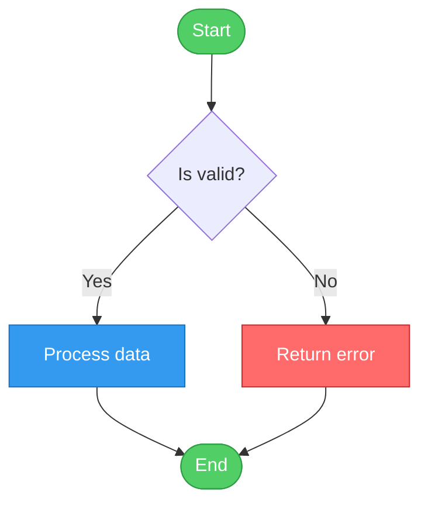
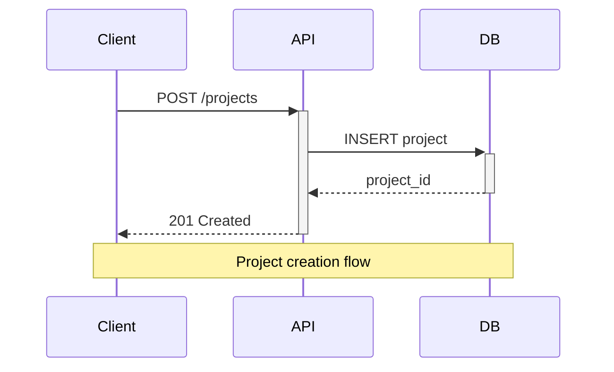
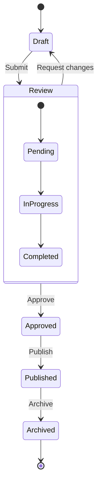
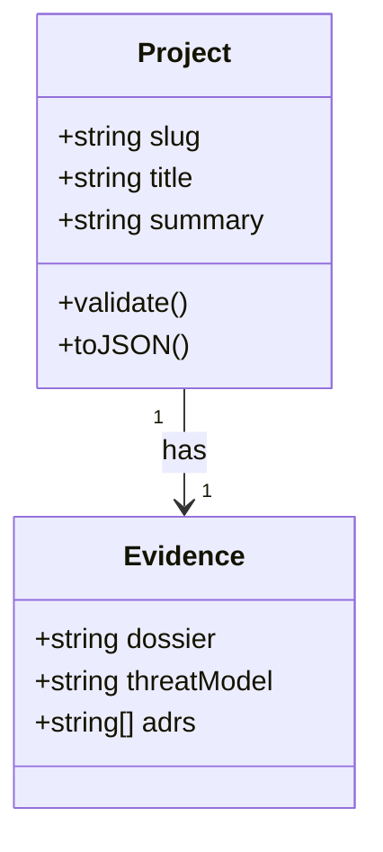
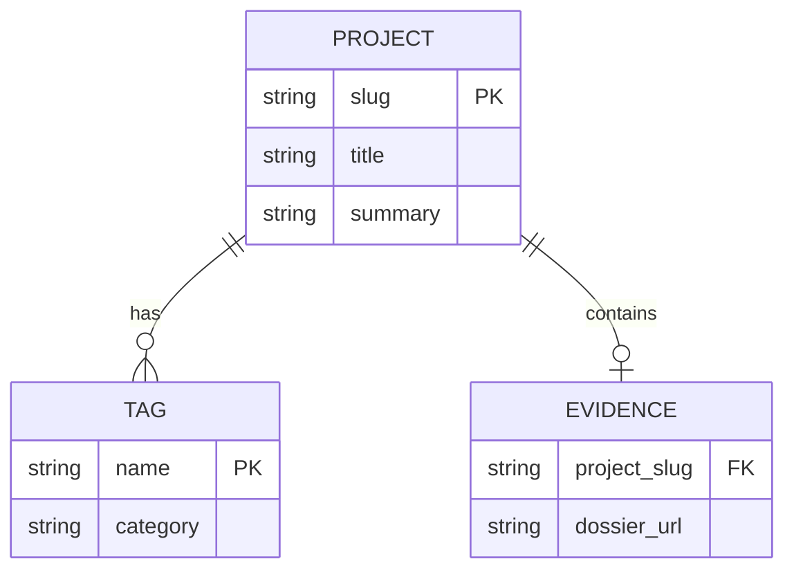
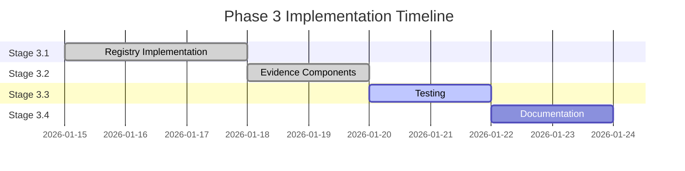
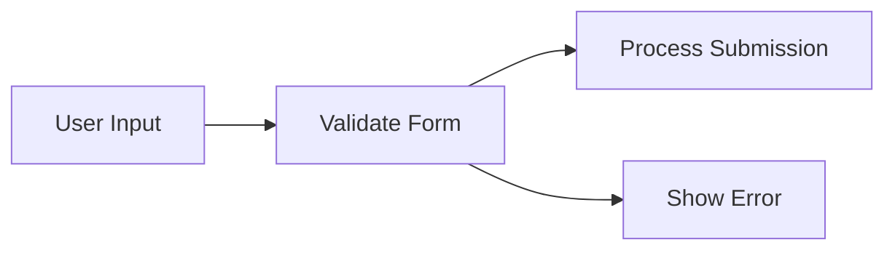
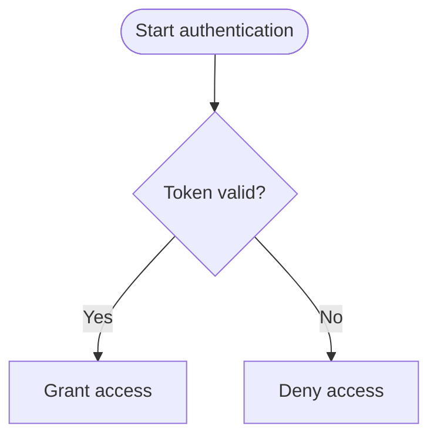
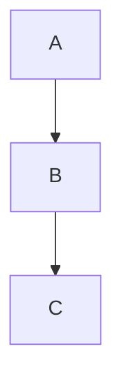
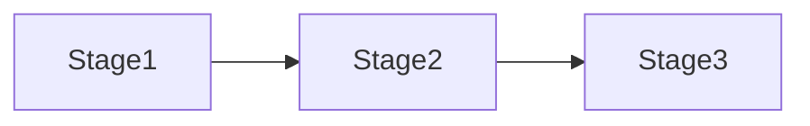

## Purpose

This guide establishes standards for creating Mermaid diagrams in portfolio documentation. Use these conventions to ensure diagrams are consistent, accessible, and maintainable across all docs.

## Scope

- Color palette and theming standards
- Diagram type selection criteria
- Naming conventions and labeling
- Layout and spacing guidelines
- Accessibility requirements
- Common patterns and anti-patterns
- Troubleshooting and validation

## Why Mermaid?

**Benefits:**

- **Version-controllable**: Text-based format in markdown
- **Maintainable**: Easy to update without specialized tools
- **Consistent**: Automated layout and styling
- **Accessible**: Screen reader compatible with proper alt text
- **Portable**: Renders in GitHub, Docusaurus, VS Code, and most markdown viewers

**When NOT to use Mermaid:**

- Complex architectural diagrams requiring precise positioning → Use draw.io or Excalidraw
- Screenshots or UI mockups → Use actual images with alt text
- Data visualizations → Use charts.js or D3.js
- Interactive diagrams → Consider custom React components

## Standard Color Palette

### Primary Colors

Use these colors consistently across all diagrams:

```yaml
# Status Colors
success: '#51cf66' # Green - completed, active, success states
warning: '#ffd43b' # Yellow - in-progress, warnings, attention needed
error: '#ff6b6b' # Red - errors, blocked, critical items
info: '#339af0' # Blue - informational, default states

# Neutral Colors
primary: '#228be6' # Primary blue - main actions, highlights
secondary: '#868e96' # Gray - secondary elements, backgrounds
dark: '#212529' # Dark gray/black - text, borders
light: '#f1f3f5' # Light gray - backgrounds, containers
```

### Semantic Usage

**Success (Green `#51cf66`)**

- Completed tasks or stages
- Passing tests
- Active/healthy services
- Approved states

**Warning (Yellow `#ffd43b`)**

- In-progress work
- Pending reviews
- Warnings or cautions
- Intermediate states

**Error (Red `#ff6b6b`)**

- Failed tests or deployments
- Blocked tasks
- Critical issues
- Deprecated elements

**Info (Blue `#339af0`)**

- Documentation references
- Informational nodes
- Default states
- General flow

**Secondary (Gray `#868e96`)**

- Background elements
- Less important nodes
- Supporting information

## Diagram Type Selection

### Flowcharts (graph TB/LR)

**Use for:**

- Process flows and workflows
- Decision trees
- State machines
- Pipeline stages
- Hierarchical relationships

**Example:**



````markdown

````

### Sequence Diagrams

**Use for:**

- API interactions
- Message flows
- Request/response cycles
- Temporal relationships
- Actor interactions

**Example:**



````markdown

````

### State Diagrams

**Use for:**

- Application states
- Lifecycle management
- Workflow stages
- Status transitions

**Example:**



````markdown

````

### Class Diagrams

**Use for:**

- Type relationships
- Schema definitions
- Component hierarchies
- Data models

**Example:**



````markdown

````

### Entity Relationship Diagrams

**Use for:**

- Database schemas
- Data relationships
- Cardinality mapping

**Example:**



````markdown

````

### Gantt Charts

**Use for:**

- Project timelines
- Milestone tracking
- Phase planning
- Resource allocation

**Example:**



````markdown

````

## Naming Conventions

### Node IDs

**Rules:**

- Use PascalCase for major nodes: `StartNode`, `ProcessData`
- Use camelCase for internal/technical nodes: `apiCall`, `dbQuery`
- Use UPPER_CASE for constants/config: `MAX_RETRIES`, `API_URL`
- Keep IDs semantic and descriptive

**Examples:**



````markdown

````

**❌ Bad:**

```
A --> B
B --> C
node1 --> node2
```

**✅ Good:**

```
UserInput --> ValidateForm
ValidateForm --> ProcessSubmission
```

### Labels

**Rules:**

- Use sentence case: "Process user input" not "Process User Input"
- Be concise but clear: max 5 words preferred
- Use active voice: "Validate data" not "Data validation"
- Avoid articles unless necessary: "Send request" not "Send the request"

**Examples:**



````markdown

````

## Layout Guidelines

### Direction

**Top to Bottom (TB)**: Default for most flows



````markdown

````

**Left to Right (LR)**: For horizontal timelines, pipelines



````markdown

````

**Recommendation**: Use TB for most diagrams unless horizontal flow is more intuitive (e.g., CI/CD pipelines, timelines).

### Node Shapes

Choose shapes that convey meaning:

```mermaid
graph TB
    Start([Start/End - Stadium])
    Process[Process - Rectangle]
    Decision{Decision - Diamond}
    Data[(Database - Cylinder)]
    Document{{Document - Folded document}}
    Subprocess[[Subprocess - Double rectangle]]
```

````markdown
```mermaid
graph TB
    Start([Start/End - Stadium])
    Process[Process - Rectangle]
    Decision{Decision - Diamond}
    Data[(Database - Cylinder)]
    Document{{Document - Folded document}}
    Subprocess[[Subprocess - Double rectangle]]
```
````

**Shape semantics:**

- `([text])` Stadium/Pill: Start/End points
- `[text]` Rectangle: Standard process steps
- `{text}` Diamond: Decision points
- `[(text)]` Cylinder: Databases, data stores
- `{{text}}` Document shape: Documents, artifacts
- `[[text]]` Subroutine: Subprocesses, modules

### Spacing and Grouping

**Use subgraphs for logical grouping:**

```mermaid
graph TB
    subgraph Frontend
        UI[User Interface]
        Router[Router]
    end

    subgraph Backend
        API[API Server]
        DB[(Database)]
    end

    UI --> Router
    Router --> API
    API --> DB
```

````markdown
```mermaid
graph TB
    subgraph Frontend
        UI[User Interface]
        Router[Router]
    end

    subgraph Backend
        API[API Server]
        DB[(Database)]
    end

    UI --> Router
    Router --> API
    API --> DB
```
````

**Benefits:**

- Visual hierarchy
- Logical separation
- Easier maintenance
- Clear boundaries

## Styling Patterns

### Standard Node Styling

**Template:**

```

style NodeID fill:#hexcolor,stroke:#hexcolor,stroke-width:2px,color:#textcolor

```

**Examples:**

```mermaid
graph TB
    Success[Completed]
    InProgress[Active]
    Error[Failed]
    Info[Informational]

    style Success fill:#51cf66,stroke:#2f9e44,stroke-width:2px,color:#fff
    style InProgress fill:#ffd43b,stroke:#fab005,stroke-width:2px,color:#000
    style Error fill:#ff6b6b,stroke:#c92a2a,stroke-width:2px,color:#fff
    style Info fill:#339af0,stroke:#1971c2,stroke-width:2px,color:#fff
```

````markdown
```mermaid
graph TB
    Success[Completed]
    InProgress[Active]
    Error[Failed]
    Info[Informational]

    style Success fill:#51cf66,stroke:#2f9e44,stroke-width:2px,color:#fff
    style InProgress fill:#ffd43b,stroke:#fab005,stroke-width:2px,color:#000
    style Error fill:#ff6b6b,stroke:#c92a2a,stroke-width:2px,color:#fff
    style Info fill:#339af0,stroke:#1971c2,stroke-width:2px,color:#fff
```
````

### Text Color Rules

- **Dark text (`color:#000`)**: Use on light backgrounds (yellow, light gray)
- **Light text (`color:#fff`)**: Use on dark backgrounds (red, green, blue, dark gray)

### Border Width

- `stroke-width:2px`: Standard for all nodes
- `stroke-width:3px`: For emphasis (start/end nodes)
- `stroke-width:1px`: For de-emphasized or background elements

### Class-Based Styling (Recommended)

For repeated styling, use classes:

```mermaid
graph TB
    A[Success state]
    B[Success state 2]
    C[Error state]

    class A,B successNode
    class C errorNode

    classDef successNode fill:#51cf66,stroke:#2f9e44,stroke-width:2px,color:#fff
    classDef errorNode fill:#ff6b6b,stroke:#c92a2a,stroke-width:2px,color:#fff
```

````markdown
```mermaid
graph TB
    A[Success state]
    B[Success state 2]
    C[Error state]

    class A,B successNode
    class C errorNode

    classDef successNode fill:#51cf66,stroke:#2f9e44,stroke-width:2px,color:#fff
    classDef errorNode fill:#ff6b6b,stroke:#c92a2a,stroke-width:2px,color:#fff
```
````

## Common Patterns

### Testing Pyramid

```mermaid
graph TB
    subgraph E2E["E2E Tests - ~12 tests"]
        E1["Evidence link resolution"]
        E2["Component rendering"]
        E3["Route coverage"]
    end

    subgraph INT["Integration Tests"]
        I1["API routes"]
        I2["Data fetching"]
    end

    subgraph UNIT["Unit Tests - ~70 tests"]
        U1["Registry validation"]
        U2["Slug helpers"]
        U3["Link construction"]
    end

    E2E --> INT
    INT --> UNIT

    style E2E fill:#ff6b6b,stroke:#c92a2a,stroke-width:2px,color:#fff
    style INT fill:#ffd43b,stroke:#fab005,stroke-width:2px,color:#000
    style UNIT fill:#51cf66,stroke:#2f9e44,stroke-width:2px,color:#000
```

````markdown
```mermaid
graph TB
    subgraph E2E["E2E Tests - ~12 tests"]
        E1["Evidence link resolution"]
        E2["Component rendering"]
        E3["Route coverage"]
    end

    subgraph INT["Integration Tests"]
        I1["API routes"]
        I2["Data fetching"]
    end

    subgraph UNIT["Unit Tests - ~70 tests"]
        U1["Registry validation"]
        U2["Slug helpers"]
        U3["Link construction"]
    end

    E2E --> INT
    INT --> UNIT

    style E2E fill:#ff6b6b,stroke:#c92a2a,stroke-width:2px,color:#fff
    style INT fill:#ffd43b,stroke:#fab005,stroke-width:2px,color:#000
    style UNIT fill:#51cf66,stroke:#2f9e44,stroke-width:2px,color:#000
```
````

### CI/CD Pipeline

```mermaid
graph LR
    Commit([Commit]) --> Lint[Lint]
    Lint --> Test[Test]
    Test --> Build[Build]
    Build --> Deploy[Deploy]
    Deploy --> Success([Success])

    Lint -->|Fails| Failed([Failed])
    Test -->|Fails| Failed
    Build -->|Fails| Failed

    style Commit fill:#339af0,stroke:#1971c2,stroke-width:2px,color:#fff
    style Success fill:#51cf66,stroke:#2f9e44,stroke-width:2px,color:#fff
    style Failed fill:#ff6b6b,stroke:#c92a2a,stroke-width:2px,color:#fff
    style Lint fill:#e9ecef,stroke:#868e96,stroke-width:2px,color:#000
    style Test fill:#e9ecef,stroke:#868e96,stroke-width:2px,color:#000
    style Build fill:#e9ecef,stroke:#868e96,stroke-width:2px,color:#000
    style Deploy fill:#e9ecef,stroke:#868e96,stroke-width:2px,color:#000
```

````markdown
```mermaid
graph LR
    Commit([Commit]) --> Lint[Lint]
    Lint --> Test[Test]
    Test --> Build[Build]
    Build --> Deploy[Deploy]
    Deploy --> Success([Success])

    Lint -->|Fails| Failed([Failed])
    Test -->|Fails| Failed
    Build -->|Fails| Failed

    style Commit fill:#339af0,stroke:#1971c2,stroke-width:2px,color:#fff
    style Success fill:#51cf66,stroke:#2f9e44,stroke-width:2px,color:#fff
    style Failed fill:#ff6b6b,stroke:#c92a2a,stroke-width:2px,color:#fff
    style Lint fill:#e9ecef,stroke:#868e96,stroke-width:2px,color:#000
    style Test fill:#e9ecef,stroke:#868e96,stroke-width:2px,color:#000
    style Build fill:#e9ecef,stroke:#868e96,stroke-width:2px,color:#000
    style Deploy fill:#e9ecef,stroke:#868e96,stroke-width:2px,color:#000
```
````

### State Machine

```mermaid
stateDiagram-v2
    [*] --> Draft
    Draft --> Review: submit
    Review --> Approved: approve
    Review --> Draft: request_changes
    Approved --> Published: publish
    Published --> Archived: archive
    Archived --> [*]

    note right of Review
        Requires 2 approvals
    end note
```

````markdown
```mermaid
stateDiagram-v2
    [*] --> Draft
    Draft --> Review: submit
    Review --> Approved: approve
    Review --> Draft: request_changes
    Approved --> Published: publish
    Published --> Archived: archive
    Archived --> [*]

    note right of Review
        Requires 2 approvals
    end note
```
````

### API Request Flow

```mermaid
sequenceDiagram
    participant Client
    participant API
    participant DB

    Client->>+API: POST /api/projects
    API->>API: Validate schema
    alt Valid
        API->>+DB: INSERT project
        DB-->>-API: project_id
        API-->>Client: 201 Created
    else Invalid
        API-->>Client: 400 Bad Request
    end
    API->>-Client: Close connection
```

````markdown
```mermaid
sequenceDiagram
    participant Client
    participant API
    participant DB

    Client->>+API: POST /api/projects
    API->>API: Validate schema
    alt Valid
        API->>+DB: INSERT project
        DB-->>-API: project_id
        API-->>Client: 201 Created
    else Invalid
        API-->>Client: 400 Bad Request
    end
    API->>-Client: Close connection
```
````

## Accessibility Guidelines

### Alt Text

Always wrap diagrams in details/summary when possible:

````markdown
<details>
<summary>View CI/CD pipeline diagram</summary>

```mermaid
graph LR
    ...
```

**Text description**: The CI/CD pipeline consists of 5 stages: lint, test, build, deploy, and success. Failed stages redirect to a failed end state.

</details>
````

### High Contrast

- Ensure minimum 4.5:1 contrast ratio for text
- Use our standard palette (pre-validated for contrast)
- Test with browser accessibility tools

### Descriptive Labels

**❌ Bad:**

```mermaid
graph TB
    A --> B
    B --> C
```

````markdown
```mermaid
graph TB
    A --> B
    B --> C
```
````

**✅ Good:**

```mermaid
graph TB
    ValidateInput[Validate user input] --> ProcessData[Process data]
    ProcessData --> SaveResult[Save result]
```

````markdown
```mermaid
graph TB
    ValidateInput[Validate user input] --> ProcessData[Process data]
    ProcessData --> SaveResult[Save result]
```
````

## Anti-Patterns

### ❌ Avoid: Overly Complex Diagrams

**Problem:**

```mermaid
graph TB
    A --> B
    A --> C
    A --> D
    B --> E
    B --> F
    C --> G
    C --> H
    D --> I
    E --> J
    F --> J
    G --> J
    H --> J
    I --> J
```

**Solution**: Break into multiple focused diagrams or use subgraphs.

### ❌ Avoid: Inconsistent Styling

**Problem**: Different colors for the same semantic meaning across diagrams.

**Solution**: Use the standard palette and semantic rules from this guide.

### ❌ Avoid: Unlabeled Edges

**Problem:**

```mermaid
graph LR
    A --> B
    A --> C
```

**Solution**: Add labels to clarify relationships:

```mermaid
graph LR
    Request[API Request] -->|Success| Success[200 OK]
    Request -->|Error| Error[400 Bad Request]
```

````markdown
```mermaid
graph LR
    Request[API Request] -->|Success| Success[200 OK]
    Request -->|Error| Error[400 Bad Request]
```
````

### ❌ Avoid: Generic Node Names

**Problem**: `node1`, `step2`, `A`, `B`

**Solution**: Use descriptive, semantic names: `ValidateInput`, `ProcessData`, `SaveResult`

## Validation and Testing

### Local Preview

1. **VS Code**: Install "Markdown Preview Mermaid Support" extension
2. **Docusaurus dev server**: `pnpm dev` and navigate to the page
3. **Mermaid Live Editor**: Paste code into https://mermaid.live

### Build Validation

Run local build to catch syntax errors:

```bash
cd portfolio-docs
pnpm build
```

**Common errors:**

- Missing quotes around labels with spaces
- Invalid direction (use TB, TD, LR, RL, BT, not others)
- Unclosed subgraphs
- Invalid style syntax

### Syntax Checker

Use the Mermaid CLI for validation:

```bash
# Install
pnpm add -D @mermaid-js/mermaid-cli

# Validate
pnpm exec mmdc -i diagram.mmd -o diagram.svg
```

## Quick Reference

### Color Palette Summary

| Use Case            | Color  | Hex       | Text Color |
| ------------------- | ------ | --------- | ---------- |
| Success/Complete    | Green  | `#51cf66` | `#fff`     |
| Warning/In-Progress | Yellow | `#ffd43b` | `#000`     |
| Error/Blocked       | Red    | `#ff6b6b` | `#fff`     |
| Info/Default        | Blue   | `#339af0` | `#fff`     |
| Secondary           | Gray   | `#868e96` | `#fff`     |

### Node Shapes Summary

| Shape      | Syntax     | Use Case          |
| ---------- | ---------- | ----------------- |
| Stadium    | `([text])` | Start/End         |
| Rectangle  | `[text]`   | Process           |
| Diamond    | `{text}`   | Decision          |
| Cylinder   | `[(text)]` | Database          |
| Document   | `{{text}}` | Document/Artifact |
| Subroutine | `[[text]]` | Subprocess        |

### Direction Codes

| Code  | Direction     | Use Case             |
| ----- | ------------- | -------------------- |
| TB/TD | Top to Bottom | Default flows        |
| LR    | Left to Right | Timelines, pipelines |
| BT    | Bottom to Top | Rare, upward flows   |
| RL    | Right to Left | Rare, reverse flows  |

## Examples Repository

### Complete Flowchart Example

```mermaid
graph TB
    Start([User submits form]) --> Validate{Valid input?}
    Validate -->|Yes| Process[Process submission]
    Validate -->|No| Error[Show error message]
    Process --> Save[(Save to database)]
    Save --> Success([Success])
    Error --> End([End])
    Success --> End

    style Start fill:#339af0,stroke:#1971c2,stroke-width:2px,color:#fff
    style Validate fill:#e9ecef,stroke:#868e96,stroke-width:2px,color:#000
    style Process fill:#339af0,stroke:#1971c2,stroke-width:2px,color:#fff
    style Save fill:#339af0,stroke:#1971c2,stroke-width:2px,color:#fff
    style Success fill:#51cf66,stroke:#2f9e44,stroke-width:2px,color:#fff
    style Error fill:#ff6b6b,stroke:#c92a2a,stroke-width:2px,color:#fff
    style End fill:#868e96,stroke:#495057,stroke-width:2px,color:#fff
```

````markdown
```mermaid
graph TB
    Start([User submits form]) --> Validate{Valid input?}
    Validate -->|Yes| Process[Process submission]
    Validate -->|No| Error[Show error message]
    Process --> Save[(Save to database)]
    Save --> Success([Success])
    Error --> End([End])
    Success --> End

    style Start fill:#339af0,stroke:#1971c2,stroke-width:2px,color:#fff
    style Validate fill:#e9ecef,stroke:#868e96,stroke-width:2px,color:#000
    style Process fill:#339af0,stroke:#1971c2,stroke-width:2px,color:#fff
    style Save fill:#339af0,stroke:#1971c2,stroke-width:2px,color:#fff
    style Success fill:#51cf66,stroke:#2f9e44,stroke-width:2px,color:#fff
    style Error fill:#ff6b6b,stroke:#c92a2a,stroke-width:2px,color:#fff
    style End fill:#868e96,stroke:#495057,stroke-width:2px,color:#fff
```
````

### Complete Sequence Diagram Example

```mermaid
sequenceDiagram
    actor User
    participant App
    participant API
    participant DB

    User->>+App: Click "Submit"
    App->>App: Validate form
    App->>+API: POST /projects

    alt Valid request
        API->>+DB: INSERT INTO projects
        DB-->>-API: project_id
        API-->>-App: 201 Created {project}
        App-->>User: Show success message
    else Invalid request
        API-->>App: 400 Bad Request
        App-->>User: Show error message
    end

    App->>-User: Update UI
```

````markdown
```mermaid
sequenceDiagram
    actor User
    participant App
    participant API
    participant DB

    User->>+App: Click "Submit"
    App->>App: Validate form
    App->>+API: POST /projects

    alt Valid request
        API->>+DB: INSERT INTO projects
        DB-->>-API: project_id
        API-->>-App: 201 Created {project}
        App-->>User: Show success message
    else Invalid request
        API-->>App: 400 Bad Request
        App-->>User: Show error message
    end

    App->>-User: Update UI
```
````

## See Also

- [Mermaid Official Documentation](https://mermaid.js.org/) — Complete syntax reference
- [Testing Guide](/docs/70-reference/testing-guide.md) — Example testing pyramid diagram
- [Doc Style Guide](https://github.com/bryce-seefieldt/portfolio-docs/tree/main/docs/_meta/doc-style-guide.md) — General documentation standards
- [Mermaid Live Editor](https://mermaid.live) — Online diagram editor and validator
