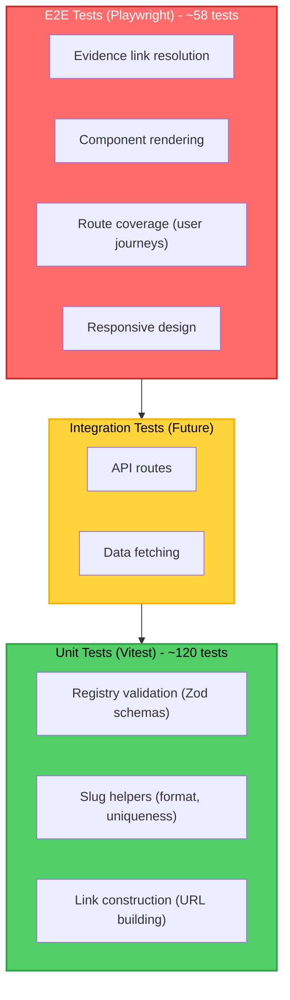

## Purpose

This guide provides patterns and examples for writing tests in the Portfolio App. Use this as a reference when adding new features or modifying existing code.

## Scope

- Unit testing patterns with Vitest (registry validation, slug helpers, link construction)
- E2E testing patterns with Playwright (component rendering, link resolution)
- Running tests locally and in CI
- Interpreting test output and coverage reports
- Troubleshooting common test failures

## Testing Strategy

### Testing Pyramid

The Portfolio App follows a testing pyramid: broad unit tests at the base, fewer integration tests in the middle, and a focused set of E2E tests at the top.



### Coverage Targets

- **Unit tests**: ≥80% for all `src/lib/` modules (current suite exceeds this baseline)
- **E2E tests**: 100% route coverage for all project pages
- **Build-time validation**: Registry schema enforcement via Zod

### Design Rationale

**Why Vitest over Jest?**

- Native ESM support (required for Next.js 15 App Router)
- Faster test execution
- Better TypeScript integration
- Shared config with Vite (simpler setup)

**Why Playwright over Cypress?**

- Multi-browser support (Chromium, Firefox)
- Better performance at scale
- Superior API for responsive design testing
- Faster test execution

**Why ≥80% coverage, not 100%?**

- Balance between quality and development velocity
- 80% catches most regressions without testing implementation details
- Reduces test maintenance burden for trivial code (re-exports, empty handlers)

## Unit Testing with Vitest

### Setup & Configuration

**Installation:**

```bash
pnpm add -D vitest @vitest/ui @vitest/coverage-v8
```

**Configuration:** `vitest.config.ts`

```typescript
import { defineConfig } from 'vitest/config';
import path from 'path';

export default defineConfig({
  test: {
    environment: 'node',
    globals: true,
    coverage: {
      provider: 'v8',
      reporter: ['text', 'json', 'html', 'text-summary'],
      include: ['src/lib/**/*.ts'],
      exclude: ['src/lib/__tests__/**', 'src/lib/**/*.test.ts'],
      lines: 80,
      functions: 80,
      branches: 75,
      statements: 80,
    },
    include: ['src/lib/__tests__/**/*.test.ts'],
  },
  resolve: {
    alias: {
      '@': path.resolve(__dirname, './src'),
    },
  },
});
```

### Test File Naming

- **Location**: `src/lib/__tests__/`
- **Pattern**: `[module].test.ts`
- **Examples**:
  - `src/lib/__tests__/registry.test.ts` — Tests for `src/lib/registry.ts`
  - `src/lib/__tests__/config.test.ts` — Tests for `src/lib/config.ts`
  - `src/lib/__tests__/slugHelpers.test.ts` — Tests for slug validation

### Unit Test Template

```typescript
import { describe, it, expect } from 'vitest';
import { functionToTest } from '../module';

describe('Module Name', () => {
  describe('functionToTest', () => {
    it('should [expected behavior]', () => {
      // Arrange: Set up test inputs
      const input = {
        /* ... */
      };

      // Act: Call the function
      const result = functionToTest(input);

      // Assert: Verify the output
      expect(result).toBe(expectedValue);
    });

    it('should handle edge cases', () => {
      expect(functionToTest(null)).toThrow();
      expect(functionToTest(undefined)).toThrow();
    });
  });
});
```

### Registry Validation Tests

**Module**: `src/lib/registry.ts`

**What to test**:

1. Valid project entries pass schema validation
2. Invalid entries (missing fields, malformed slugs) are rejected
3. Slug uniqueness is enforced
4. Required fields are validated

**Example test**:

```typescript
import { describe, it, expect } from 'vitest';
import { ProjectSchema } from '../registry';

describe('Registry Validation', () => {
  describe('ProjectSchema', () => {
    it('should accept valid project entries', () => {
      const validProject = {
        slug: 'portfolio-app',
        title: 'Portfolio App',
        summary: 'A comprehensive portfolio web application.',
        tags: ['nextjs', 'typescript'],
        // ... other required fields
      };

      const result = ProjectSchema.safeParse(validProject);
      expect(result.success).toBe(true);
    });

    it('should reject projects with invalid slug format', () => {
      const invalidProject = {
        slug: 'Invalid Slug!',
        title: 'Test Project',
        summary: 'A test project.',
        tags: ['test'],
      };

      const result = ProjectSchema.safeParse(invalidProject);
      expect(result.success).toBe(false);
      expect(result.error?.issues[0].message).toContain(
        'slug must be lowercase'
      );
    });

    it('should enforce slug uniqueness', () => {
      // This is tested by the registry loader
      // See src/lib/__tests__/registry.test.ts
    });
  });
});
```

### Link Construction Tests

**Module**: `src/lib/config.ts`

**What to test**:

1. `docsUrl()` builds URLs with `NEXT_PUBLIC_DOCS_BASE_URL`
2. `githubUrl()` builds GitHub URLs correctly
3. Fallback behavior when environment variables are missing
4. URL normalization (trailing slashes, leading slashes)

**Example test**:

```typescript
import { describe, it, expect } from 'vitest';
import { docsUrl, githubUrl } from '../config';

describe('Link Construction Helpers', () => {
  describe('docsUrl', () => {
    it('should build URL with default base path', () => {
      // Default when NEXT_PUBLIC_DOCS_BASE_URL is not set: "/docs"
      const result = docsUrl('/portfolio/roadmap');
      expect(result).toBe('/docs/portfolio/roadmap');
    });

    it('should strip leading slashes from pathname', () => {
      const result = docsUrl('portfolio/roadmap');
      expect(result).toBe('/docs/portfolio/roadmap');
    });

    it('should handle empty pathname', () => {
      const result = docsUrl('');
      expect(result).toBe('/docs');
    });
  });

  describe('githubUrl', () => {
    it('should return placeholder when GITHUB_URL not configured', () => {
      // When NEXT_PUBLIC_GITHUB_URL is not set
      const result = githubUrl('portfolio-app');
      expect(result).toBe('#');
    });
  });
});
```

### Running Unit Tests

```bash
# Run all unit tests (watch mode for development)
pnpm test

# Run unit tests once
pnpm test:unit

# Run with coverage report
pnpm test:coverage

# Open Vitest UI dashboard
pnpm test:ui
```

### Viewing Coverage Reports

After running `pnpm test:coverage`:

1. Open `coverage/index.html` in a browser
2. Review per-file coverage metrics
3. Click a file to see line-level coverage highlighting
4. Identify uncovered branches and functions

**Coverage thresholds**:

- Lines: 80%
- Functions: 80%
- Branches: 75%
- Statements: 80%

## E2E Testing with Playwright

### Setup & Configuration

**Installation:**

```bash
pnpm add -D @playwright/test
pnpm exec playwright install
```

**Configuration:** `playwright.config.ts`

```typescript
import { defineConfig, devices } from '@playwright/test';

export default defineConfig({
  testDir: './tests/e2e',
  fullyParallel: false,
  forbidOnly: !!process.env.CI,
  retries: process.env.CI ? 2 : 0,
  workers: process.env.CI || process.env.DEBUG ? 1 : undefined,
  reporter: 'html',
  use: {
    baseURL: process.env.PLAYWRIGHT_TEST_BASE_URL || 'http://localhost:3000',
    trace: process.env.DEBUG ? 'on' : 'on-first-retry',
    screenshot: process.env.DEBUG ? 'only-on-failure' : 'off',
    video: process.env.DEBUG ? 'retain-on-failure' : 'off',
  },
  projects: [
    {
      name: 'chromium',
      use: { ...devices['Desktop Chrome'] },
    },
    {
      name: 'firefox',
      use: { ...devices['Desktop Firefox'] },
    },
  ],
  webServer: process.env.CI
    ? undefined
    : {
        command: 'pnpm dev',
        url: 'http://localhost:3000',
        reuseExistingServer: !process.env.CI,
      },
});
```

### Test File Naming

- **Location**: `tests/e2e/`
- **Pattern**: `[feature].spec.ts`
- **Examples**:
  - `tests/e2e/smoke.spec.ts` — Smoke tests for core routes + docs link presence
  - `tests/e2e/routes.spec.ts` — Route coverage (project slugs, 404s, metadata endpoints)
  - `tests/e2e/evidence-links.spec.ts` — Evidence link rendering and accessibility

### E2E Test Template

```typescript
import { test, expect } from '@playwright/test';

test.describe('Feature Name', () => {
  test('should [user-facing behavior]', async ({ page }) => {
    // Navigate to the page
    await page.goto('/projects/portfolio-app');

    // Interact with the page
    await page.locator('button').click();

    // Verify expected outcome
    await expect(page.locator('text=Success')).toBeVisible();
  });

  test('should handle error case', async ({ page }) => {
    await page.goto('/projects/invalid-slug');

    // Verify error handling
    await expect(page.locator('text=Not Found')).toBeVisible();
  });
});
```

### Current E2E Coverage (tests/e2e)

**What is currently covered**:

1. Core routes: `/`, `/cv`, `/projects`, `/contact`
2. Project detail routes discovered from `/projects`
3. 404 handling for unknown routes and invalid project slugs
4. Health and metadata endpoints: `/api/health`, `/robots.txt`, `/sitemap.xml`
5. Evidence link rendering and accessibility on `/projects/portfolio-app`
6. Responsive checks (mobile/tablet/desktop) for evidence content

### Evidence Link Resolution Tests (optional enhancement)

**Recommended additions**:

1. EvidenceBlock component displays all 5 evidence categories
2. Evidence links have correct href attributes
3. BadgeGroup displays correct badges based on evidence presence
4. Responsive design (mobile/tablet/desktop)

**Example test**:

```typescript
import { test, expect } from '@playwright/test';

test.describe('Evidence Link Resolution', () => {
  test('portfolio-app project page renders', async ({ page }) => {
    await page.goto('/projects/portfolio-app');

    // Verify page loads
    await expect(page).toHaveTitle(/Portfolio App/i);

    // Verify main content renders
    await expect(page.locator('h1')).toContainText('Portfolio App');
  });

  test('should display all evidence categories', async ({ page }) => {
    await page.goto('/projects/portfolio-app');

    // Verify all 5 evidence categories are present
    await expect(page.locator('text=Dossier')).toBeVisible();
    await expect(page.locator('text=Threat Model')).toBeVisible();
    await expect(page.locator('text=ADRs')).toBeVisible();
    await expect(page.locator('text=Runbooks')).toBeVisible();
    await expect(page.locator('text=GitHub Repository')).toBeVisible();
  });

  test('should render gold standard badge', async ({ page }) => {
    await page.goto('/projects/portfolio-app');

    // Verify gold standard badge for portfolio-app
    await expect(page.locator('text=Gold Standard')).toBeVisible();
  });

  test('should render on mobile viewport', async ({ page }) => {
    // Set mobile viewport
    await page.setViewportSize({ width: 390, height: 844 });
    await page.goto('/projects/portfolio-app');

    // Verify content is visible on mobile
    await expect(page.locator('h1')).toContainText('Portfolio App');
  });
});
```

### Running E2E Tests

```bash
# Run all E2E tests
pnpm test:e2e

# Interactive UI mode (recommended for development)
pnpm test:e2e:ui

# Debug mode (step through tests)
pnpm test:e2e:debug

# Run a single spec (smoke tests)
pnpm test:e2e:single

# View test report (after running tests)
pnpm playwright show-report
```

## CI Integration

### Test Job in GitHub Actions

The CI pipeline includes a `test` job that runs before the `build` job:

```yaml
test:
  name: test
  runs-on: ubuntu-latest
  timeout-minutes: 15
  needs: [quality]
  permissions:
    contents: read

  steps:
    - name: Checkout
      uses: actions/checkout@v6

    - name: Setup pnpm
      uses: pnpm/action-setup@v4

    - name: Setup Node
      uses: actions/setup-node@v6
      with:
        node-version: '20'
        cache: 'pnpm'

    - name: Install deps
      run: pnpm install --frozen-lockfile

    - name: Run unit tests
      run: pnpm test:unit

    - name: Install Playwright browsers
      run: npx playwright install --with-deps

    - name: Start dev server
      run: pnpm dev &

    - name: Wait for server to be ready
      run: npx wait-on http://localhost:3000

    - name: Run E2E tests
      run: pnpm test:e2e

    - name: Upload coverage reports
      if: always()
      uses: actions/upload-artifact@v4
      with:
        name: coverage-report
        path: coverage/
        retention-days: 7
```

### Build Blocking

The `build` job depends on the `test` job:

```yaml
build:
  needs: [quality, test]
  if: always() && needs.quality.result == 'success' && needs.test.result == 'success'
  # ...
```

This ensures:

1. Build fails if any tests fail
2. Merge is blocked if CI fails
3. Coverage reports are available for review

## Troubleshooting

### Unit Test Failures

**Problem**: Test fails with "Cannot find module"

**Solution**: Check that the import path matches the actual file location. Verify path aliases in `vitest.config.ts` and `tsconfig.json`.

**Problem**: Coverage report shows 0% for a module

**Solution**: Ensure the module is imported in at least one test file. Vitest only measures coverage for files that are loaded.

**Problem**: Environment variables not available in tests

**Solution**: Mock environment variables using `beforeEach`:

```typescript
beforeEach(() => {
  process.env.NEXT_PUBLIC_DOCS_BASE_URL = 'https://docs.example.com';
});

afterEach(() => {
  delete process.env.NEXT_PUBLIC_DOCS_BASE_URL;
});
```

### E2E Test Failures

**Problem**: Tests fail locally but pass in CI

**Solution**: Ensure dev server is running (`pnpm dev`). E2E tests require a live server on `http://localhost:3000`.

**Problem**: Timeout waiting for element

**Solution**: Use `page.waitForLoadState('networkidle')` before assertions:

```typescript
await page.goto('/projects/portfolio-app');
await page.waitForLoadState('networkidle');
await expect(page.locator('text=Evidence Artifacts')).toBeVisible();
```

**Problem**: Tests pass individually but fail when run together

**Solution**: Ensure tests clean up state (clear cookies, logout). Use `test.beforeEach()` and `test.afterEach()` for setup/teardown.

### Coverage Issues

**Problem**: Coverage report shows lower coverage than expected

**Solution**: Check that test files are included in `coverage.include` in `vitest.config.ts`. Verify that tests are actually running for the code paths.

**Problem**: Cannot achieve 80% coverage target

**Solution**: Review uncovered lines in the coverage report. Consider if those lines are worth testing or if the coverage target is appropriate for that module.

## Best Practices

1. **Use descriptive test names**: Test names should clearly describe what is being tested
   - ✅ Good: `should accept valid project entries`
   - ❌ Bad: `test validation`

2. **Follow arrange/act/assert pattern**: Structure tests clearly

   ```typescript
   it('should build correct URL', () => {
     // Arrange
     const input = '/portfolio/roadmap';

     // Act
     const result = docsUrl(input);

     // Assert
     expect(result).toBe('/docs/portfolio/roadmap');
   });
   ```

3. **Test behavior, not implementation**: Test what the function does, not how it does it
   - ✅ Good: `expect(result).toBe('/docs/portfolio/roadmap')`
   - ❌ Bad: `expect(docsUrl).toHaveBeenCalledWith(...)`

4. **Use specific assertions**: Avoid generic `toBeTruthy()`
   - ✅ Good: `expect(result).toBe('/docs/portfolio/roadmap')`
   - ❌ Bad: `expect(result).toBeTruthy()`

5. **Test edge cases**: Include tests for null, undefined, empty strings
   ```typescript
   it('should handle empty pathname', () => {
     expect(docsUrl('')).toBe('/docs');
   });
   ```

## See Also

- [Registry Schema Guide](/docs/70-reference/registry-schema-guide.md) — Field-by-field registry reference
- [Portfolio App: Testing](/docs/60-projects/portfolio-app/05-testing.md) — Testing dossier and CI gates
- [Vitest Documentation](https://vitest.dev) — Official Vitest docs
- [Playwright Documentation](https://playwright.dev) — Official Playwright docs
