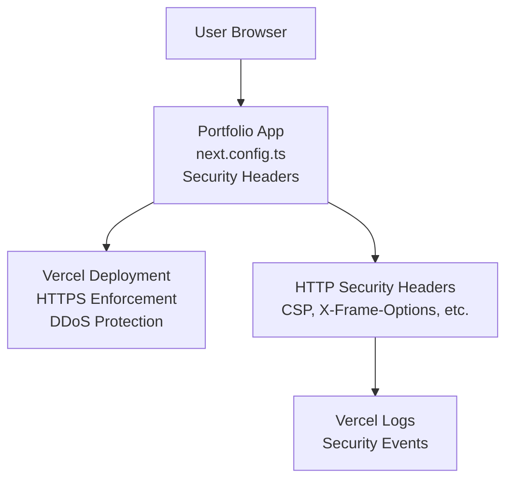

> **Archive notice:** Archived 2026-02-06. This issue is retained for historical traceability only.
> See release note: /docs/00-portfolio/release-notes/20260206-portfolio-roadmap-issues-archived.md

# Stage 4.4: Security Posture Deepening — App Implementation

**Type:** Feature / Enhancement / Security Hardening  
**Phase:** Phase 4 — Enterprise-Grade Platform Maturity  
**Stage:** 4.4  
**Linked Issue:** stage-4.4-docs-issue  
**Duration Estimate:** 4–6 hours  
**Assignee:** [TBD]

---

## Overview

Harden the portfolio app's security posture by implementing OWASP-recommended HTTP security headers, defining and documenting a Content Security Policy (CSP), and establishing environment variable documentation with security annotations. This stage extends the threat model to cover deployment and runtime misconfiguration surfaces and formalizes a dependency audit policy for proactive vulnerability management.

## Objectives

- Add security headers to all HTTP responses (X-Frame-Options, X-Content-Type-Options, X-XSS-Protection, Referrer-Policy, Permissions-Policy, Content-Security-Policy)
- Define and document CSP policy with clear rationale and trade-off analysis
- Expand `.env.example` with security-related environment variables and annotations
- Validate that no hardcoded secrets or sensitive configuration exist in codebase
- Enable automated dependency vulnerability scanning and audit policy

---

## Scope

### Files to Create

1. **`.env.example`** (expanded version) — Comprehensive environment variable template with security annotations
   - Document all `NEXT_PUBLIC_*` variables for portfolio app
   - Include security-specific variables (CSP nonce, security headers flags)
   - Add comments explaining each variable's purpose, security impact, and valid values
   - Ensure no default values contain secrets

2. **`docs/40-security/security-configuration.md`** (NEW, may be referenced from next.config.ts or dossier) — Security configuration reference guide
   - Purpose: Explain security headers, CSP policy, environment variables for maintainers
   - Audience: Developers, security reviewers, DevOps engineers
   - Sections: Security headers overview, CSP policy structure, CSP trade-offs, environment variable security contract

### Files to Update

1. **`next.config.ts`** — Add security headers configuration
   - Add `headers()` async function returning array of header configurations
   - Configure X-Frame-Options: DENY
   - Configure X-Content-Type-Options: nosniff
   - Configure X-XSS-Protection: 1; mode=block
   - Configure Referrer-Policy: strict-origin-when-cross-origin
   - Configure Permissions-Policy: geolocation=(), microphone=(), camera=()
   - Configure Content-Security-Policy (see design specs below)
   - Document why each header was chosen and trade-offs

2. **`package.json`** — Dependency audit configuration
   - Verify Dependabot is configured (already should be from Phase 2)
   - Ensure `pnpm audit` is documented as part of CI/CD process
   - Optionally add audit script: `pnpm audit --audit-level moderate` or similar

3. **`src/lib/config.ts`** — Security-related configuration helpers (if needed)
   - May add CSP-related helpers or environment variable validators
   - Ensure all security config is sourced from environment variables, not hardcoded

4. **`.env.example`** (existing) — Add security-related variables
   - Add placeholders for any new security configuration variables
   - Add security annotations to existing variables

5. **`README.md`** — Add security section
   - Reference to security headers configuration
   - Link to threat model and security documentation
   - Brief explanation of dependency audit policy

---

## Design & Architecture

### System Overview

Security hardening layers:



### OWASP Security Headers Configuration

```typescript
// next.config.ts
import type { NextConfig } from 'next';

const nextConfig: NextConfig = {
  // ... other configuration ...

  headers: async () => [
    {
      source: '/:path*',
      headers: [
        // Prevent clickjacking attacks
        {
          key: 'X-Frame-Options',
          value: 'DENY',
        },
        // Prevent MIME type sniffing
        {
          key: 'X-Content-Type-Options',
          value: 'nosniff',
        },
        // Enable XSS protection in older browsers
        {
          key: 'X-XSS-Protection',
          value: '1; mode=block',
        },
        // Control referrer information
        {
          key: 'Referrer-Policy',
          value: 'strict-origin-when-cross-origin',
        },
        // Restrict feature/API usage (geolocation, microphone, camera)
        {
          key: 'Permissions-Policy',
          value: 'geolocation=(), microphone=(), camera=()',
        },
        // Content Security Policy (strict)
        {
          key: 'Content-Security-Policy',
          value:
            "default-src 'self'; script-src 'self' 'unsafe-inline' https://cdn.vercel-analytics.com; style-src 'self' 'unsafe-inline'; img-src 'self' https: data:; font-src 'self'; connect-src 'self' https://vitals.vercel-analytics.com;",
        },
      ],
    },
  ],
};

export default nextConfig;
```

### Content Security Policy (CSP) Breakdown & Rationale

**Full Policy:**

```
default-src 'self';
script-src 'self' 'unsafe-inline' https://cdn.vercel-analytics.com;
style-src 'self' 'unsafe-inline';
img-src 'self' https: data:;
font-src 'self';
connect-src 'self' https://vitals.vercel-analytics.com;
```

**Directive Explanation:**

| Directive     | Value                                         | Rationale                                                                                                                                                                                        |
| ------------- | --------------------------------------------- | ------------------------------------------------------------------------------------------------------------------------------------------------------------------------------------------------ |
| `default-src` | `'self'`                                      | Default fallback: only allow resources from the same origin. Restrictive by default, exceptions added per-directive.                                                                             |
| `script-src`  | `'self' 'unsafe-inline' https://cdn.vercel-*` | Allows same-origin scripts, inline scripts (needed for Next.js), and Vercel Analytics CDN. **Trade-off:** `unsafe-inline` reduces security but is necessary for Next.js inline script execution. |
| `style-src`   | `'self' 'unsafe-inline'`                      | Allows same-origin stylesheets and inline styles. **Trade-off:** `unsafe-inline` required for Tailwind CSS and Next.js styling.                                                                  |
| `img-src`     | `'self' https: data:`                         | Allows same-origin images, HTTPS external images (CDNs), and data URIs (base64-encoded images).                                                                                                  |
| `font-src`    | `'self'`                                      | Allows same-origin fonts only. If external font CDNs needed, add them explicitly (e.g., `https://fonts.googleapis.com`).                                                                         |
| `connect-src` | `'self' https://vitals.vercel-analytics.com`  | Allows fetch/WebSocket/XMLHttpRequest to same-origin and Vercel Analytics telemetry endpoint.                                                                                                    |

**CSP Trade-offs Documented:**

1. **`unsafe-inline` for scripts and styles:** Reduces XSS protection but is necessary for Next.js. Consider in future:
   - Using script hashes or nonces for inline scripts (requires build-time integration)
   - Migrating to CSS-in-JS with dynamic class names (reduces inline styles need)

2. **Vercel Analytics exception:** Required for telemetry; consider removing if analytics becomes optional.

3. **`data:` for images:** Allows embedded images but could theoretically smuggle data. Considered acceptable risk for this app.

**Testing CSP:**

```bash
# View CSP header in responses
curl -I https://portfolio.example.com/

# Browser DevTools Console will warn about CSP violations
# Example: If inline script blocked, you'll see:
# "Refused to execute inline script because it violates the following CSP directive: ..."
```

### Environment Variable Security Contract

**Variables to document in `.env.example`:**

```env
# Application URL (public-safe; no secrets)
NEXT_PUBLIC_SITE_URL=http://localhost:3000

# Documentation Base URL (public-safe)
NEXT_PUBLIC_DOCS_BASE_URL=https://portfolio-docs.example.com/docs/

# GitHub URLs (public-safe)
NEXT_PUBLIC_GITHUB_URL=https://github.com/bryce-seefieldt
NEXT_PUBLIC_DOCS_GITHUB_URL=https://github.com/bryce-seefieldt/portfolio-docs

# Environment Name (production/staging/preview/development)
VERCEL_ENV=development

# Build-time variables (not exposed to browser)
NEXT_PUBLIC_ANALYTICS_ID=  # Optional: analytics service ID if added

# Security: Never add API keys, database credentials, or private URLs here
# All variables prefixed with NEXT_PUBLIC_ are exposed to the browser and visible to clients.
```

**Security Validation Rules:**

- [ ] No variable contains API keys, tokens, passwords, or private URLs
- [ ] All public variables are documented with their purpose and security implications
- [ ] Environment variable names follow `NEXT_PUBLIC_*` convention for client-exposed config
- [ ] .env.example is committed; actual secrets are in Vercel dashboard only

---

## Implementation Tasks

Break the work into concrete, sequential phases.

### Phase 1: Security Headers Configuration (1–2 hours)

Implement HTTP security headers in Next.js configuration.

#### Tasks

- [ ] **Add security headers to `next.config.ts`**
  - Import and extend NextConfig with `headers()` async function
  - Configure X-Frame-Options: DENY
  - Configure X-Content-Type-Options: nosniff
  - Configure X-XSS-Protection: 1; mode=block
  - Configure Referrer-Policy: strict-origin-when-cross-origin
  - Configure Permissions-Policy: geolocation=(), microphone=(), camera=()
  - Configure Content-Security-Policy (see Design specs)
  - Test locally: `pnpm dev` → curl http://localhost:3000 and verify headers present

- [ ] **Verify CSP policy doesn't break existing functionality**
  - Run `pnpm dev` and load each route in browser
  - Open DevTools Console and verify no CSP violations
  - Check that Vercel Analytics works (if enabled)
  - Test image loading, styling, and script execution

- [ ] **Document security headers rationale in code**
  - Add comment block explaining each header
  - Include CSP policy explanation and trade-off notes
  - Reference OWASP guidelines

#### Success Criteria for Phase 1

- [ ] All 6 security headers configured and present in HTTP responses
- [ ] CSP policy allows all legitimate app functionality without violations
- [ ] No console warnings or errors related to CSP
- [ ] Headers validated with `pnpm build && pnpm start`
- [ ] Documentation in code explains each header

### Phase 2: Environment Variable Documentation (1–2 hours)

Document all environment variables with security annotations.

#### Tasks

- [ ] **Expand `.env.example` with all variables**
  - List all `NEXT_PUBLIC_*` variables used by the app
  - Add descriptions and valid values for each
  - Include security annotations (e.g., "public-safe, no secrets")
  - Add example values for development/testing

- [ ] **Add security validation rules to documentation**
  - Document that all NEXT*PUBLIC* variables are exposed to clients
  - Explain why secrets should never be in environment variables
  - Reference `.env.local` for local development

- [ ] **Update `src/lib/config.ts` if needed**
  - Add any missing environment variable references
  - Ensure all variables are properly validated on load
  - Document variable format/validation rules

- [ ] **Create or update `docs/40-security/security-configuration.md`**
  - Explain security headers implementation
  - Document CSP policy and trade-offs
  - Reference environment variable contract
  - Include examples and testing procedures

#### Success Criteria for Phase 2

- [ ] `.env.example` is comprehensive and well-documented
- [ ] All variables have clear descriptions and examples
- [ ] Security annotations explain which variables are public-safe
- [ ] No hardcoded secrets found in codebase
- [ ] `pnpm secrets:scan` passes without false positives

### Phase 3: Dependency Audit Policy Integration (1–2 hours)

Formalize and document dependency vulnerability management.

#### Tasks

- [ ] **Review and document Dependabot configuration**
  - Verify `.github/dependabot.yml` exists and is configured
  - Document auto-update strategy (majors/minors/patches)
  - Link to dependency audit policy

- [ ] **Add `pnpm audit` validation**
  - Run `pnpm audit` and document baseline (expected 0 vulnerabilities)
  - Consider adding `--audit-level` check if using npm workspaces
  - Document process for reviewing and responding to vulnerabilities

- [ ] **Update `README.md` with security section**
  - Add "Security" section to README
  - Link to threat model and security documentation
  - Document dependency audit policy and update cadence
  - Reference `.env.example` and public-safe variables

- [ ] **Update package.json scripts if needed**
  - Ensure no audit-related scripts conflict with existing workflow
  - Document in README how to run `pnpm audit` locally

#### Success Criteria for Phase 3

- [ ] Dependabot configuration documented and active
- [ ] `pnpm audit` runs clean (or baseline vulnerabilities documented)
- [ ] README includes security section with clear policies
- [ ] Team understands dependency audit workflow and responsibilities
- [ ] Any existing vulnerabilities have documented risk acceptance or remediation plan

---

## Testing Strategy

### Security Header Validation

- [ ] **Manual header inspection**
  - Run `pnpm dev` and curl http://localhost:3000 with `-I` flag
  - Verify all 6 headers present in response
  - Repeat for production build: `pnpm build && pnpm start`

- [ ] **Browser DevTools inspection**
  - Load http://localhost:3000 in Chrome/Firefox
  - Open DevTools → Network tab → click any request
  - Verify CSP, X-Frame-Options, X-Content-Type-Options headers visible
  - Check Console tab for CSP violations or warnings

- [ ] **CSP functionality testing**
  - Load each route and verify page renders correctly
  - Verify images load without CSP violations
  - Verify styles apply correctly (no styling broken by CSP)
  - Verify scripts execute (if any inline scripts present)
  - If analytics enabled, verify telemetry endpoint accessible

- [ ] **E2E test validation**
  - Run `pnpm test:e2e` to ensure Playwright tests still pass
  - All 12 smoke tests should pass with headers in place

### Environment Variable Validation

- [ ] **No secrets in source code**
  - Run `pnpm secrets:scan` and verify passes
  - Manually review `.env.example` for any hardcoded sensitive values
  - Verify no API keys or tokens in config files

- [ ] **Configuration loading**
  - Verify `src/lib/config.ts` correctly exports all variables
  - Test that missing optional variables don't break app startup
  - Test with `.env.local` overrides

### Dependency Audit

- [ ] **Baseline audit**
  - Run `pnpm install` and `pnpm audit`
  - Document baseline vulnerability count (target: 0)
  - If vulnerabilities exist, document risk assessment

- [ ] **Dependabot configuration**
  - Verify Dependabot PRs are created weekly
  - Review recent Dependabot PRs for patterns

### Test Commands

```bash
# Header validation
curl -I http://localhost:3000/

# Build validation
pnpm build
pnpm start

# Security scanning
pnpm secrets:scan

# Dependency audit
pnpm audit

# Full quality gate
pnpm quality

# E2E tests
pnpm test:e2e
```

---

## Success Criteria

- [ ] All 6 OWASP security headers configured and present in HTTP responses
- [ ] CSP policy tested and verified to not break functionality
- [ ] CSP policy documented with rationale and trade-offs
- [ ] All environment variables documented in `.env.example`
- [ ] No hardcoded secrets found in codebase (`pnpm secrets:scan` passes)
- [ ] Dependabot configured and documented
- [ ] `pnpm audit` passes with 0 critical/high vulnerabilities (or documented risk acceptance)
- [ ] README includes security section
- [ ] All existing tests pass (`pnpm quality`, `pnpm test:e2e`)
- [ ] PR created with title: `feat: Stage 4.4 - Security posture deepening`

---

## Related Documentation

- Security configuration guide (new or reference document)
- OWASP Top 10 and OWASP Secure Headers guidelines (external reference)
- Threat Model v2 (being created in parallel docs issue)
- Dependency Audit Policy runbook (being created in parallel docs issue)
- Environment variable security contract (in `.env.example`)

---

## Notes & Considerations

1. **CSP `unsafe-inline` trade-off:** This is a documented security compromise necessary for Next.js. Future iterations could explore nonces or script hashing if external scripts are added.

2. **Analytics dependency:** CSP includes exceptions for Vercel Analytics. If analytics is disabled, simplify CSP by removing those directives.

3. **Build-time validation:** Consider adding build-time checks to validate `.env.example` format and that no secrets are committed.

4. **Monitoring:** The health check endpoint (`GET /api/health`) can be extended in future to report security status (e.g., CSP violations, failed dependency audits).

5. **Post-incident:** If security incident occurs, runbooks should reference this documentation and CSP configuration for root cause analysis.
